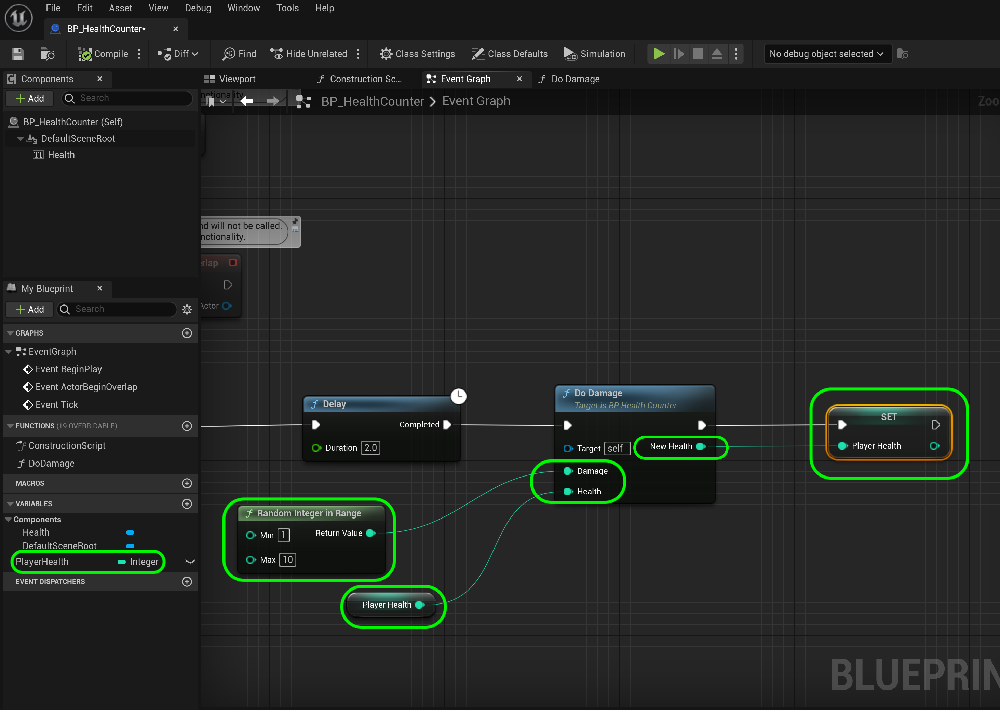

### Blueprint Functions

[previous](../vanilla-functions/README.md#user-content-vanilla-cpp-functions) • [home](../README.md#user-content-ue5-cpp-functions--templates--classes) • [next](../unreal-cpp-functions/README.md#user-content-unreal-capp-functions)

Blueprint functions are a bit different in C++.  They allow for multiple return values and don't require a declaration.  It is defined and declared all in place.  

Blueprint functions are node graphs that belong to a particular Blueprint and can be executed or called from another graph within the Blueprint. They allow the reuse of code, improve overall organization, and make it easier to maintain and update your project. Functions have a single entry point designated by a node with the name of the function containing a single exec output pin. When the function is called from another graph, the output exec pin is activated, causing the connected network to execute.

To create a function inside a Blueprint Class or Level Blueprint, you can use the My Blueprint tab and click the Add Button on the functions list header. You can then enter a name for your function and create the function graph by dragging off the function node and adding nodes to it. You can also create functions in code by specifying the BlueprintCallable or BlueprintPure keyword in the UFUNCTION declaration.

Blueprint functions can be used to perform a wide range of tasks, such as calculating distances between objects, spawning actors, or playing sounds. They can also be used to create custom events that can be triggered by other parts of the Blueprint. By using Blueprint functions, you can create more complex and efficient Blueprints that are easier to understand and maintain.

Lets rebuild what we did in Vanilla C++ in Unreal.

 

---

##### `Step 1.`\|`UECPPFTC`|:small_blue_diamond:

Start a new UE5 5.2.X project.  Select the **Game** template tab and select **Blank**.  Make sure it is type **C++** as we will need to use C++ classes as well.  Select a **Target Platform** of `Desktop`, **Quality Preset** of `Maximum`, and no **Starter Content** and **Raytracing** is not necessary. Pick a **Directory** and select a **Project Name**, I used `UE5_CPP_FTC`.

If you have not already done so, you will need to set up visual studio and make sure you have all the components you need to compile the game.  Clear instructions are given on Unreal's [Setting up Visual Studio for Unreal Engine](https://docs.unrealengine.com/4.26/en-US/ProductionPipelines/DevelopmentSetup/VisualStudioSetup/).

##### `Step 2.`\|`UECPPFTC`|:small_blue_diamond: :small_blue_diamond: 

Again, we do not need a streaming large level so press **File | New Level** and select a **Basic** level. Press the <kbd>Create</kbd> button.

##### `Step 3.`\|`UECPPFTC`|:small_blue_diamond: :small_blue_diamond: :small_blue_diamond:

Add a new folder to **Content** called `Maps`.  Call the level `Functions`.

##### `Step 4.`\|`UECPPFTC`|:small_blue_diamond: :small_blue_diamond: :small_blue_diamond: :small_blue_diamond:

Add another folder called `Blueprints`.  Right click in that empty folder and add a **Blueprint Class** of type **Actor**.  Call the blueprint `BP_HealthCounter`.

##### `Step 5.`\|`UECPPFTC`| :small_orange_diamond:

Add a **Text Render** component to the blueprint and call it `Health`. Set **Text** to `100` representing 100% health.  Change the **Horizontal Alignment** to `Center` and **Vertical Alignment** to `TextCenter`.  Change the **TextRenderColor** to the one you have been using and the **World Size** to `72` so it is nice, big and readable.

##### `Step 6.`\|`UECPPFTC`| :small_orange_diamond: :small_blue_diamond:

Let's create the same function we just did in C++ in a blueprint.  Press the **+ Function** button to create a new function and name this new function `DoDamage`.

 Add an output of type **Integer** with the name of `NewHealth`.  Add two inputs called `Damage` and `Health` each of type **Integer**.  Notice that a **Return** node is added when you added an **Output** to the function.

##### `Step 7.`\|`UECPPFTC`| :small_orange_diamond: :small_blue_diamond: :small_blue_diamond:

Now pull off of the **Health** output pin and select an **- (Subtraction)** node.  Connect the pins making sure that you are deducting **Damage** from **Score** then sending the outut to the **Return Node | NewHealth** input pin.

##### `Step 8.`\|`UECPPFTC`| :small_orange_diamond: :small_blue_diamond: :small_blue_diamond: :small_blue_diamond:

Lets go back to the **Event Graph** and right click on the empty graph next to the **Event Tick** and add a **Delay** node. Change the duration to `2.0` and pull off the **Completed** execution pin and select the **DoDamage** function you just wrote.

##### `Step 9.`\|`UECPPFTC`| :small_orange_diamond: :small_blue_diamond: :small_blue_diamond: :small_blue_diamond: :small_blue_diamond:

Create a new **Variable** and call it `PlayerHealth` and make it type **Integer**.  Now since no other class needs to alter or read this function - set **Private** to `true`. This means no other blueprint (even one that inherits from this one) will be able to read or write to **PlayerHealth**. Press the **Compile** button and change the **Default Value** to `100`.

##### `Step 10.`\|`UECPPFTC`| :large_blue_diamond:

Drag a **Get Health** reference to the graph and connect it to the **Health** input pin in the **DoDamage** function.  Add a **Random Integer in Rage** node and set the **Min** to `1` and the **Max** to `5`. Send the **Return Value** to the **Damage** parameter in **Do Damage**. Add a **Set PlayerHealth** reference node and connect its execution pin to **DoDamage** node and pipe the **NewHealth** return value to it's input **Health** pin. 

##### `Step 11.`\|`UECPPFTC`| :large_blue_diamond: :small_blue_diamond: 

Drag a copy of the **Health** text component to the graph and pull off of its pin to select a **Set Text** node. Connect execution pin from **Set Score** to **Set Text**.  Connect th eoutput of **Set Text** node to the **Set Text | Value** node. 

##### `Step 12.`\|`UECPPFTC`| :large_blue_diamond: :small_blue_diamond: :small_blue_diamond: 

Go to the game and add the **BP_ScoreCounter** to the scene in front of the player. 

##### `Step 13.`\|`UECPPFTC`| :large_blue_diamond: :small_blue_diamond: :small_blue_diamond:  :small_blue_diamond: 

But where does the player start?  Go to the **Add Actor** button and select a **Player Start** actor and add it to your level. Make sure the white arrow is pointing at the blueprint you just added.  Press the three dots next to the <kbd>Play</kbd> button and select **Default Player Start**.

##### `Step 14.`\|`UECPPFTC`| :large_blue_diamond: :small_blue_diamond: :small_blue_diamond: :small_blue_diamond:  :small_blue_diamond: 

Press the **Compile** button and run the game. Notice that if you keep running the game it will go below zero.  Lets fix that,

https://github.com/maubanel/UE5-CPP-Functions-Templates-Classes/assets/5504953/3ca43e93-6c6f-4e2f-8079-aae3b8e8ec3a

##### `Step 15.`\|`UECPPFTC`| :large_blue_diamond: :small_orange_diamond: 

It is never good to leave an edge case even in a silly example like this.  Lets stop the score from getting negative and display a message instead.  This is NOT the most efficient solution as it still subtracts on the delay when it is no longer necessary. Since this is an incomplete problem, we will just leave it as is.

Before setting the text component we need to verify that the score is still above 0.  If it is not, set the text to display a death message. Add a **Get PlayerHealth** node and connect it to a **>** node.  Send this output to a new **Branch** node. Hightjack the execution pin between **Set PlayerHealth** and **SetText** with it connecting through the **True** pin.

##### `Step 16.`\|`UECPPFTC`| :large_blue_diamond: :small_orange_diamond:   :small_blue_diamond: 
 
 Get a new reference to the **Health** component and add another **Set Text** node an connect this to the **False** pin of the **Branch** node.

##### `Step 17.`\|`UECPPFTC`| :large_blue_diamond: :small_orange_diamond: :small_blue_diamond: :small_blue_diamond:

 There is another way of creating a variable.  Right click on **Set Text | Value** and select **Promote to Variable**. Call this text variable `DeathMessage` and set its default value to `Player is Dead!`. Make it `Private`. Add a **Get DeathMessage**.

##### `Step 18.`\|`UECPPFTC`| :large_blue_diamond: :small_orange_diamond: :small_blue_diamond: :small_blue_diamond: :small_blue_diamond:

Now play the game and when the health goes below **0** you get the message instead of a negative number!

<!--  -->

| [previous](../vanilla-functions/README.md#user-content-vanilla-cpp-functions)| [home](../README.md#user-content-ue5-cpp-functions--templates--classes) | [next](../unreal-cpp-functions/README.md#user-content-unreal-capp-functions)|
|---|---|---|
