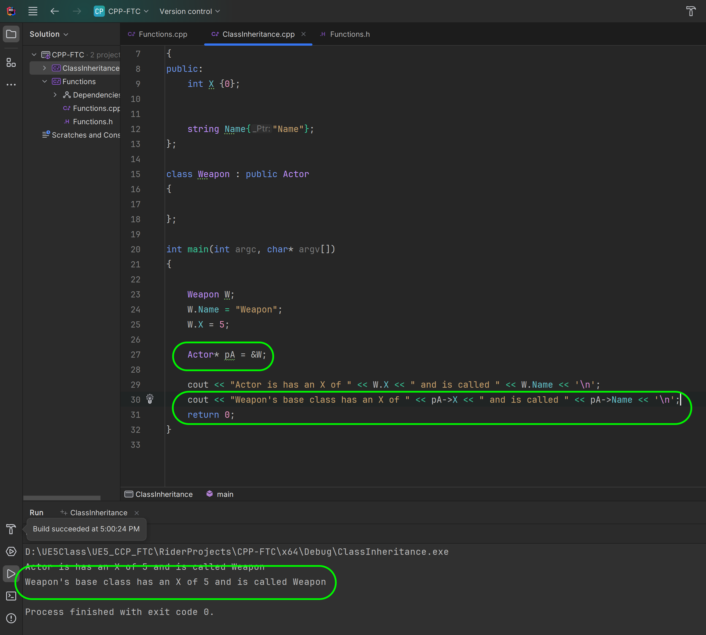

### Class Inheritance

<sub>[previous](../classes-cpp-ii/README.md#user-content-classes-in-cpp-ii) • [home](../README.md#user-content-ue5-cpp-functions--templates--classes)</sub>


In C++, inheritance is a process in which one class acquires the properties and behaviors of another class automatically. The class that inherits the members of another class is called the derived class, and the class whose members are inherited is called the base class.

To inherit a class in C++, we use the colon (:) symbol followed by the access specifier and the name of the base class. The access specifier can be public, protected, or private, and it determines the visibility of the base class members in the derived class. The most common is to use the public access specifier.

<br>

---

##### `Step 1.`\|`UECPPFTC`|:small_blue_diamond:

Add a new project to the solution by selecting **File | Add New | Project** and select a console C++ project and press the <kbd>Next</kbd> button.


##### `Step 2.`\|`UECPPFTC`|:small_blue_diamond: :small_blue_diamond: 

Call the project `ClassInheritanceCasting` and leave it in the same folder. Press the <kbd>Create</kbd> button.  Now right click the new project in the **Solution Explorer** and select **Set as Startup Project**. 


##### `Step 3.`\|`UECPPFTC`|:small_blue_diamond: :small_blue_diamond: :small_blue_diamond:

Add a `Main.cpp` file to the project.  We will start by including `iostream` and allowing us to direftly call `cout` and `string`. We will start with our base class `Enemy` which will have two public members, with the first being the number of heads the creature has and then the species name.  We initialize the number of heads to a default of `1` the most common and since each **Name** will be unique we leave it an empty string.

We will then create two derived classes one `Aligator` and the other `Lion`.  Now they are derived by deriving aligator from enemy using the public access specifier.
```cpp
class Aligator : public Enemy
{
// do something
};
```

Then we will create a **Lion** type and define its name.  We don't need to define the **NumberOfHeads** as the default of `1` we inherit will do.


##### `Step 4.`\|`UECPPFTC`|:small_blue_diamond: :small_blue_diamond: :small_blue_diamond: :small_blue_diamond:


##### `Step 5.`\|`UECPPFTC`| :small_orange_diamond:

Run the project.  Even though there are no variables in the derived **Lions** class it still has access to its parents public and protected members.  Remember protected allows any derived class to access those members but not other classes.

This is called encapsulation which is a fundamental concept in object-oriented programming (OOP) that involves bundling data members and functions inside a single class. 

Encapsulation helps to protect the internal state of an object by keeping its data members private, and access to and modification of these data members is restricted to the class’s public methods, ensuring controlled and secure data manipulation. 

Encapsulation also leads to data abstraction, which is a mechanism of exposing only the interfaces and hiding the implementation details from the user.

So we get a lion with 1 head.


##### `Step 6.`\|`UECPPFTC`| :small_orange_diamond: :small_blue_diamond:

Now what if we wanted to keep an array of all enemies regardless of the derived class (so in our case both **Aligator** and **Lion**). This is where pointers can be useful.  Since they both derive from the same enemy class we can store an array of pointers of the base class type.

Now when we access this base class member we will get the derived value.  Let me demonstrate this.




##### `Step 7.`\|`UECPPFTC`| :small_orange_diamond: :small_blue_diamond: :small_blue_diamond:


##### `Step 8.`\|`UECPPFTC`| :small_orange_diamond: :small_blue_diamond: :small_blue_diamond: :small_blue_diamond:


##### `Step 9.`\|`UECPPFTC`| :small_orange_diamond: :small_blue_diamond: :small_blue_diamond: :small_blue_diamond: :small_blue_diamond:


##### `Step 10.`\|`UECPPFTC`| :large_blue_diamond:


##### `Step 11.`\|`UECPPFTC`| :large_blue_diamond: :small_blue_diamond: 


##### `Step 12.`\|`UECPPFTC`| :large_blue_diamond: :small_blue_diamond: :small_blue_diamond: 


##### `Step 13.`\|`UECPPFTC`| :large_blue_diamond: :small_blue_diamond: :small_blue_diamond:  :small_blue_diamond: 


##### `Step 14.`\|`UECPPFTC`| :large_blue_diamond: :small_blue_diamond: :small_blue_diamond: :small_blue_diamond:  :small_blue_diamond: 


##### `Step 15.`\|`UECPPFTC`| :large_blue_diamond: :small_orange_diamond: 


##### `Step 16.`\|`UECPPFTC`| :large_blue_diamond: :small_orange_diamond:   :small_blue_diamond: 


##### `Step 17.`\|`UECPPFTC`| :large_blue_diamond: :small_orange_diamond: :small_blue_diamond: :small_blue_diamond:


##### `Step 18.`\|`UECPPFTC`| :large_blue_diamond: :small_orange_diamond: :small_blue_diamond: :small_blue_diamond: :small_blue_diamond:


##### `Step 19.`\|`UECPPFTC`| :large_blue_diamond: :small_orange_diamond: :small_blue_diamond: :small_blue_diamond: :small_blue_diamond: :small_blue_diamond:


##### `Step 20.`\|`UECPPFTC`| :large_blue_diamond: :large_blue_diamond:


##### `Step 21.`\|`UECPPFTC`| :large_blue_diamond: :large_blue_diamond: :small_blue_diamond:


<!--  -->


| [previous](../classes-cpp-ii/README.md#user-content-classes-in-cpp-ii)| [home](../README.md#user-content-ue5-cpp-functions--templates--classes) |
|---|---|
