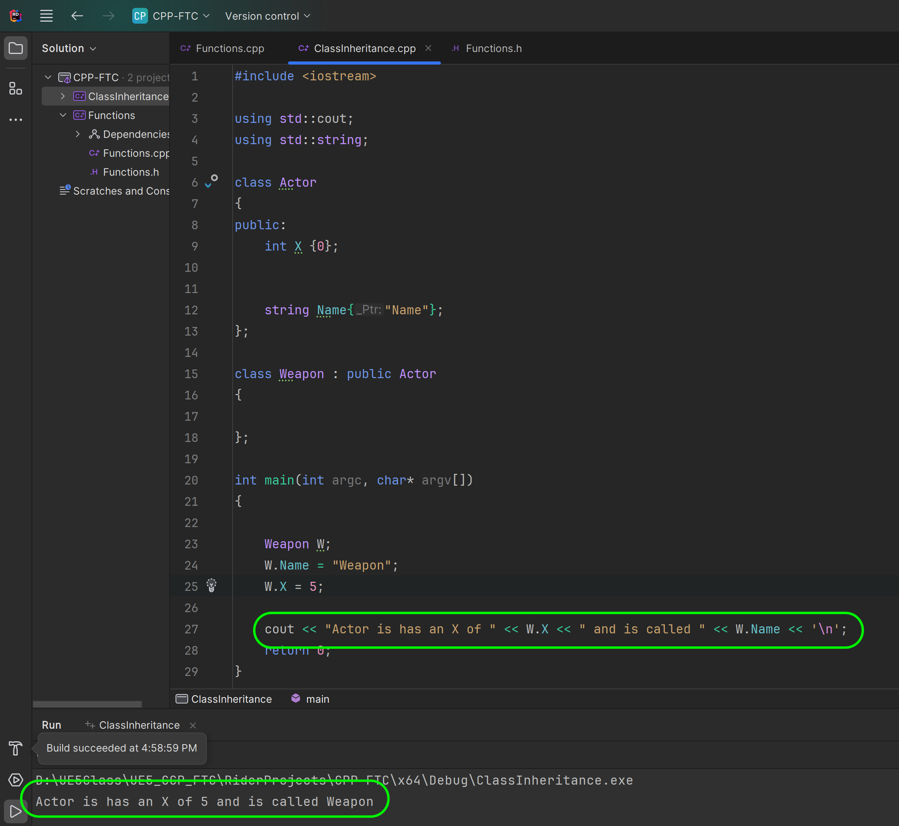
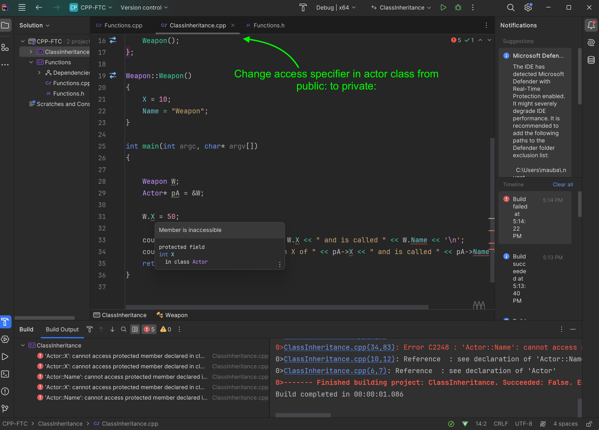
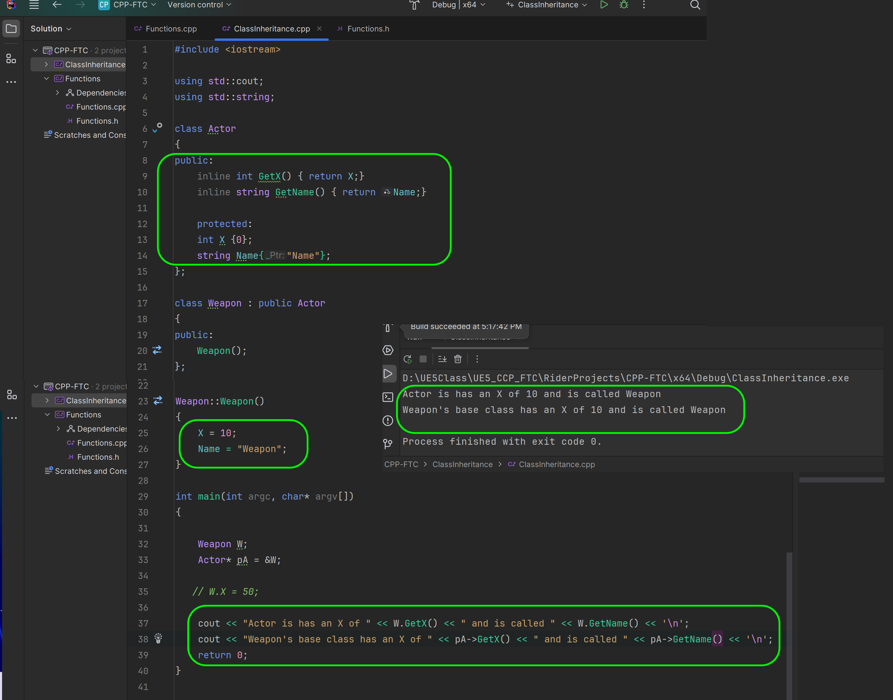
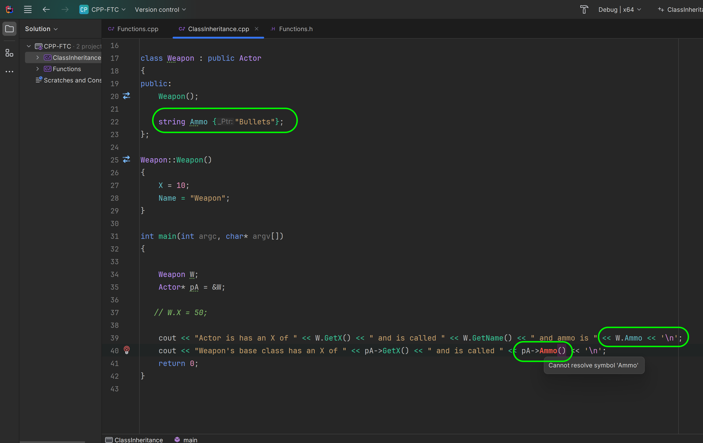

### Class Inheritance

<sub>[previous](../classes-cpp-ii/README.md#user-content-classes-in-cpp-ii) • [home](../README.md#user-content-ue5-cpp-functions--templates--classes)</sub>


In C++, inheritance is a process in which one class acquires the properties and behaviors of another class automatically. The class that inherits the members of another class is called the derived class, and the class whose members are inherited is called the base class.

To inherit a class in C++, we use the colon (:) symbol followed by the access specifier and the name of the base class. The access specifier can be public, protected, or private, and it determines the visibility of the base class members in the derived class. The most common is to use the public access specifier.

<br>

---

##### `Step 1.`\|`UECPPFTC`|:small_blue_diamond:

Add a new project to the sCPP-FTC solution by opening it up and right clicking on the top most folder and selecting **Add | New Project**. Set the project as a **C++ | Console Application** and call it `ClassInheritance`.  Press the <kbd>Create</kbd> button.


##### `Step 2.`\|`UECPPFTC`|:small_blue_diamond: :small_blue_diamond: 

Right click on the **ClassInheritance** folder and select **Run 'ClassInheritance'** so it runs **main()** from this project.


##### `Step 3.`\|`UECPPFTC`|:small_blue_diamond: :small_blue_diamond: :small_blue_diamond:

We will start by including `iostream` and allowing us to direftly call `cout` and `string`. We will start with our base class `Actor` which will have two public members, with the first being the X position of the actor initialized to `0` and a string with the actor **Name** initialized to `Name`.

We will then create one derived classes one `Weapon` with no implementation.

```cpp
class Weapon : public Actor
{
// do nothing for now
};
```

In main, we will create a **Weapon** class and change the **Name** and the **X** value with the dot access specifier.


##### `Step 4.`\|`UECPPFTC`|:small_blue_diamond: :small_blue_diamond: :small_blue_diamond: :small_blue_diamond:

Now lets print out the derived Weapon class.  Notice that even though there is no code within the class that it still has access to its parents public and protected members. Protected allows any derived class to access those members but not other classes.

Run the project and even though there are no variables in the derived **Weapons** class it still has access to its parents public and protected members and displays the overriden derived settings of `5` and `Weapon`.  

This is called encapsulation which is a fundamental concept in object-oriented programming (OOP) that involves bundling data members and functions inside a single class.

Encapsulation helps to protect the internal state of an object by keeping its data members private, and access to and modification of these data members is restricted to the class’s public methods, ensuring controlled and secure data manipulation.

Encapsulation also leads to data abstraction, which is a mechanism of exposing only the interfaces and hiding the implementation details from the user.

So we get an **Actor with an **X** of `5` called `Weapon`.





##### `Step 5.`\|`UECPPFTC`| :small_orange_diamond:

Now what if we wanted to keep an array of all actors regardless of the derived class (so in our case both **Weapon** derived from **Actor**). This is where pointers can be useful.  Since they both derive from the same enemy class we can store an array of pointers of the base class type. 

Since storage containers can only keep a class of a single type this way we could keep any object that inherited from the **Actor** class in a single array.

Now when we access this base class member we will get the derived value.  Let me demonstrate this.

We create a pointer to the base class by calling:

```cpp
Actor* pA = &W;
```

So we create a pointer to the **Actor** base of derived class of **W**.  We then output the **Name** and **X** from the parent class.  But it prints out **Weapon** and not an Name string as it was in the parent's class. The value was overriden by the derived class but the parent still has access to its original members.  


##### `Step 6.`\|`UECPPFTC`| :small_orange_diamond: :small_blue_diamond:

This is called polymorphism.  This is one of the key features of object-oriented programming. In C++, polymorphism can be achieved through inheritance, overriding, and overloading.

Inheritance is a mechanism that allows a class to inherit properties and methods from another class. Overriding is a feature that allows a subclass to provide its own implementation of a method that is already defined in its superclass.

Polymorphism is useful for code reusability, as it allows us to reuse attributes and methods of an existing class when we create a new class. Polymorphism is also useful for creating more flexible and extensible code, as it allows us to write code that can work with different types of objects.

Lets instead of setting the weapon's variables in **main** set them in its class constructor.  So in **Weapon** add a constructor `Weapon` and in the definition make the **X** `10` and leave the name as **Weapon**. 

Now <kbd>Run</kbd> the program and we get the same result as before with both the derived and parent class printing out the save value.


##### `Step 7.`\|`UECPPFTC`| :small_orange_diamond: :small_blue_diamond: :small_blue_diamond:

We can still override this in **main()**.


##### `Step 8.`\|`UECPPFTC`| :small_orange_diamond: :small_blue_diamond: :small_blue_diamond: :small_blue_diamond:

Now change the spcifier in the **Actor** parent class from `public:` to `private`.  Now compile and since this is no longer accessible in the derived class we cannot access the member.  We get a compiler error.




##### `Step 9.`\|`UECPPFTC`| :small_orange_diamond: :small_blue_diamond: :small_blue_diamond: :small_blue_diamond: :small_blue_diamond:

Lets make the accessor **Protected** in the *Actor** class.  This means that **Weapon** the derived class can still access its members.  Then create two getters so that **main** can access the output of those protected values (main can only access public members).

<kbd>Run</kbd> the simulation and we have now protected these members of the derived class.




##### `Step 10.`\|`UECPPFTC`| :large_blue_diamond:

We need to be careful.  Because if we give the derived class it's own variable `Ammo` and set it to `Bullets`.  This can be accessed through it derived class `W.Ammo` but is **NOT** accessible from the parents pointer `pA->Ammo`.




##### `Step 11.`\|`UECPPFTC`| :large_blue_diamond: :small_blue_diamond: 

To access this member through a pointer to the base class we will have to **cast** it to the derived class. This is very common in Unreal to go from a class like your **Character** class then cast to your derived class that you are using in the game.

In C++, `static_cast` is an operator that performs an explicit type conversion. It can be used for operations such as implicit conversions between types as well as pointers.

To cast a pointer from one type to another, `static_cast` can be used. For example, to cast a pointer of a `base class` to a pointer of a `derived class`, `static_cast` can be used. In our case we are casting from our **Actor** base class to our **Weapon** derived class. 

Now we can print the new variable from the new derived class pointer. You need to change `pA` to `pW` in the `cout <<...` print statement.


##### `Step 12.`\|`UECPPFTC`| :large_blue_diamond: :small_blue_diamond: :small_blue_diamond: 

In games inheritance can only get us so far. So for weapons deriving from a base class and using polymorphism makes sense. But what about a game where there is physics, sounds, animation and multiple unrelated systems.  It doesn't make sense for them to inherit from each other.

We can decouple this relationship by using the component design pattern. This allows us to decouple attributes of a class and allows a single component to be inheritable by multiple domains.  It is extensively used in Unreal and Unity.

Create a new **Component** class before **Weapon** and give it access to its **Parent** through  pointer.  In this case its parent class will be an `Actor`.


##### `Step 13.`\|`UECPPFTC`| :large_blue_diamond: :small_blue_diamond: :small_blue_diamond:  :small_blue_diamond: 

Now we can create a component class and access its parent's object through the pointer.  


##### `Step 14.`\|`UECPPFTC`| :large_blue_diamond: :small_blue_diamond: :small_blue_diamond: :small_blue_diamond:  :small_blue_diamond:

Now in our Weapon's class we can add a component and point it to our own class using `this` which is the derived instance of the weapon class.  

The full design pattern is more complex but this gives you a simple example of how Unreal is implementing its components.


That's it for this walk through. Thanks for following through to the end.

<!--  -->


| [previous](../classes-cpp-ii/README.md#user-content-classes-in-cpp-ii)| [home](../README.md#user-content-ue5-cpp-functions--templates--classes) |
|---|---|
