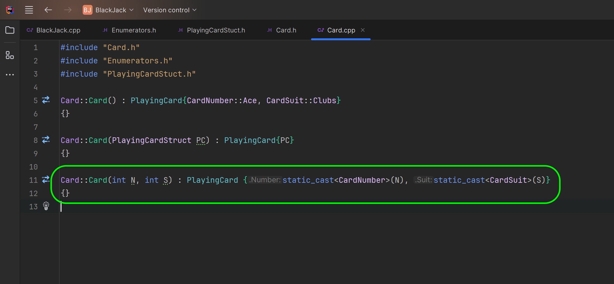

### Classes in CPP II

[previous](../classes-cpp/README.md#user-content-classes-in-cpp) • [home](../README.md#user-content-ue5-cpp-functions--templates--classes) • [next](../)

Lets look at overloading the C++ constructor to allow for different ways to initialize the class.  We will also look at ways to cast from integers to enumerators safely.

 

---

##### `Step 1.`\|`UECPPFTC`|:small_blue_diamond:

Now lets say we wanted to allow a power user to remember the order of the cards and suits (which are alphabetical) and use integers to save time (may not be a recommneded practice though).  We can overload the constructor to also accept two integers.

##### `Step 2.`\|`UECPPFTC`|:small_blue_diamond: :small_blue_diamond: 

Now the compiler doesn't natively convert from `int` to `enum`.  So you need to call the `static_cast` operator. It is a compile-time cast that can be used for operations such as implicit conversions between types (such as int to enumerator class, int to float, or pointer to void*). The syntax of `static_cast` is `static_cast<dest_type>(source)` where `dest_type` is the data type to which the source is to be converted.

So in our case we want to go to **CardNumber** and **CardClass** as a destination and our sourse is an **int**. So in ther override definition cast from a interger to each of our enumerators.

##### `Step 3.`\|`UECPPFTC`|:small_blue_diamond: :small_blue_diamond: :small_blue_diamond:

Open up the **Main.cpp** and pass the **Card** initialization two integers.  In this case a 3 of clubs.  Run the program to see if it overrides the constructor correctly.

##### `Step 4.`\|`UECPPFTC`|:small_blue_diamond: :small_blue_diamond: :small_blue_diamond: :small_blue_diamond:

##### `Step 5.`\|`UECPPFTC`| :small_orange_diamond:

##### `Step 6.`\|`UECPPFTC`| :small_orange_diamond: :small_blue_diamond:

##### `Step 7.`\|`UECPPFTC`| :small_orange_diamond: :small_blue_diamond: :small_blue_diamond:

##### `Step 8.`\|`UECPPFTC`| :small_orange_diamond: :small_blue_diamond: :small_blue_diamond: :small_blue_diamond:

##### `Step 9.`\|`UECPPFTC`| :small_orange_diamond: :small_blue_diamond: :small_blue_diamond: :small_blue_diamond: :small_blue_diamond:

##### `Step 10.`\|`UECPPFTC`| :large_blue_diamond:

##### `Step 11.`\|`UECPPFTC`| :large_blue_diamond: :small_blue_diamond: 

##### `Step 12.`\|`UECPPFTC`| :large_blue_diamond: :small_blue_diamond: :small_blue_diamond: 

##### `Step 13.`\|`UECPPFTC`| :large_blue_diamond: :small_blue_diamond: :small_blue_diamond:  :small_blue_diamond: 

##### `Step 14.`\|`UECPPFTC`| :large_blue_diamond: :small_blue_diamond: :small_blue_diamond: :small_blue_diamond:  :small_blue_diamond: 

##### `Step 15.`\|`UECPPFTC`| :large_blue_diamond: :small_orange_diamond: 

##### `Step 16.`\|`UECPPFTC`| :large_blue_diamond: :small_orange_diamond:   :small_blue_diamond: 

##### `Step 17.`\|`UECPPFTC`| :large_blue_diamond: :small_orange_diamond: :small_blue_diamond: :small_blue_diamond:

##### `Step 18.`\|`UECPPFTC`| :large_blue_diamond: :small_orange_diamond: :small_blue_diamond: :small_blue_diamond: :small_blue_diamond:

##### `Step 19.`\|`UECPPFTC`| :large_blue_diamond: :small_orange_diamond: :small_blue_diamond: :small_blue_diamond: :small_blue_diamond: :small_blue_diamond:

##### `Step 20.`\|`UECPPFTC`| :large_blue_diamond: :large_blue_diamond:

##### `Step 21.`\|`UECPPFTC`| :large_blue_diamond: :large_blue_diamond: :small_blue_diamond:

<!--  -->

| [previous](../classes-cpp/README.md#user-content-classes-in-cpp)| [home](../README.md#user-content-ue5-cpp-functions--templates--classes) | [next](../)|
|---|---|---|
