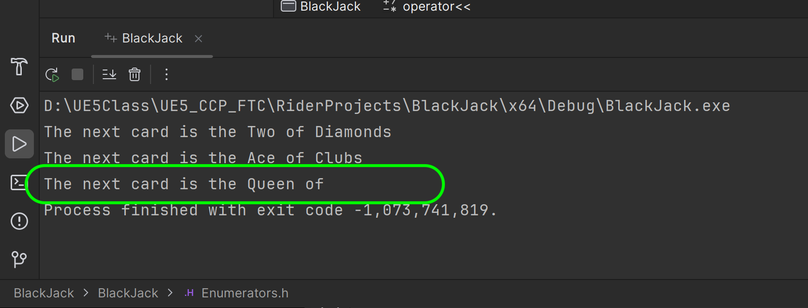
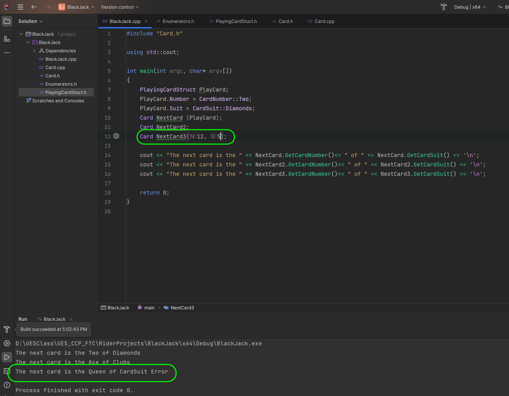
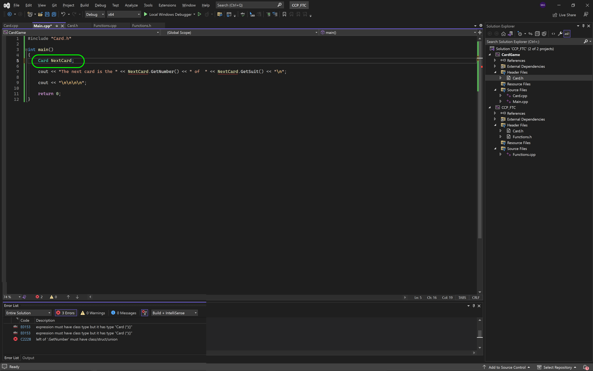

### Classes in CPP II

<sub>[previous](../classes-cpp/README.md#user-content-classes-in-cpp) • [home](../README.md#user-content-ue5-cpp-functions--templates--classes) • [next](../)</sub>


Lets look at overloading the C++ constructor to allow for different ways to initialize the class.  We will also look at ways to cast from integers to enumerators safely.

<br>

---

##### `Step 1.`\|`UECPPFTC`|:small_blue_diamond:

Now lets say we wanted to allow a power user to remember the order of the cards and suits (which are alphabetical) and use integers to save time (may not be a recommneded practice though).  We can overload the constructor to also accept two integers.


##### `Step 2.`\|`UECPPFTC`|:small_blue_diamond: :small_blue_diamond: 

Now the compiler doesn't natively convert from `int` to `enum`.  So you need to call the `static_cast` operator. It is a compile-time cast that can be used for operations such as implicit conversions between types (such as int to enumerator class, int to float, or pointer to void*). The syntax of `static_cast` is `static_cast<dest_type>(source)` where `dest_type` is the data type to which the source is to be converted.

So in our case we want to go to **CardNumber** and **CardClass** as a destination and our sourse is an **int**. So in ther override definition cast from a interger to each of our enumerators.


##### `Step 3.`\|`UECPPFTC`|:small_blue_diamond: :small_blue_diamond: :small_blue_diamond:

Open up the **Main.cpp** and pass the **Card** initialization two integers.  In this case a 3 of clubs.  Run the program to see if it overrides the constructor correctly.


##### `Step 4.`\|`UECPPFTC`|:small_blue_diamond: :small_blue_diamond: :small_blue_diamond: :small_blue_diamond:

Now we have to be careful about using `static_cast` to ensure a safe conversion.  If we pass card a value that is no in the range of our enumerator there will be a runtime crash. Make the following change to line 5.

```cpp
Card NextCard(1, 5);
```

So we know there is no 5 cards suit and the program crashes when run.




##### `Step 5.`\|`UECPPFTC`| :small_orange_diamond:

Now it is crashing in our operator overload as there is no case for the switch statement that is valid.  This is where the **default** catch all will work and we will return an error message warning the programmer that they are not accessing a valid value. 

This default cast will run on any other possible integer value and return the error message below. 


##### `Step 6.`\|`UECPPFTC`| :small_orange_diamond: :small_blue_diamond:

Now it will run without crashing and give us some feedback.




##### `Step 7.`\|`UECPPFTC`| :small_orange_diamond: :small_blue_diamond: :small_blue_diamond:

Now, what if we wanted to have a default initializer than just gives us an ace of spades (first number and first suit) if you don't care which card is created or for a user that is just getting used to the class and doesn't know all of the enumerators yet.  We can create an initializer for a class with no parameters (you cannot use empty parenthesis `()` just a the name of the class or it won't compile).




##### `Step 8.`\|`UECPPFTC`| :small_orange_diamond: :small_blue_diamond: :small_blue_diamond: :small_blue_diamond:

We can overload the constructor so it has a a default constructor to run if no parameters are passed.


##### `Step 9.`\|`UECPPFTC`| :small_orange_diamond: :small_blue_diamond: :small_blue_diamond: :small_blue_diamond: :small_blue_diamond:

In the definition we will pass an Ace of Clubs to the default constructor.


##### `Step 10.`\|`UECPPFTC`| :large_blue_diamond:


##### `Step 11.`\|`UECPPFTC`| :large_blue_diamond: :small_blue_diamond: 


##### `Step 12.`\|`UECPPFTC`| :large_blue_diamond: :small_blue_diamond: :small_blue_diamond: 


##### `Step 13.`\|`UECPPFTC`| :large_blue_diamond: :small_blue_diamond: :small_blue_diamond:  :small_blue_diamond: 


##### `Step 14.`\|`UECPPFTC`| :large_blue_diamond: :small_blue_diamond: :small_blue_diamond: :small_blue_diamond:  :small_blue_diamond: 


##### `Step 15.`\|`UECPPFTC`| :large_blue_diamond: :small_orange_diamond: 


##### `Step 16.`\|`UECPPFTC`| :large_blue_diamond: :small_orange_diamond:   :small_blue_diamond: 


##### `Step 17.`\|`UECPPFTC`| :large_blue_diamond: :small_orange_diamond: :small_blue_diamond: :small_blue_diamond:


##### `Step 18.`\|`UECPPFTC`| :large_blue_diamond: :small_orange_diamond: :small_blue_diamond: :small_blue_diamond: :small_blue_diamond:


##### `Step 19.`\|`UECPPFTC`| :large_blue_diamond: :small_orange_diamond: :small_blue_diamond: :small_blue_diamond: :small_blue_diamond: :small_blue_diamond:


##### `Step 20.`\|`UECPPFTC`| :large_blue_diamond: :large_blue_diamond:


##### `Step 21.`\|`UECPPFTC`| :large_blue_diamond: :large_blue_diamond: :small_blue_diamond:


<!--  -->


| [previous](../classes-cpp/README.md#user-content-classes-in-cpp)| [home](../README.md#user-content-ue5-cpp-functions--templates--classes) | [next](../)|
|---|---|---|
