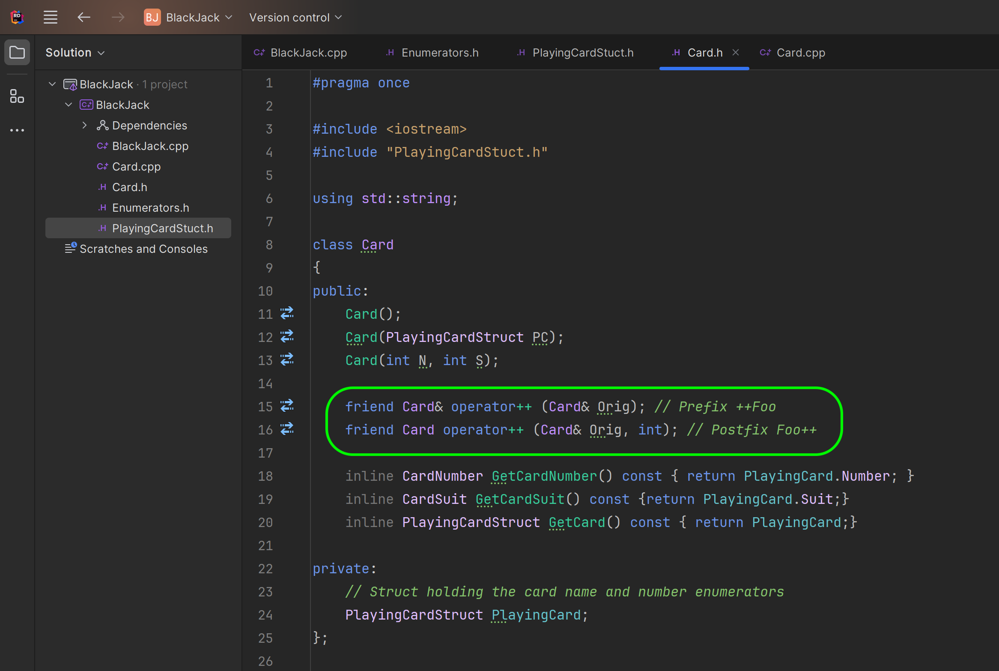
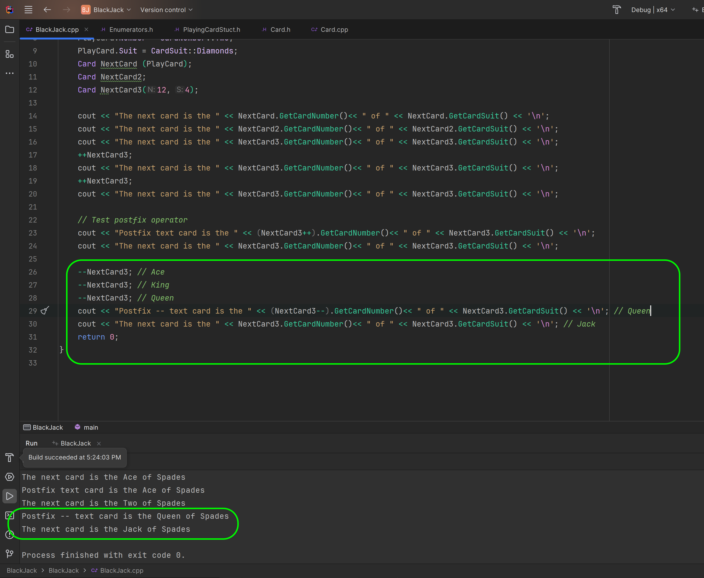
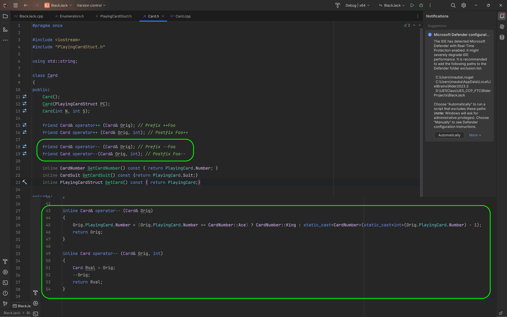

### Classes in CPP II

<sub>[previous](../classes-cpp/README.md#user-content-classes-in-cpp) • [home](../README.md#user-content-ue5-cpp-functions--templates--classes) • [next](../class-inheritance/README.md#user-content-class-inheritance)</sub>


Lets look at overloading the C++ constructor to allow for different ways to initialize the class.  We will also look at ways to cast from integers to enumerators safely.

---

##### `Step 1.`\|`UECPPFTC`|:small_blue_diamond:

Now lets say we wanted to allow a power user to remember the order of the cards and suits (which are alphabetical) and use integers to save time (may not be a recommended practice though).  Or maybe, this was a prior way of working and we didn't want to force others to change the code. We can overload the constructor to also accept two integers. Open up **Card.h** and make the following addition:


##### `Step 2.`\|`UECPPFTC`|:small_blue_diamond: :small_blue_diamond: 

Now the compiler doesn't natively convert from `int` to `enum`.  So you need to call the `static_cast` operator. It is a compile-time cast that can be used for operations such as implicit conversions between types (such as int to enumerator class, int to float, or pointer to void*). The syntax of `static_cast` is `static_cast<dest_type>(source)` where `dest_type` is the data type to which the source is to be converted.

So in our case we want to go to **CardNumber** and **CardSuit** as a destination and our source is two **int**s. So in their override declaration we cast from a integer to each of our enumerators.


##### `Step 3.`\|`UECPPFTC`|:small_blue_diamond: :small_blue_diamond: :small_blue_diamond:

Open up the **BlackJack.cpp** and create a new card called `NextCard3`.  Set it to `12`, `4`.  This will then get output as the **Queen of Spades** so our explicit conversion is working!


##### `Step 4.`\|`UECPPFTC`|:small_blue_diamond: :small_blue_diamond: :small_blue_diamond: :small_blue_diamond:

Now we have to be careful about using `static_cast` to ensure a safe conversion.  If we pass card a value that is no in the range of our enumerator there be no value to override in our **<<** override. 

```cpp
Card NextCard(12, 5);
```

So we know there is no 5th card in suit and the program will not output anything.


##### `Step 5.`\|`UECPPFTC`| :small_orange_diamond:

Now lets give the user of this class an idea that they are not going to get a valid result. At the end of the switch statement if it doesnt' return then we will give a generic error message warning the programmer that they are not accessing a valid value.


##### `Step 6.`\|`UECPPFTC`| :small_orange_diamond: :small_blue_diamond:

Now it will run without crashing and give us some feedback.


##### `Step 7.`\|`UECPPFTC`| :small_orange_diamond: :small_blue_diamond: :small_blue_diamond:

Now what if we wanted the player to be able to increment the card?  This is just an example since we have made the card read only and private I wouldn't want you to mutate the card.

This is just a demonstration that for custom classes we can override the mathematical operators with any logic we want.  Now we want to be germain to their original meaning.  So I am interpreting `++` operator as the next card number in the same suit.

So lets override the `++` operator.  We need to versions for for `foo++` a post fix operator and `++foo` a prefix operator.

For the postfix we are returning with a pass by reference and prefix a by value.

We need the "++" operator to access our private **Card** class member so we will need to make it a **Friend** class. 

> A friend class can access private and protected members of other classes in which it is declared as a friend. It is sometimes useful to allow a particular class to access private and protected members of other classes. For example, a LinkedList class may be allowed to access private members of Node. - https://www.geeksforgeeks.org




##### `Step 8.`\|`UECPPFTC`| :small_orange_diamond: :small_blue_diamond: :small_blue_diamond: :small_blue_diamond:

Under the class we will incline the defnition of these overrides in our **.h** file and make them inline since they are very short.

We can overload the pre-increment operator by returning a reference to the object being incremented. So `Card& overload++(Card& Orig)` returns a reference to the object itself which allows for chaining multiple increment operations together like `++(++NextCard)`.

We also need to allow for ++ to wrap so that when we increment the **King** we go back to the **Ace**.  We then need to cast the to a **CardNumber** the private **Number** member.  This means we need to make it a friend class which we did in the `.h`.  If it was not a private member we could have left it a public class.

For the postfix operator we pass it a `operator++(Card& Orig, int)` a dummy parameter to differentiate it from the prefix operator. So in this case we make a copy of the card and return that value so it is unchanged.  Then we increment the reference with the prefix operator (handles the King wrapping logic).  So this function returns a copy of the object before it was incremented.  So the next line we will get the incremented value.


##### `Step 9.`\|`UECPPFTC`| :small_orange_diamond: :small_blue_diamond: :small_blue_diamond: :small_blue_diamond: :small_blue_diamond:

Lets test the wrapping. Call **++NextCard3** twice.  It will change the Queen of Spades to the King then Ace of Spades.  So our plus plus is wrapping correctly.


##### `Step 10.`\|`UECPPFTC`| :large_blue_diamond:

Now lets test the post operator implementation to make sure it works. Notice that when we call it on the Ace of Spades it only increments on the line after we call it.  It seems to work correctly!




##### `Step 11.`\|`UECPPFTC`| :large_blue_diamond: :small_blue_diamond: 

Now repeat this for the decriment overload and the edge condition changes from decrimenting Ace to become King.




##### `Step 12.`\|`UECPPFTC`| :large_blue_diamond: :small_blue_diamond: :small_blue_diamond: 

Lets test the wrapping and the postfix implementation. Run the program and yes in fact we wrap in and decrement correctly!


<!--  -->


| [previous](../classes-cpp/README.md#user-content-classes-in-cpp)| [home](../README.md#user-content-ue5-cpp-functions--templates--classes) | [next](../class-inheritance/README.md#user-content-class-inheritance)|
|---|---|---|
