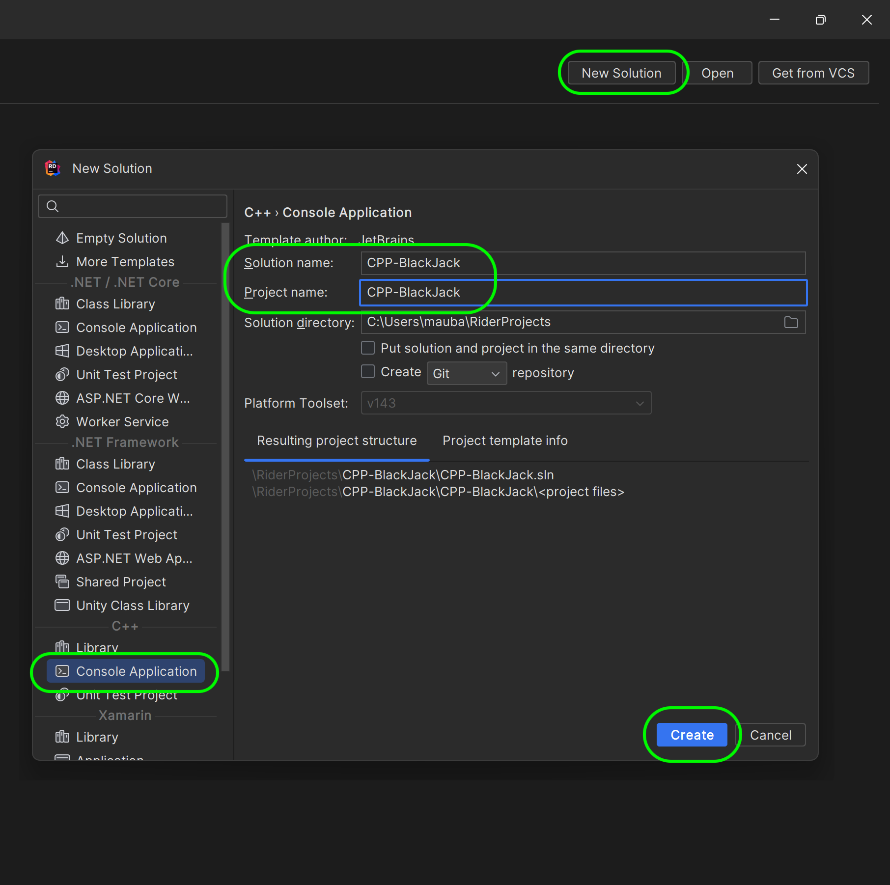
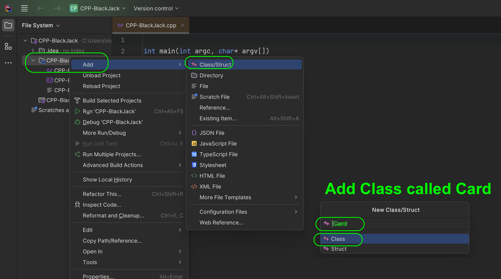
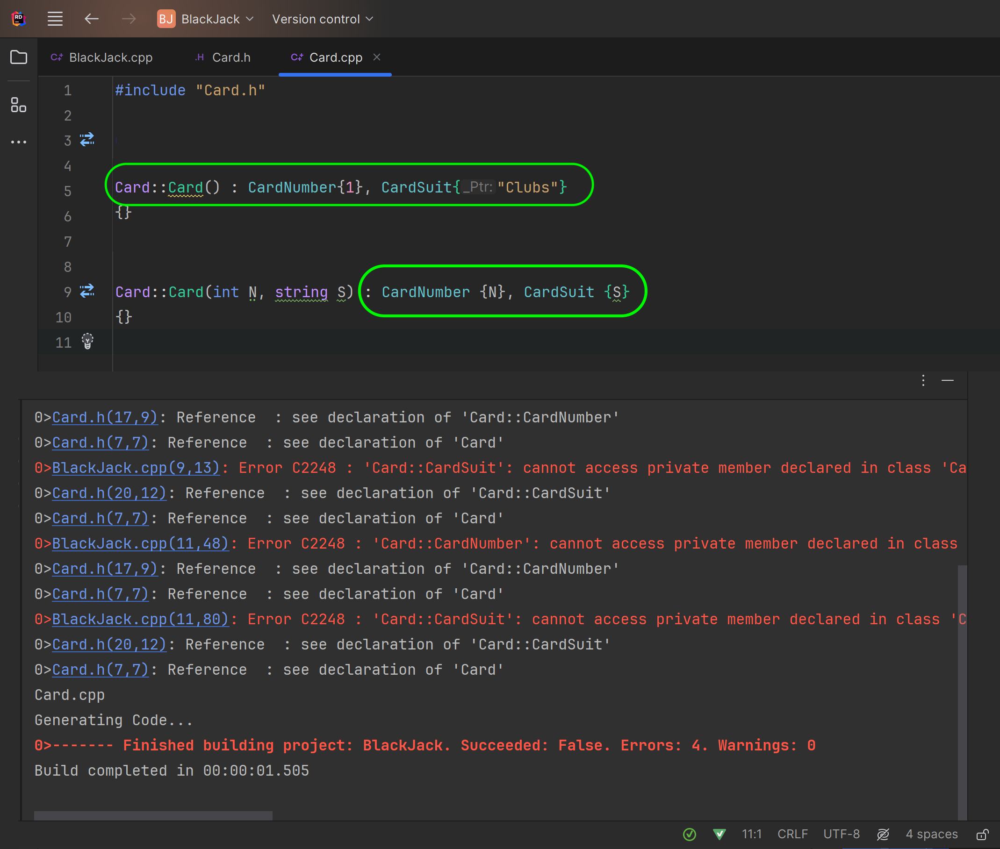
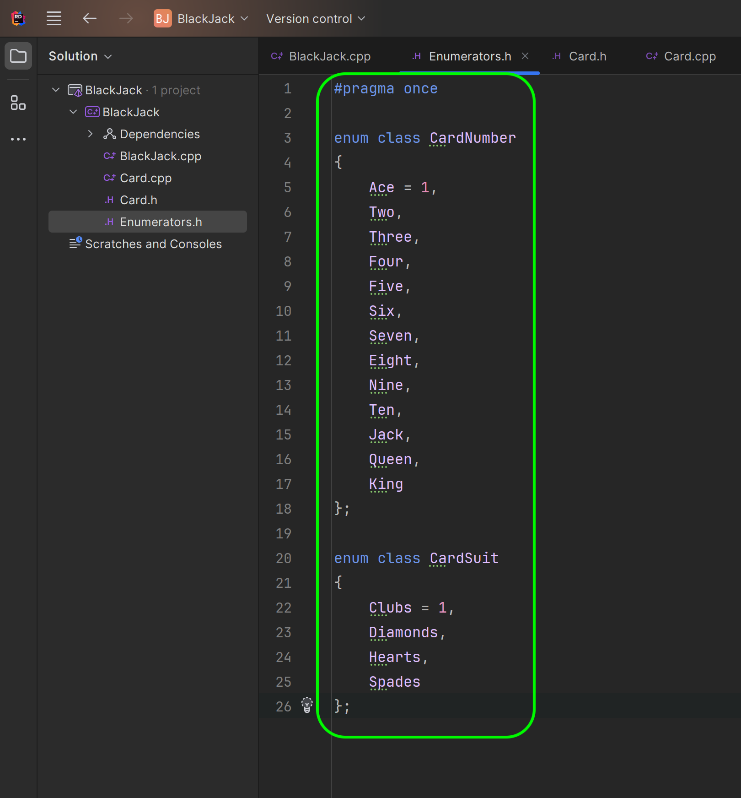
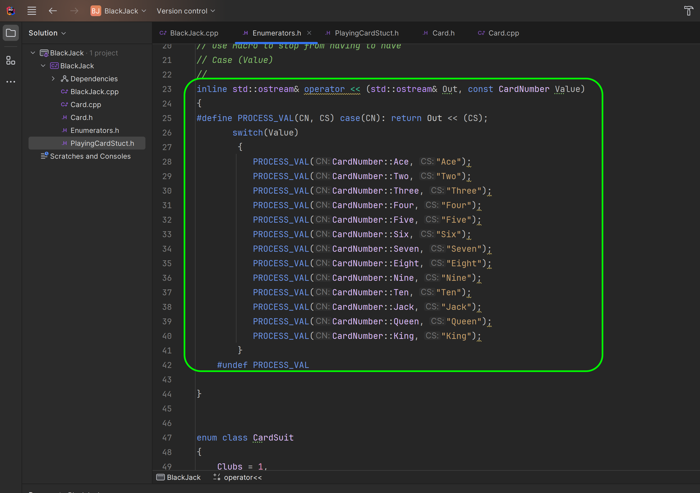

### Classes in CPP

<sub>[previous](../more-functions/README.md#user-content-more-with-functions) • [home](../README.md#user-content-ue5-cpp-functions--templates--classes) • [next](../classes-cpp-ii/README.md#user-content-classes-in-cpp-ii)</sub>


In C++, a class is a user-defined data type that encapsulates data and functions (also called member variables and member functions) as its members whose access is governed by the three access specifiers private, protected or public. By default, access to members of a C++ class is private. The private members are not accessible outside the class; they can be accessed only through methods of the class. The public members form an interface to the class and are accessible outside the class.

The public interface is the api that accesses the members of the class and the private interface is the implementation of that class. So if the class returns the time the interface is to ask the time in a given time zone at a give point in time.  The implementation details of how that class determines the correct time is hidden from the rest of the program. 

 A class is a blueprint for creating objects, and an object is an instance of a class. Attributes and methods are basically variables and functions that belong to the class. These are often referred to as "class members". 

<br>

---

##### `Step 1.`\|`UECPPFTC`|:small_blue_diamond:

Press the <kbd>New Solution</kbd> button and select a new **C++ | Console Application** and call the **Solution** and **ProjectName** `CPP_Blackjack`. Press the <kbd>Create</kbd> button.




##### `Step 2.`\|`UECPPFTC`|:small_blue_diamond: :small_blue_diamond: 

Now lets add a class to use in our Black Jack game called **Card**. Right click on the **CPP-Blackjack** folder and select `Add | Class/Struct` and name it `Card` to create a **.h** and **.cpp** file.  




##### `Step 3.`\|`UECPPFTC`|:small_blue_diamond: :small_blue_diamond: :small_blue_diamond:

Open up the **Card.H** file.

Lets start by adding the libraries that this class will need, for now it is just `iostream`.  We will also add the `using` keyword to make it quicker to type `string`.

In a user defined class we need to initialize all the variables and functions. In C++, a class can have member variables and member functions, which are also called data members and methods. The access to these members is governed by the three access specifiers: private, protected, and public. By default, the access to members of a C++ class is private, which means that the private members can only be accessed through methods of the class. The public members, on the other hand, form an interface to the class and are accessible outside the class using the direct member access operator `.` with the object of that class. All the class members declared under public will be available to everyone, including other classes. The data members and member functions declared public can be accessed by other classes too.

We typically seperate interface(public) from implementation (private/protected).  THe public members are the API we want other classes (or the main() function) to use to access this class.

We will start by creating an `int CardNumber;` to represent the number of a playing card with 1 meaning ace and 11 meaning Jack.  We will also create a `string CardSuit` to hold one of the four suits of playing cards (Clubs, Diamonds, Hearts, Spades).

Select the **File | Save** or <kbd>cntrl-s</kbd> to save the change.


##### `Step 4.`\|`UECPPFTC`|:small_blue_diamond: :small_blue_diamond: :small_blue_diamond: :small_blue_diamond:

Now open up **BlackJack.cpp**. We first need to include the libraries we need.  Now don't have to include `iostream` as when we include `"Card.h"`, this will also use its includes so we will get access to `iostream` through `"Card.h"`.  We will need to add `using std::cout;` as a shortcut for printing to the output stream.

We will create a new **main()** function as it will be used when we run the project.  Create a new variable of type **Card**.

In C++ the dot operator `.` is used to reference individual members of classes and is also known as the class member access operator. The dot operator is applied to the actual object, and it is used to access public members of a class.
Public members contain data members (variables) and member functions (class methods) of a class. The dot operator can only be used on objects, not on pointers.

So we can access the **CardNumber** and **CardSuit** variables in our CPP file.  We then print the results and you see that we have created an instance of the card class, adjusted its variables and sent them to the output stream.

We have created our first user defined class, created an instance of it and altered its public interface.

Press the <kbd>Run</kbd> button and see that it is interfacing propertly with the **Card** class and we print the 3 of spades to the console.


##### `Step 5.`\|`UECPPFTC`| :small_orange_diamond:

Now lets open up **Card.h** again and we don't want the card to be in the public open API.  Do we want someone using our card class just arbitrarilly change the value of a card?  I think once the card is assigned it should be fixed and not mutable.  So lets change the access to **Private**.

Now how do we create a read only interface so we can give the other class the value and suit of the card?

In C++, a getter function is a member function of a class that is used to retrieve the value of a private member variable of that class. Since private member variables cannot be accessed outside the class, getter functions provide a way to access them indirectly. Getter functions are also known as accessor methods or simply getters.  To create a getter function in C++, a public member function is defined that returns the value of the private member variable
The function can have any name, but it is common to use a name that starts with "get" followed by the name of the member variable.

So we will create two public getter functions `inline int GetCardNumber()` and `inline string GetCardSuit()` and return the private member.  So we are giving read access to this property!

Now we are not only declaring the function but we are also defining it in the `.h` file.  This is common for very simple one or two line functions.  The `inline` keyword which is a compiler directive that requests (but does not require) the compiler to substitute the body of the function inline by inserting the code at the address of each function call thereby saving the overhead of said function call.

Notice there are two functions with the name of the class in **Public**

```cpp
Card()
Card(int N, string S);
```

Notice it has no type in front of what looks like a regular function name.  It is a special member function called a **constructor**. The constructor is called when an object of that class is instantiated. The constructor is used to initialize the object's data members and allocate any necessary resources. A constructor has the same name as the class and no return type.

There are two types of constructors in C++: default constructors and parameterized constructors. A default constructor is a constructor that takes no arguments, while a parameterized constructor takes one or more arguments.

In this case we create a default and parameterized function with two members.  This override means that the program will run one of the two otions based on the paramters passed (or not passed).


##### `Step 6.`\|`UECPPFTC`| :small_orange_diamond: :small_blue_diamond:

Now click on the hammer next to both constructors and select **Generate definition** which will give us a working start inside of **Card.cpp**.


##### `Step 7.`\|`UECPPFTC`| :small_orange_diamond: :small_blue_diamond: :small_blue_diamond:

For the definitions of **Card()** we will use an initialization list. In C++, an initialization list is used in a constructor to initialize the data members of a class. The initialization list is a comma-separated list of data members to be initialized, each followed by its corresponding value in parentheses `()`. The initialization list is indicated with the constructor as a comma-separated list followed by a colon `:`. The initialization list is inserted after the constructor parameters and before the constructor body.

The initialization list is used to directly initialize data members of a class. It allows us to initialize the data members of a class before the constructor body is executed. The initialization list is used to initialize const and reference members of a class, and to initialize members of a class that do not have a default constructor.

When you press the <kbd>Run</kbd> button it won't compile as the BlackJack.cpp can no longer access the private members of card.




##### `Step 8.`\|`UECPPFTC`| :small_orange_diamond: :small_blue_diamond: :small_blue_diamond: :small_blue_diamond:

Now return to **BlackJack.cpp**.  The compiler complains that you can't acess the **CardNumber** variable or the **CardSuit** variable. It also can't print them to the console. 


##### `Step 9.`\|`UECPPFTC`| :small_orange_diamond: :small_blue_diamond: :small_blue_diamond: :small_blue_diamond: :small_blue_diamond:

So we will use both constructors.  First create a class and pass it an integer of `1` and a string of `"Spades"`.  Next createa a class with the default constructor (you don't need the `()`. 

In the **cout** we will use the getter to get the number and suit.  Run the simulation and see that we are now using the public interface to instantiate the card with a card of our choice and a suit.  We can then access it with the **GetCardNumber()** and **GetCardSuit()** getters.

Press the <kbd>Run</kbd> button and it will print both cards and use the default constructor for the card where we passed no parameters and uses the card we assigned in the constructor!


##### `Step 10.`\|`UECPPFTC`| :large_blue_diamond:

Now using an integer to represent a card value is flawed.  If it was used to represent the points a card is worth then an integer is appropriate.  But I have to create a rule that `1` is Ace and `11` is Jack etc... The 2 through 10 card works but not for aces or face cards.  We also have a problem with the suit where any string can be entered, how do we limit it to just the four suits?

The is a special class that we can use to use essentially an unsigned int but give it a human readble name. In C++11, a new type of enum called an enum class (or scoped enum) was introduced. An enum class is a strongly typed enumeration that provides better type safety and scoping than traditional enums. 

Lets right click on the **BlackJack** folder and and select **Add File**.  Call it `Enumerators.h` as we do not need a cpp file and can just use the header for all the work.


##### `Step 11.`\|`UECPPFTC`| :large_blue_diamond: :small_blue_diamond: 

An enum class is declared using the enum class keyword, followed by the name of the enum and a list of enumerators enclosed in braces.

We can also set the starting value of the enumerator class that defaults to start at `0`.

So we have created two enumerator classes to better represent what we mean.  So we will create a **CardNumber** enumerator and give it 5 numbers for now.  Notice that with `Ace = 1` means that we want the enumerator to start at `1` and not its default `0` so that card `2` will have enumerator value `2` which I think is more elegant.

Since we are starting the **CardNumber** enum with `1` I decide to do the same thing for **CardSuit** for symmetry.

Now we can access the enumerator by selecting `CardNumber.Ace` (it will return the enumerator but will be equivalent to the integer `1`).




##### `Step 12.`\|`UECPPFTC`| :large_blue_diamond: :small_blue_diamond: :small_blue_diamond: 

Now lets create a **Struct** to hold the card.  A struct looks a lot like a class.  A class is good at enforcing invariants.  So if we had to limit a card to a range we would use a class.  An invariant is a condition to make sure that a certain value is true (or range of values)

A struct is used for holding data that doesn't have a lot of logic.  The main difference between a struct and a class is that the default accessor is public.

So this struct is going to include a CardNumber and CardSuit enum so a struct is the way to go.  Right click on the **BlackJack** folder and select **File** and call it `PlayingCardStruct.h`.


##### `Step 13.`\|`UECPPFTC`| :large_blue_diamond: :small_blue_diamond: :small_blue_diamond:  :small_blue_diamond: 

Now the structure is really simple.  We include the **Enumerators.h" file and we only have two public members (we do not need to declare public: as it is so by default) with a `CardNumber` enum and `CardSuit` enum.


##### `Step 14.`\|`UECPPFTC`| :large_blue_diamond: :small_blue_diamond: :small_blue_diamond: :small_blue_diamond:  :small_blue_diamond: 

Now we will need to make major changes to **Card.h**. We now will as a private member have a single `PlayingCardStruct` called `PlayingCard`.

We will now need three getters, one to get the entire card and a way to get just the suit or just the number.

We also have to change the constructor with parameters be a single PlayingCardStruct parameter.


##### `Step 15.`\|`UECPPFTC`| :large_blue_diamond: :small_orange_diamond: 

In the **Card.cpp** we need to change the definitions to adapt to the enumerators passed to the constructors. So for the default constructor we assign a single playing card with a single initializer containing the Ace of Clubs. Where as the constructor with a passed **PlayingCardStruct** initializes said struct.


##### `Step 16.`\|`UECPPFTC`| :large_blue_diamond: :small_orange_diamond:   :small_blue_diamond: 

Back in **BlackJack.cpp** add a struct with the **Ace** of **Clubs**.  Pass it to our first **NextCard**.  Then another **NextCard2** with the default constructor. 

In C++ we cannot just send an enumerator to the output stream.  If we try and compile our **BlackJack.cpp** we get an error that says **CardNumber** and **CardSuit** have no `<<` operator. It is because it doesn't know what this type is supposed to display as it is not a number or a string.


##### `Step 17.`\|`UECPPFTC`| :large_blue_diamond: :small_orange_diamond: :small_blue_diamond: :small_blue_diamond:

C++ allows us to overload operators to have user-defined meanings to user-defined classes. The operator function is defined using the `operator` keyword followed by the symbol to be overloaded, in this case `<<`. Link any function an overloaded operator can have parameters and a return type.

Open up **Enumerators.h** and after the **CardNumber** enumerator lets overload the **<<** operator. Now it would normally look like:

```
inline std::ostream& operator << (std::ostream& Out, const CardNumber Value)
{
    switch (Value)
    {
        case CardNumber::Ace: return Out << "Ace";
        case CardNumber::Two: return Out << "Two";
        
        // repeath through king
    }
}
```
Two things we don't need a break between each case as we are returning and exiting the switch statement.  Also we can use a C++ **Macro** to make this quicker to type by only having to enter the enumerator and the string. 

Now Macros are dangerous as they are global in scope so another class could use this unwittingly.  So the `#undef` is important as it will only use that macro within the scope of the define and undefine, so there is no risk that this can get used elsewhere.




##### `Step 18.`\|`UECPPFTC`| :large_blue_diamond: :small_orange_diamond: :small_blue_diamond: :small_blue_diamond: :small_blue_diamond:

On cool feature of Rider is the ability to preview how the pre-processor will expand the macro so we can look for issues. So highlight the first **PROCESS_VAL** macro and it previews the expansion to look like the above.


##### `Step 19.`\|`UECPPFTC`| :large_blue_diamond: :small_orange_diamond: :small_blue_diamond: :small_blue_diamond: :small_blue_diamond: :small_blue_diamond:

Define the **CardSuit** in the same manner as the number except passing the 4 suits to `<<` overload. Also test that you cannot access **PROCESS_VAL** outside of the define.  We notice that it is no longer global and can only be used within this override.  Comment this out or delete this line and lets continue.


##### `Step 20.`\|`UECPPFTC`| :large_blue_diamond: :large_blue_diamond:
 
Open up **BlackJack.cpp** and change the enumerator to be different than the default construct.  So I set it to the Two of Diamonds. 

Now when we run the program it compiles and prints the card number and name just as we want to!


<!--  -->


| [previous](../more-functions/README.md#user-content-more-with-functions)| [home](../README.md#user-content-ue5-cpp-functions--templates--classes) | [next](../classes-cpp-ii/README.md#user-content-classes-in-cpp-ii)|
|---|---|---|
