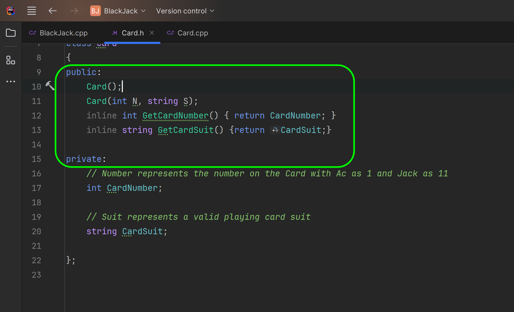

### Classes in CPP

[previous](../more-functions/README.md#user-content-more-with-functions) • [home](../README.md#user-content-ue5-cpp-functions--templates--classes) • [next](../)

In C++, a class is a user-defined data type that encapsulates data and functions (also called member variables and member functions) as its members whose access is governed by the three access specifiers private, protected or public. By default, access to members of a C++ class is private. The private members are not accessible outside the class; they can be accessed only through methods of the class. The public members form an interface to the class and are accessible outside the class.

The public interface is the api that accesses the members of the class and the private interface is the implementation of that class. So if the class returns the time the interface is to ask the time in a given time zone at a give point in time.  The implementation details of how that class determines the correct time is hidden from the rest of the program. 

 A class is a blueprint for creating objects, and an object is an instance of a class. Attributes and methods are basically variables and functions that belong to the class. These are often referred to as "class members". 

 

---

##### `Step 1.`\|`UECPPFTC`|:small_blue_diamond:

Press **File | Add | New Project...** and select a new **Empty Project** for **C++** and **Console**. Press the <kbd>Next</kbd> button.

##### `Step 2.`\|`UECPPFTC`|:small_blue_diamond: :small_blue_diamond: 

Call the new project you want to add to the solution `CardGame`. Keep it in the same directory as the solution file. Press the <kbd>Create</kbd> button.

##### `Step 3.`\|`UECPPFTC`|:small_blue_diamond: :small_blue_diamond: :small_blue_diamond:

Right click on the **Card Game** project and add a new **Class** called `Card`.  Press the <kbd>OK</kbd> button.

##### `Step 4.`\|`UECPPFTC`|:small_blue_diamond: :small_blue_diamond: :small_blue_diamond: :small_blue_diamond:

*Right click* on the project and add a new **Add | New Item...** and call it `Main.cpp`.

##### `Step 5.`\|`UECPPFTC`| :small_orange_diamond:

Now if you select **Card.h** you will see that there is a template to start with.

##### `Step 6.`\|`UECPPFTC`| :small_orange_diamond: :small_blue_diamond:

Lets start by adding the libraries that this class will need, for now it is just `iostream`.  We will also add the `using` keyword to make it quicker to type `cout` and `string`.

In a user defined class we need to initialize all the variables and functions. In C++, a class can have member variables and member functions, which are also called data members and methods. The access to these members is governed by the three access specifiers: private, protected, and public. By default, the access to members of a C++ class is private, which means that the private members can only be accessed through methods of the class. The public members, on the other hand, form an interface to the class and are accessible outside the class using the direct member access operator `.` with the object of that class. All the class members declared under public will be available to everyone, including other classes. The data members and member functions declared public can be accessed by other classes too. 

We typically seperate interface(public) from implementation (private/protected).  THe public members are the API we want other classes (or the main() function) to use to access this class.  

We will start by creating an `int Number;` to represent the number of a playing card with 1 meaning ace and 11 meaning Jack.  We will also create a `string Suit` to hold one of the four suits of playing cards (Clubs, Diamonds, Hearts, Spades).

Select the **File | Save** or <kbd>cntrl-c</kbd> to save the change.  

##### `Step 7.`\|`UECPPFTC`| :small_orange_diamond: :small_blue_diamond: :small_blue_diamond:

Now open up **Main.cpp**. We first need to include the libraries we need.  Now don't have to include `iostream` as when we include `"Card.h"`, this will also use its includes so we will get access to `iostream` through `"Card.h"`.  We will create a new **main()** function as it will be used when we run the project.  Create a new variable of type **Card**.  

In C++ the dot operator `.` is used to reference individual members of classes and is also known as the class member access operator. The dot operator is applied to the actual object, and it is used to access public members of a class.
Public members contain data members (variables) and member functions (class methods) of a class. The dot operator can only be used on objects, not on pointers.

So we can access the **Card** and **Suit** variables and define them in our CPP file.  We then print the results and you see that we have created an instance of the card class, adjusted its variables and sent them to the output stream.

We have created our first user defined class, created an instance of it and altered its public interface.

##### `Step 8.`\|`UECPPFTC`| :small_orange_diamond: :small_blue_diamond: :small_blue_diamond: :small_blue_diamond:

Now lets open up **Card.h** again and we don't want the card to be in the public open API.  Do we want someone using our card class just arbitrarilly change the value of a card?  I think once the card is assigned it should be fixed and not mutable.  So lets change the access to **Private**.

Now how do we create a read only interface so we can give the other class the value and suit of the card? 

In C++, a getter function is a member function of a class that is used to retrieve the value of a private member variable of that class. Since private member variables cannot be accessed outside the class, getter functions provide a way to access them indirectly. Getter functions are also known as accessor methods or simply getters.  To create a getter function in C++, a public member function is defined that returns the value of the private member variable
The function can have any name, but it is common to use a name that starts with "get" followed by the name of the member variable.

##### `Step 9.`\|`UECPPFTC`| :small_orange_diamond: :small_blue_diamond: :small_blue_diamond: :small_blue_diamond: :small_blue_diamond:

##### `Step 10.`\|`UECPPFTC`| :large_blue_diamond:

##### `Step 11.`\|`UECPPFTC`| :large_blue_diamond: :small_blue_diamond: 

##### `Step 12.`\|`UECPPFTC`| :large_blue_diamond: :small_blue_diamond: :small_blue_diamond: 

##### `Step 13.`\|`UECPPFTC`| :large_blue_diamond: :small_blue_diamond: :small_blue_diamond:  :small_blue_diamond: 

##### `Step 14.`\|`UECPPFTC`| :large_blue_diamond: :small_blue_diamond: :small_blue_diamond: :small_blue_diamond:  :small_blue_diamond: 

##### `Step 15.`\|`UECPPFTC`| :large_blue_diamond: :small_orange_diamond: 

##### `Step 16.`\|`UECPPFTC`| :large_blue_diamond: :small_orange_diamond:   :small_blue_diamond: 

##### `Step 17.`\|`UECPPFTC`| :large_blue_diamond: :small_orange_diamond: :small_blue_diamond: :small_blue_diamond:

##### `Step 18.`\|`UECPPFTC`| :large_blue_diamond: :small_orange_diamond: :small_blue_diamond: :small_blue_diamond: :small_blue_diamond:

##### `Step 19.`\|`UECPPFTC`| :large_blue_diamond: :small_orange_diamond: :small_blue_diamond: :small_blue_diamond: :small_blue_diamond: :small_blue_diamond:

##### `Step 20.`\|`UECPPFTC`| :large_blue_diamond: :large_blue_diamond:

##### `Step 21.`\|`UECPPFTC`| :large_blue_diamond: :large_blue_diamond: :small_blue_diamond:

<!--  -->

| [previous](../more-functions/README.md#user-content-more-with-functions)| [home](../README.md#user-content-ue5-cpp-functions--templates--classes) | [next](../)|
|---|---|---|
