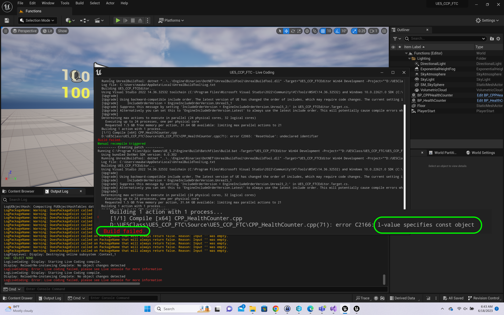

### const Keyword

<sub>[previous](../macros/README.md#user-content-macros--blueprints) • [home](../README.md#user-content-ue5-cpp-functions--templates--classes) • [next](../static-array/README.md#user-content-static-array)</sub>


In C++, the const keyword is used to specify that a variable's value is constant and cannot be modified. 

Declaring a variable as const means that its value cannot be changed once it has been initialized. A const variable in C++ needs to be initalized and assigned at the same time.

<br>

---

##### `Step 1.`\|`UECPPFTC`|:small_blue_diamond:

Load the **UE5_CPP_FTC** project and open the **CPP_HealthCounter.h** in **Visual Studio**. Now comment out our Macro and we will replace it with a more suitable **const** var.

```cpp
const int32 RESETHEALTH = 6000;
```

Please note, you should normally assign variables in the `.cpp` file and normally is done in the constructor.  But since constants need to be assigned and defined in place it is best to do it in the `.h`.


##### `Step 2.`\|`UECPPFTC`|:small_blue_diamond: :small_blue_diamond: 

Press the <kbd>Play</kbd> from **Visual Studio** button to launch the game from the debugger. Now we want to run Unreal from Visual Studio as it is designed to inegrate smoothly and allows us to use breakpoints and use the full set of debug tools.


##### `Step 3.`\|`UECPPFTC`|:small_blue_diamond: :small_blue_diamond: :small_blue_diamond:

Now we get the same result as before but it is using a **const** variable instead of a macro.


##### `Step 4.`\|`UECPPFTC`|:small_blue_diamond: :small_blue_diamond: :small_blue_diamond: :small_blue_diamond:

Lets prove that the constant is actually a constant.  Go to **ResetHealth** and add **ResetValue** at the bottom


##### `Step 5.`\|`UECPPFTC`| :small_orange_diamond:




##### `Step 6.`\|`UECPPFTC`| :small_orange_diamond: :small_blue_diamond:


##### `Step 7.`\|`UECPPFTC`| :small_orange_diamond: :small_blue_diamond: :small_blue_diamond:


<!--  -->


| [previous](../macros/README.md#user-content-macros--blueprints)| [home](../README.md#user-content-ue5-cpp-functions--templates--classes) | [next](../static-array/README.md#user-content-static-array)|
|---|---|---|
