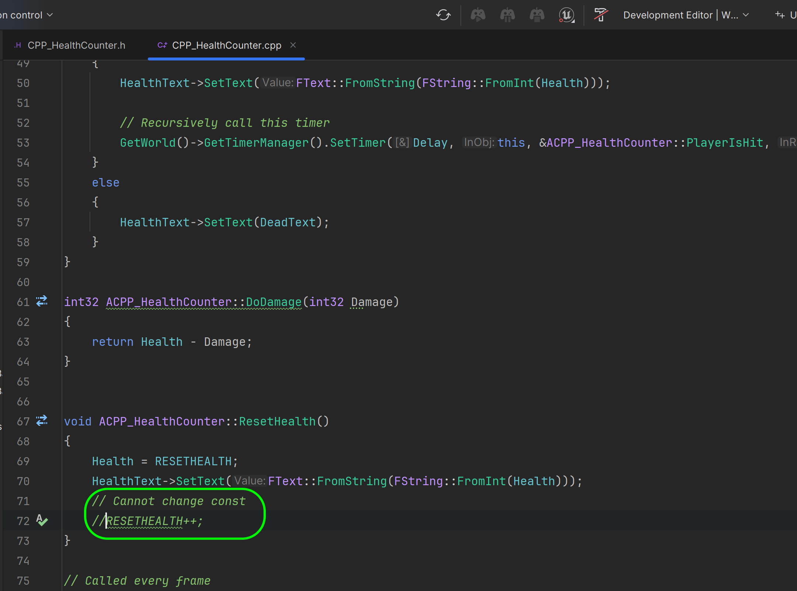

### const Keyword

[previous](../macros/README.md#user-content-macros--blueprints) • [home](../README.md#user-content-ue5-cpp-functions--templates--classes) • [next](../static-array/README.md#user-content-static-array)

In C++, the const keyword is used to specify that a variable's value is constant and cannot be modified. 

It can be used to declare constant variables, constant pointers, and constant member functions.

Declaring a variable as const means that its value cannot be changed once it has been initialized. 

 

---

##### `Step 1.`\|`UECPPFTC`|:small_blue_diamond:

##### `Step 2.`\|`UECPPFTC`|:small_blue_diamond: :small_blue_diamond: 

##### `Step 3.`\|`UECPPFTC`|:small_blue_diamond: :small_blue_diamond: :small_blue_diamond:

##### `Step 4.`\|`UECPPFTC`|:small_blue_diamond: :small_blue_diamond: :small_blue_diamond: :small_blue_diamond:

##### `Step 5.`\|`UECPPFTC`| :small_orange_diamond:

##### `Step 6.`\|`UECPPFTC`| :small_orange_diamond: :small_blue_diamond:

##### `Step 7.`\|`UECPPFTC`| :small_orange_diamond: :small_blue_diamond: :small_blue_diamond:

<!--  -->

| [previous](../macros/README.md#user-content-macros--blueprints)| [home](../README.md#user-content-ue5-cpp-functions--templates--classes) | [next](../static-array/README.md#user-content-static-array)|
|---|---|---|
