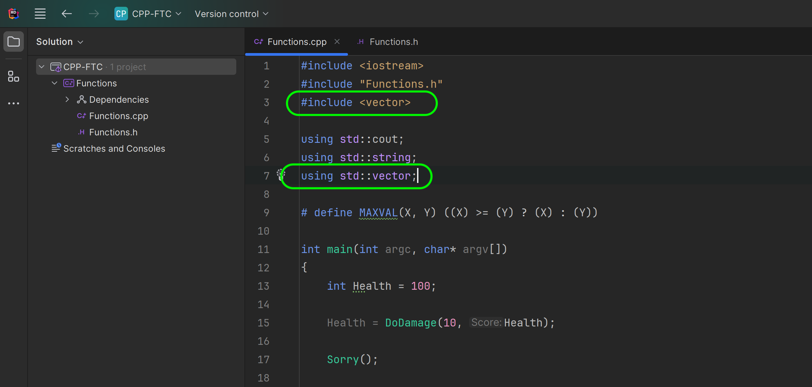
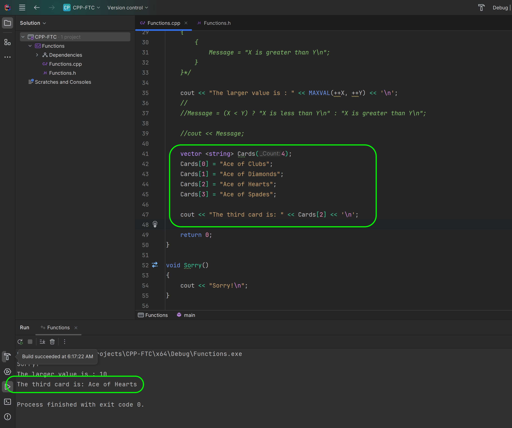
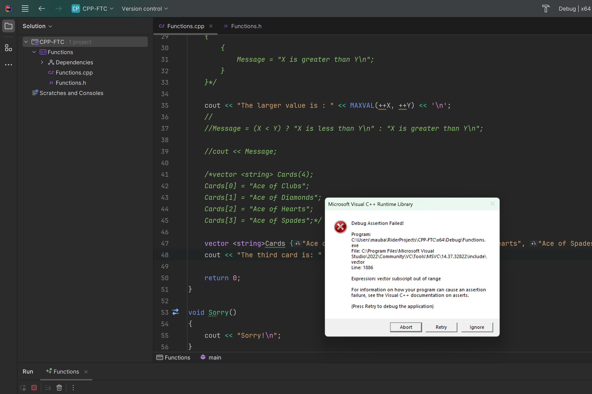
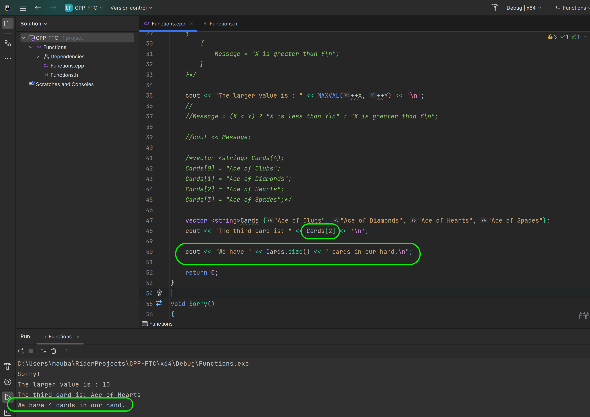
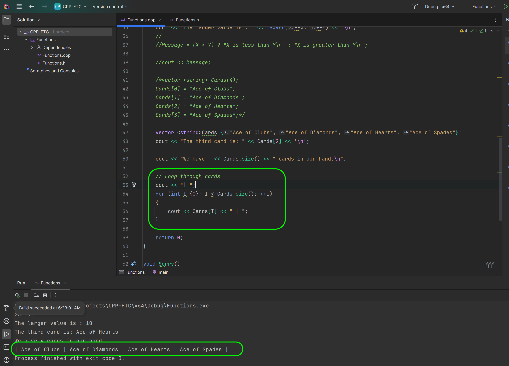
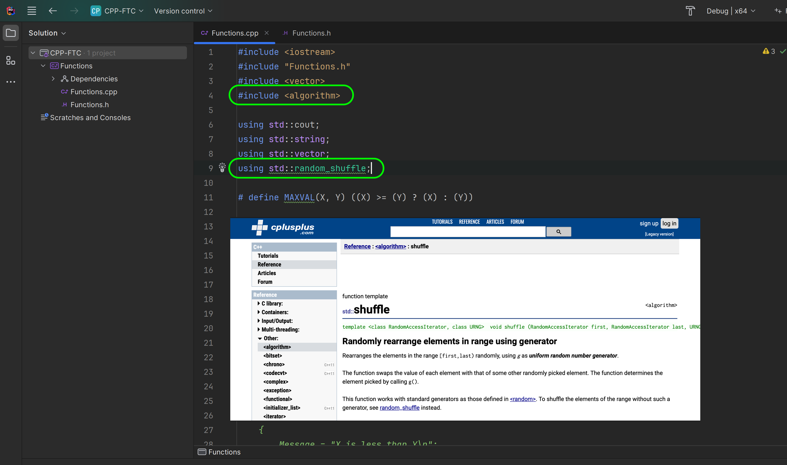
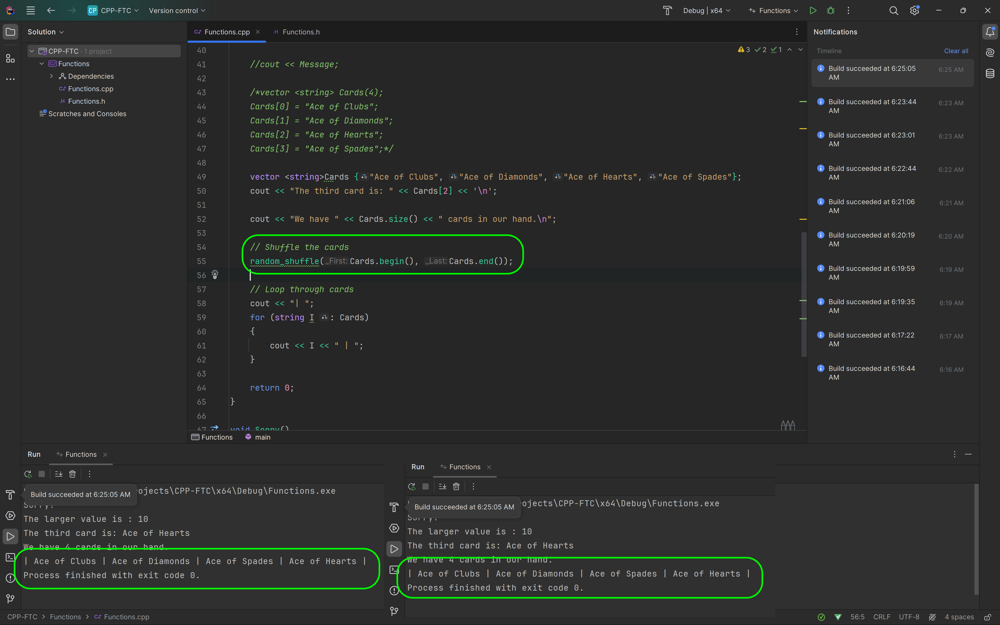
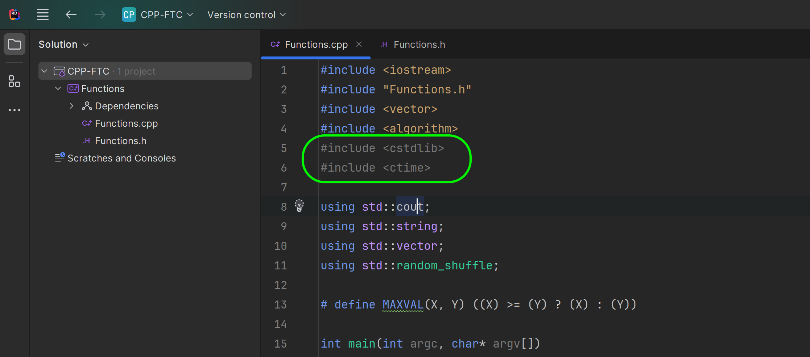

### Containers

<sub>[previous](../static-array/README.md#user-content-static-array) • [home](../README.md#user-content-ue5-cpp-functions--templates--classes) • [next](../)</sub>


C++ provides a variety of containers in the Standard Template Library (STL) that can be used to store and manipulate collections of objects. The containers are implemented as class templates, which allows great flexibility in the types supported as elements. The STL containers can be broadly classified into three categories: sequential containers, associative containers, and unordered associative containers.

Sequential containers allow us to store elements that can be accessed in sequential order. Internally, sequential containers are implemented as arrays or linked lists data structures. The following are the types of sequential containers in C++:

- `std::array`: Static contiguous array (class template)
- `std::vector`: Dynamic contiguous array (class template)
- `std::deque`: Double-ended queue (class template)
- `std::forward_list`: Singly-linked list (class template)
- `std::list`: Doubly-linked list (class template)

Associative containers implement sorted data structures that can be quickly searched (O(log n) complexity). The following are the types of associative containers in C++:

- `std::set`: Sorted set of unique keys (class template)
- `std::multiset`: Sorted set of keys with duplicates (class template)
- `std::map`: Sorted key-value pairs (class template)
- `std::multimap`: Sorted key-value pairs with duplicate keys (class template)

Unordered associative containers provide the unsorted versions of the associative container. The following are the types of unordered associative containers in C++:

- `std::unordered_set`: Unsorted set of unique keys (class template)
- `std::unordered_multiset`: Unsorted set of keys with duplicates (class template)
- `std::unordered_map`: Unsorted key-value pairs (class template)
- `std::unordered_multimap`: Unsorted key-value pairs with duplicate keys (class template)

Each container has its own set of member functions to access and manipulate its elements. Iterators are used to traverse the elements of a container. The elements of containers are accessed by using iterators, which have a common interface but each container defines its own specialized iterators.

<br>

---

##### `Step 1.`\|`UECPPFTC`|:small_blue_diamond:

Lets start with a dynamic contiguous array in the Standard Template Library (STL) called **Vector**.

A vector in C++ is a sequence container that represents an array that can change its size during runtime. It is a template class in the Standard Template Library (STL) of C++ programming language. Vectors are similar to dynamic arrays, but they have the ability to resize themselves automatically when an element is inserted or deleted. The storage of vector elements is handled automatically by the container, and the elements are placed in contiguous storage so that they can be accessed and traversed using iterators (pointers). In vectors, data is inserted at the end, and removing the last element is the most efficient.

Open up your **CPP_FTC** solution and open your **Function.cpp** file.Include the **vector** .h file from the STL.




##### `Step 2.`\|`UECPPFTC`|:small_blue_diamond: :small_blue_diamond: 

A template class has a different syntax than a static array.  We have the 

```cpp
// containerType<listType>(NumberOfStartingElements);
vector <string> Cards(4);
```

So we declare it in its unique way so it is a vector container with a list of 4 strings.  We then assign the strings in the same way we did with arrays.

Press the <kbd>Play</kbd> button and you see that [2] prints the third card.




##### `Step 3.`\|`UECPPFTC`|:small_blue_diamond: :small_blue_diamond: :small_blue_diamond:

You can also assign the vector container with a list of multiple items in `{}` such as `{"one", "two", "three}`.  Press the <kbd>Play</kbd> button and notice that it is the same as before but takes much less space in the file and is a bit easier to read.


##### `Step 4.`\|`UECPPFTC`|:small_blue_diamond: :small_blue_diamond: :small_blue_diamond: :small_blue_diamond:

Now just like arrays, you should not exceed the size of the area and try and access an item that does not exist.  If you change the item to `20` and press the Press the <kbd>Play</kbd> button, you will get an assertion.  Now this would allow you to write code to handle the assertion and potentially not crash.  If you press the <kbd>Ignore</kbd> button, then it goes and crashes just olike the array did prior.




##### `Step 5.`\|`UECPPFTC`| :small_orange_diamond:

Return the **Card** printed to `2` to get rid of the error next time around. Now we can also figure out how many items there are in the vector class using `vector::size()`.  [This method](https://cplusplus.com/reference/vector/vector/size/) returns the number of elements the vector class contains.

So now lets add a print out of how many cards are in the **Card** instance.  Press the <kbd>Play</kbd> button and you will notice that we have 4 cards.




##### `Step 6.`\|`UECPPFTC`| :small_orange_diamond: :small_blue_diamond:

Now with the **vector::size** method we can construct a **for loop** that allows us to go from the first item to the last item (notice that is is `<` and not `<=` as the first element is still `0`). We can then concatonate all the cards into a single line separated by spaces.

Press the <kbd>Play</kbd> button and see that it prints all four cards on the same line.




##### `Step 7.`\|`UECPPFTC`| :small_orange_diamond: :small_blue_diamond: :small_blue_diamond:

A range-based for loop is a C++11 feature that provides a more readable equivalent to the traditional for loop operating over a range of values, such as all elements in a container. Range-based for loops work with all standard container types as well as the ones included in **Unreal**, and they are just a shortcut for certain iterator operations

The syntax of a range-based for loop is for `( range_declaration : range_expression ) {//do somehting..}` loop_statement.

So in our case we will be adding:

```cpp
for (string I : Cards)
{
    //...
}
```

Press the <kbd>Play</kbd> button and now we are looping through them with a ranged loop and we disntiguish this by adding the `-` character between cards.


##### `Step 8.`\|`UECPPFTC`| :small_orange_diamond: :small_blue_diamond: :small_blue_diamond: :small_blue_diamond:

In the `.h` file we will add the `<algorithm>` header from stl. The <algorithm> library in C++ is part of the Standard Template Library (STL) and provides a set of functions for a variety of purposes, such as searching, sorting, counting, and manipulating data that operate on ranges of elements. The library contains over 100 algorithms that can be used with any container that provides iterators, including arrays, vectors, lists, maps, and sets. The algorithms are designed to be efficient, generic, and easy to use, and they can be used to simplify code, reduce the likelihood of errors, and improve the performance of programs.

The particular method we want to use is `random_shuffle`, which is a quick way of shuffling the order of any stl container that provides iterators like **vector**.





##### `Step 9.`\|`UECPPFTC`| :small_orange_diamond: :small_blue_diamond: :small_blue_diamond: :small_blue_diamond: :small_blue_diamond:

Now lets first shuffle the cards then use iterators (poiters, will explain in more detail later on) our final way of iterating through a four loop.  The `auto` type is generic and will accept any pointer type that the container contains (which could be any c++ class).  Don't worry if this doesn't make too much sense yet.

Press the <kbd>Play</kbd> button multiple times and the vector of cards is always in the same position so the shuffle doesn't appear to be random?




##### `Step 10.`\|`UECPPFTC`| :large_blue_diamond:

We have the correct behavior as we are not changing the random see in a pseudorandom number generator (PRNG).  A PRNG is a computer algorithm that generates a sequence of numbers that look random, but are actually deterministic and repricable. 

Here are some key characteristics of PRNGs:
- **Seed state**: A PRNG starts from an arbitrary starting state using a seed state. Many numbers are generated in a short time and can also be reproduced later, if the starting point in the sequence is known.
- **Deterministic**: PRNGs are deterministic, meaning that given the same seed state, they will always produce the same sequence of numbers[1][3].
- **Efficient**: PRNGs are efficient at generating large numbers of random-like values

So we need to update the random see based on time.  So we will import `cstdlib` and `ctime` into the `.h` file.




##### `Step 11.`\|`UECPPFTC`| :large_blue_diamond: :small_blue_diamond: 

Now back in the `CPP` before we shuffle we will change the seed based on the currect time in milliseconds, so we will not have the same seed twice when running the game. Press the <kbd>Play</kbd> button and notice that the order is different each time. So by updating the seed we make the number look truly random (though it is still deterministic, we will get the same order with the same seed)


##### `Step 12.`\|`UECPPFTC`| :large_blue_diamond: :small_blue_diamond: :small_blue_diamond: 

Now since this is a dynamic container we can make changes to the size even at runtime.  So if it was keeping track of enemies spawning in, we can do this at runtime.  The **Push_Back** method 


##### `Step 13.`\|`UECPPFTC`| :large_blue_diamond: :small_blue_diamond: :small_blue_diamond:  :small_blue_diamond: 


##### `Step 14.`\|`UECPPFTC`| :large_blue_diamond: :small_blue_diamond: :small_blue_diamond: :small_blue_diamond:  :small_blue_diamond: 


##### `Step 15.`\|`UECPPFTC`| :large_blue_diamond: :small_orange_diamond: 


##### `Step 16.`\|`UECPPFTC`| :large_blue_diamond: :small_orange_diamond:   :small_blue_diamond: 


##### `Step 17.`\|`UECPPFTC`| :large_blue_diamond: :small_orange_diamond: :small_blue_diamond: :small_blue_diamond:


##### `Step 18.`\|`UECPPFTC`| :large_blue_diamond: :small_orange_diamond: :small_blue_diamond: :small_blue_diamond: :small_blue_diamond:


##### `Step 19.`\|`UECPPFTC`| :large_blue_diamond: :small_orange_diamond: :small_blue_diamond: :small_blue_diamond: :small_blue_diamond: :small_blue_diamond:


##### `Step 20.`\|`UECPPFTC`| :large_blue_diamond: :large_blue_diamond:


##### `Step 21.`\|`UECPPFTC`| :large_blue_diamond: :large_blue_diamond: :small_blue_diamond:


<!--  -->


| [previous](../static-array/README.md#user-content-static-array)| [home](../README.md#user-content-ue5-cpp-functions--templates--classes) | [next](../)|
|---|---|---|
