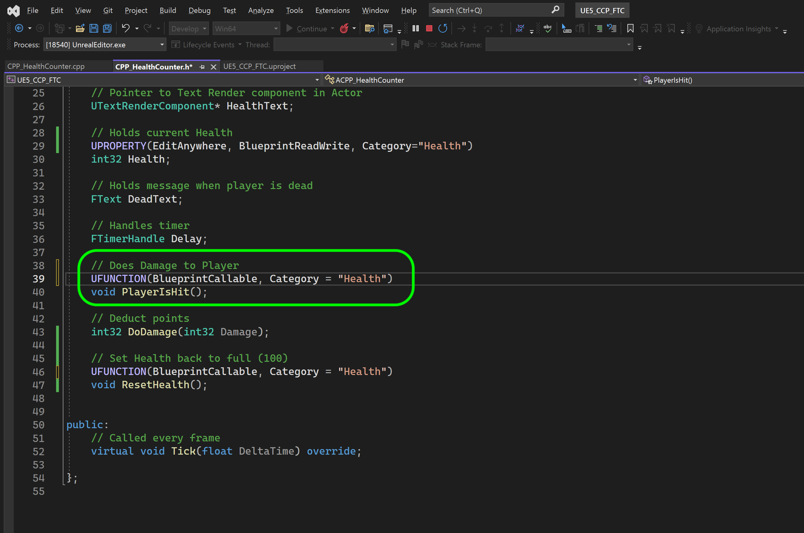

### Macros & Blueprints

[previous](../unreal-cpp-functions-ii/README.md#user-content-unreal-cpp-functions-ii) • [home](../README.md#user-content-ue5-cpp-functions--templates--classes) • [next](../)

Macros in C++ are different than Macros in blueprints.  We will cover blueprint Macros later.  But since we were using macros for UPROPERTY and UFUNCTION it would be good to explain what these are. 

In C++, a macro is a piece of code that is replaced by the value of the macro. Macros are defined using the #define directive. 

Whenever the compiler encounters a macro name, it replaces the name with the definition of the macro. Macro definitions need not be terminated by a semicolon.

There are three types of macros in C++: object-like macros, function-like macros, and predefined macros. We will be looking at object and function-like Macros.

A [macro](http://www.cplusplus.com/doc/tutorial/preprocessor/) is a preprocessor directive that is preceded by a hash sign `#`.  These lines are resolved by the pre processor before the compilation begins.  These do not resolve at rutime.

Lets add a restart so that when the health gets to 0 it resets to a new value (just for testing) `400`.  We will do this initially by using Macros.

One of the issues with Macros is that they are global in scope.

 

---

##### `Step 1.`\|`UECPPFTC`|:small_blue_diamond:

Object-like macros are defined as simple identifiers that are replaced by a code fragment. They look like an object in code and are called object-like macros. 

They are global in scope and can be accessed anywhere.  So lets open up **HealthCOunter.h** and add a Macro before the class definition.

It's worth noting that using macros to define global variables can introduce unexpected behavior, especially since macros have global scope. It's generally recommended to use other methods, such as declaring the variable outside of any function, to define global variables in C++.

It is a common style in C++ to have all MACROS (and global objects, variables and functions) in all caps.

##### `Step 2.`\|`UECPPFTC`|:small_blue_diamond: :small_blue_diamond: 

##### `Step 3.`\|`UECPPFTC`|:small_blue_diamond: :small_blue_diamond: :small_blue_diamond:

##### `Step 4.`\|`UECPPFTC`|:small_blue_diamond: :small_blue_diamond: :small_blue_diamond: :small_blue_diamond:

##### `Step 5.`\|`UECPPFTC`| :small_orange_diamond:

##### `Step 6.`\|`UECPPFTC`| :small_orange_diamond: :small_blue_diamond:

##### `Step 7.`\|`UECPPFTC`| :small_orange_diamond: :small_blue_diamond: :small_blue_diamond:

##### `Step 8.`\|`UECPPFTC`| :small_orange_diamond: :small_blue_diamond: :small_blue_diamond: :small_blue_diamond:

##### `Step 9.`\|`UECPPFTC`| :small_orange_diamond: :small_blue_diamond: :small_blue_diamond: :small_blue_diamond: :small_blue_diamond:

##### `Step 10.`\|`UECPPFTC`| :large_blue_diamond:

##### `Step 11.`\|`UECPPFTC`| :large_blue_diamond: :small_blue_diamond: 

##### `Step 12.`\|`UECPPFTC`| :large_blue_diamond: :small_blue_diamond: :small_blue_diamond: 

##### `Step 13.`\|`UECPPFTC`| :large_blue_diamond: :small_blue_diamond: :small_blue_diamond:  :small_blue_diamond: 

##### `Step 14.`\|`UECPPFTC`| :large_blue_diamond: :small_blue_diamond: :small_blue_diamond: :small_blue_diamond:  :small_blue_diamond: 

##### `Step 15.`\|`UECPPFTC`| :large_blue_diamond: :small_orange_diamond: 

##### `Step 16.`\|`UECPPFTC`| :large_blue_diamond: :small_orange_diamond:   :small_blue_diamond: 

##### `Step 17.`\|`UECPPFTC`| :large_blue_diamond: :small_orange_diamond: :small_blue_diamond: :small_blue_diamond:

##### `Step 18.`\|`UECPPFTC`| :large_blue_diamond: :small_orange_diamond: :small_blue_diamond: :small_blue_diamond: :small_blue_diamond:

##### `Step 19.`\|`UECPPFTC`| :large_blue_diamond: :small_orange_diamond: :small_blue_diamond: :small_blue_diamond: :small_blue_diamond: :small_blue_diamond:

##### `Step 20.`\|`UECPPFTC`| :large_blue_diamond: :large_blue_diamond:

##### `Step 21.`\|`UECPPFTC`| :large_blue_diamond: :large_blue_diamond: :small_blue_diamond:

<!--  -->

| [previous](../unreal-cpp-functions-ii/README.md#user-content-unreal-cpp-functions-ii)| [home](../README.md#user-content-ue5-cpp-functions--templates--classes) | [next](../)|
|---|---|---|
