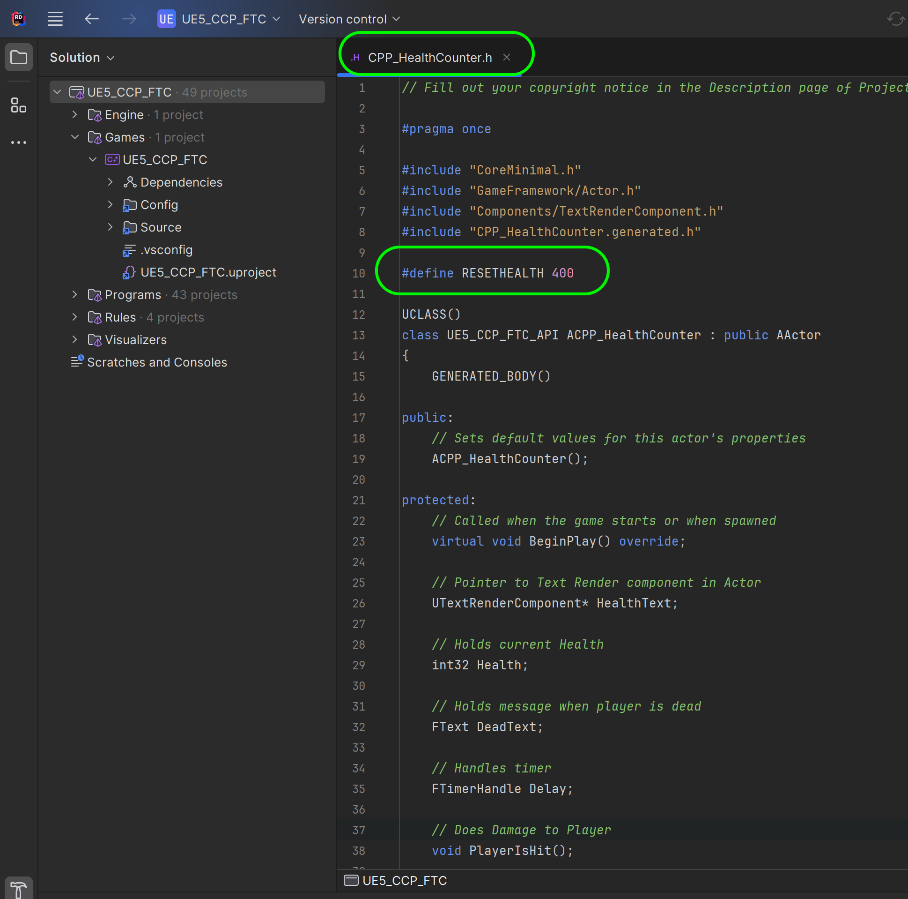
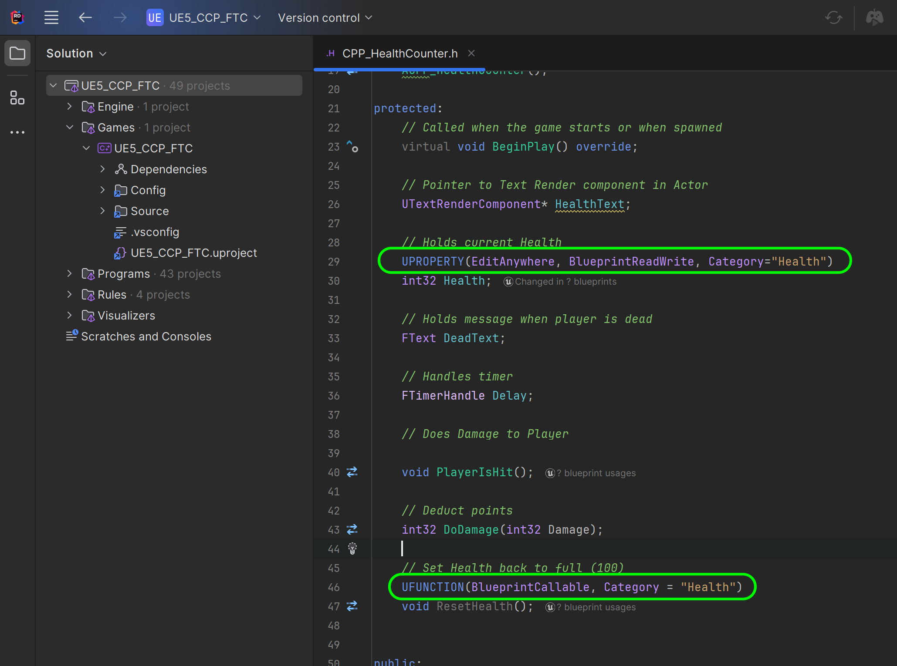
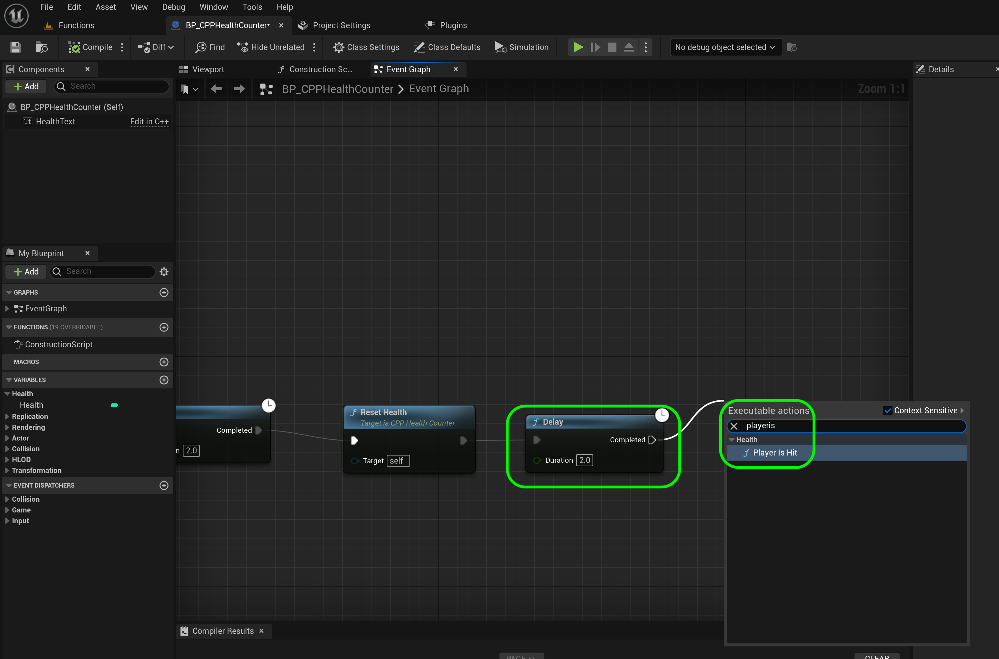
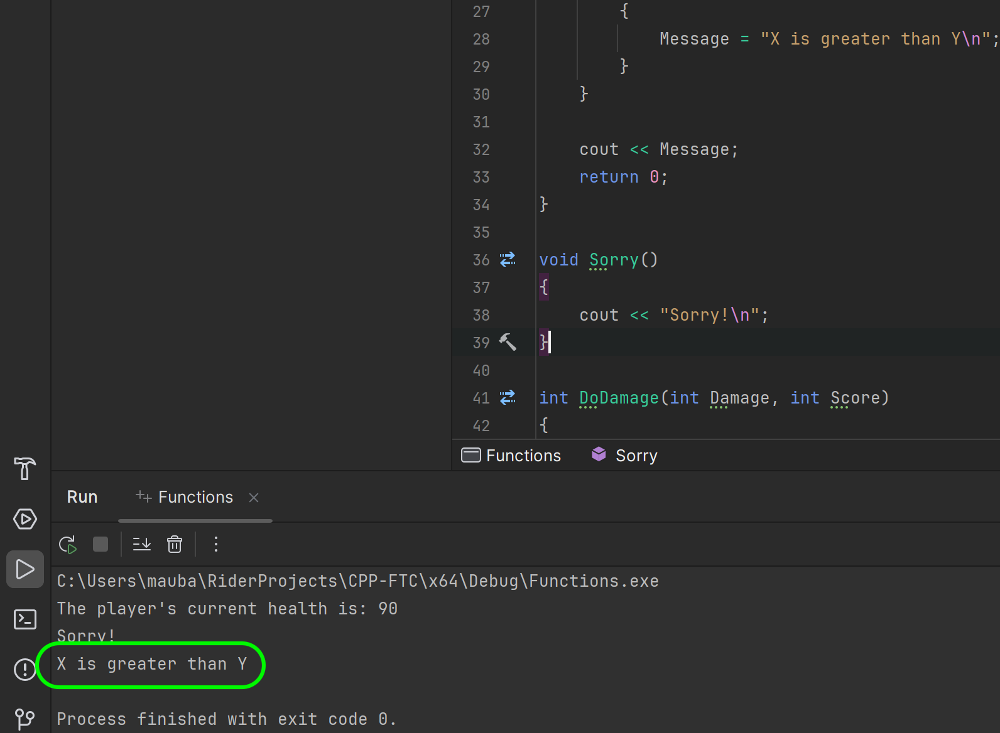
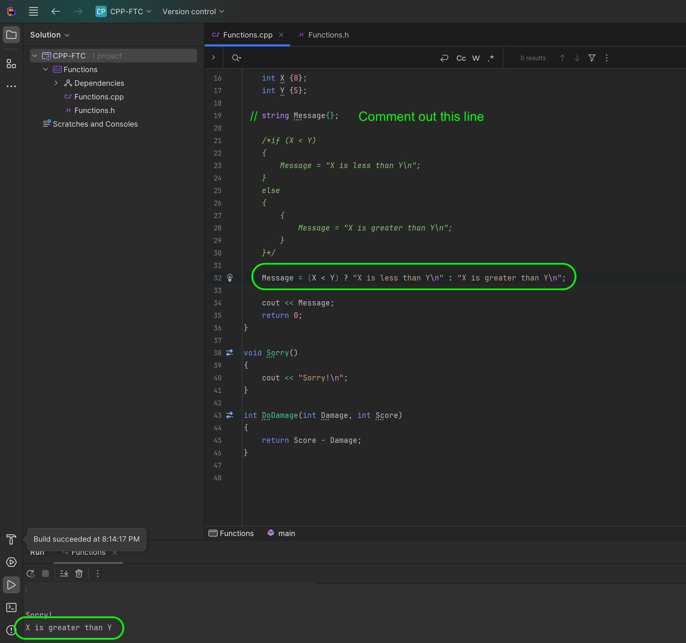

### Macros & Blueprints

[previous](../unreal-cpp-functions-ii/README.md#user-content-unreal-cpp-functions-ii) • [home](../README.md#user-content-ue5-cpp-functions--templates--classes) • [next](../const/README.md#user-content-const-keyword)

Macros in C++ are different than Macros in blueprints.  We will cover blueprint Macros later.  But since we were using macros for UPROPERTY and UFUNCTION it would be good to explain what these are. 

In C++, a macro is a piece of code that is replaced by the value of the macro. Macros are defined using the #define directive. 

Whenever the compiler encounters a macro name, it replaces the name with the definition of the macro. Macro definitions need not be terminated by a semicolon.

There are three types of macros in C++: object-like macros, function-like macros, and predefined macros. We will be looking at object and function-like Macros.

A [macro](http://www.cplusplus.com/doc/tutorial/preprocessor/) is a preprocessor directive that is preceded by a hash sign `#`.  These lines are resolved by the pre processor before the compilation begins.  These do not resolve at rutime.

Lets add a restart so that when the health gets to 0 it resets to a new value (just for testing) `400`.  We will do this initially by using Macros.

One of the issues with Macros is that they are global in scope.

 

---

##### `Step 1.`\|`UECPPFTC`|:small_blue_diamond:

Object-like macros are defined as simple identifiers that are replaced by a code fragment. They look like an object in code and are called object-like macros. 

They are global in scope and can be accessed anywhere.  So lets open up **HealthCOunter.h** and add a Macro before the class definition.

It's worth noting that using macros to define global variables can introduce unexpected behavior, especially since macros have global scope. It's generally recommended to use other methods, such as declaring the variable outside of any function, to define global variables in C++.

It is a common style in C++ to have all MACROS (and global objects, variables and functions) in all caps.

So in the case below the pre procesor with replace RESETHEALTH with `400`.

##### `Step 2.`\|`UECPPFTC`|:small_blue_diamond: :small_blue_diamond: 

Unreal uses function-like macros to include both variables (*UPROPERTY()*) macro and functions (*UFUNCTION()*) in blueprints. Without these pre-processor macro directives these class variables and functions will not be accessible inside of lueprints.

Unreal calls this a [Property Specifier](https://docs.unrealengine.com/4.26/en-US/ProgrammingAndScripting/GameplayArchitecture/Properties/Specifiers/).

So we want to expose **Health** to the blueprint so we will include it as a **UPROPERTY()**.

`UPROPERTY(EditAnywhere, BlueprintReadWrite, Category="Health")`

The first parameter **EditAnywhere** is *Indicates that this property can be edited by property windows, on archetypes and instances.*. The second specifier is **BlueprintReadWrte** which allows the variable to be read or written from a Blueprint. This Specifier is incompatible with the BlueprintReadOnly Specifier.

The last ia a **Categor** which specifies the category of the property when displayed in Blueprint editing tools. 

Lets create a new function that resets the **Health** variable and calls the MACRO we defined above.  On top of that we nee to add what Unreal calls function macros [Function Specifiers](https://docs.unrealengine.com/4.26/en-US/ProgrammingAndScripting/GameplayArchitecture/Functions/Specifiers/). In our case we want to be able to call **PlayerIsHit** from the blueprint so we will add:

`UFUNCTION(BlueprintCallable, Category="Health")`.

The first parameter **BlueprintCallable** does what it says and allows the function can be executed in a Blueprint or Level Blueprint graph.  

Please note that functions and property specifiers only affect the single function or property below it.  Each function and property needs its own specifier.

##### `Step 3.`\|`UECPPFTC`|:small_blue_diamond: :small_blue_diamond: :small_blue_diamond:

Next to the function definition click on the paint brush button and select **Create definition of `ResetHealth` in HealthCounter.cpp**.

Then you just assign our **RESETHEALTH** macro to the **Health** variable.  Then we set the **Text** component to reflect this change to the **Health** variable.

##### `Step 4.`\|`UECPPFTC`|:small_blue_diamond: :small_blue_diamond: :small_blue_diamond: :small_blue_diamond:

Now previously we used a C++ class directly in the level.  To access it as a **Blueprint** we can also inherit from the C++ parent class and create a blueprint from it.  Go to **C++ Classes | UE5_CPP_FTC** and right click on **CPP_HealthCounter** and select **Create Blueprint class based on CPP_HealthCounter**.

##### `Step 5.`\|`UECPPFTC`| :small_orange_diamond:

Call it `BP_CPPHealthCounter` and seave it in the **Blueprints** folder and press the <kbd>Create Blueprint Class</kbd> button to add a new blueprint to the project.

##### `Step 6.`\|`UECPPFTC`| :small_orange_diamond: :small_blue_diamond:

Now delete the old **CPP_HealthCounter** and replace it with the new **BP_HealthCounter** in your **Functions** level.

##### `Step 7.`\|`UECPPFTC`| :small_orange_diamond: :small_blue_diamond: :small_blue_diamond:

Now since we had the function specifier we now see a **Health** variable in the blueprint under **Health**.  If you don't see it, reboot the game as this only updates at run time when linking the code.

Drag a **Get Health** getter to the blueprint graph in the **Event Graph**.

##### `Step 8.`\|`UECPPFTC`| :small_orange_diamond: :small_blue_diamond: :small_blue_diamond: :small_blue_diamond:

Add a **<** less than node and connect it to **Health** leaving the bottom float to be `0`.  Then connect this to a **Branch** node (acts like an if statement) so we can call our new reset function if it passes.

##### `Step 9.`\|`UECPPFTC`| :small_orange_diamond: :small_blue_diamond: :small_blue_diamond: :small_blue_diamond: :small_blue_diamond:

Now lets try calling a function that we did not have a function specifier created.  Try calling **DoDamage** in the blueprint but it is not found.

##### `Step 10.`\|`UECPPFTC`| :large_blue_diamond:

So instead a a **Delay** node and set it to `2.0` seconds and call **ResetHealth**.  Now this appears as we have a **UFUNCTION** specifier that allows blueprints to call this function.

##### `Step 11.`\|`UECPPFTC`| :large_blue_diamond: :small_blue_diamond: 

Now we will reset the health variable but it will no longer call **PlayerIsHit()**.  We need to call this again in the blueprint.  So go back to the C++ `.h` file and add a function specifier.

](images/playerIsHitMacro.png)

##### `Step 12.`\|`UECPPFTC`| :large_blue_diamond: :small_blue_diamond: :small_blue_diamond: 

Now we can add another **Delay** node set to `2.0` seconds and then call **PlayerIsHit**.

##### `Step 13.`\|`UECPPFTC`| :large_blue_diamond: :small_blue_diamond: :small_blue_diamond:  :small_blue_diamond: 

Select the **File | Save All** menu item to save all your work.

##### `Step 14.`\|`UECPPFTC`| :large_blue_diamond: :small_blue_diamond: :small_blue_diamond: :small_blue_diamond:  :small_blue_diamond: 

Press the <kbd>Play</kbd> button and now after you die it resets and starts with the new health value of 400 that was set in the MACRO.

https://github.com/maubanel/UE5-CPP-Functions-Templates-Classes/assets/5504953/ecfb7ecf-906a-47b3-a053-20cc374920bb

##### `Step 15.`\|`UECPPFTC`| :large_blue_diamond: :small_orange_diamond: 

##### `Step 16.`\|`UECPPFTC`| :large_blue_diamond: :small_orange_diamond:   :small_blue_diamond: 

##### `Step 17.`\|`UECPPFTC`| :large_blue_diamond: :small_orange_diamond: :small_blue_diamond: :small_blue_diamond:

##### `Step 18.`\|`UECPPFTC`| :large_blue_diamond: :small_orange_diamond: :small_blue_diamond: :small_blue_diamond: :small_blue_diamond:

##### `Step 19.`\|`UECPPFTC`| :large_blue_diamond: :small_orange_diamond: :small_blue_diamond: :small_blue_diamond: :small_blue_diamond: :small_blue_diamond:

##### `Step 20.`\|`UECPPFTC`| :large_blue_diamond: :large_blue_diamond:

##### `Step 21.`\|`UECPPFTC`| :large_blue_diamond: :large_blue_diamond: :small_blue_diamond:

<!--  -->

| [previous](../unreal-cpp-functions-ii/README.md#user-content-unreal-cpp-functions-ii)| [home](../README.md#user-content-ue5-cpp-functions--templates--classes) | [next](../const/README.md#user-content-const-keyword)|
|---|---|---|
