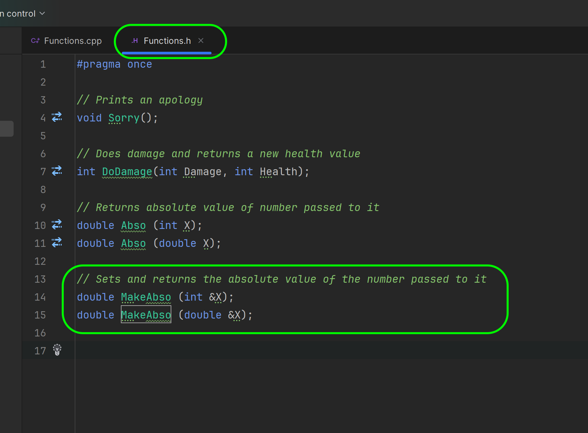

### More with Functions

<sub>[previous](../containers/README.md#user-content-containers) • [home](../README.md#user-content-ue5-cpp-functions--templates--classes) • [next](../)</sub>


Lets take a close look at **Functions** in C++.  

<br>

---

##### `Step 1.`\|`UECPPFTC`|:small_blue_diamond:

Re-open **CPP_FTC** solution and pick **Functions.h** and lets add a new function called `Abso`. This function will return type **double** and take an integer parameter.  This will return an absolute value to the integer passed (so it is always a positive number -5 would be become 5).


##### `Step 2.`\|`UECPPFTC`|:small_blue_diamond: :small_blue_diamond: 

Now click on the paintbrush next to the function declaration and select **Create definition of `Abso` in Function.cpp**.  This will give you a compilable start to the function definition.


##### `Step 3.`\|`UECPPFTC`|:small_blue_diamond: :small_blue_diamond: :small_blue_diamond:

Open up the `.cpp` file and lets define **Abso()**.  We will check to see if value is positive,and if so just return the integer and if it is negative return the opposite sign (--X == +X). Then in the **main()** function call this new method.

Press the <kbd>Play</kbd> button and notice that if we pass `-15` we get `15` back!


##### `Step 4.`\|`UECPPFTC`|:small_blue_diamond: :small_blue_diamond: :small_blue_diamond: :small_blue_diamond:

If we send a double to the function by parameter it will cast it to an integer and we will get a truncated double back so `-15.7` becomes `15`. How can we accomplish this objective?


##### `Step 5.`\|`UECPPFTC`| :small_orange_diamond:

We can overload a function (a feature of C++) that allows multiple functions to have the same name but different parametersIn function overloading, the function name should be the same but the arguments should be different. Function overloading can be considered an example of a polymorphism feature in C++. Overloaded functions are those that belong to a class but have more than one instance with the same name but different parameters.

So in our case we can overload **Abso()** with a different parameter type. Open up the `.h` file and we will use the same return type, and the same name but a different parameter type.  In this case we will pass a double. It will be up to the program to pick the most appropriate version of the function based on the parameter given.


##### `Step 6.`\|`UECPPFTC`| :small_orange_diamond: :small_blue_diamond:

Now we have to define this new function in the `.cpp` file.  Now the code is the same as the math is identical.

Now when we Press the <kbd>Play</kbd> button, the program picks the overloaded function and does this math on the double parameter, preserving the fractional number.


##### `Step 7.`\|`UECPPFTC`| :small_orange_diamond: :small_blue_diamond: :small_blue_diamond:

When we call a function what is happening to that data?  When we pass the integer as we have in our two examples we are passing it by value. This is a method of passing arguments to a function in C++ where the actual value of an argument is copied into the parameter of the function. In this method, changes made to the parameter inside the function have no effect on the argument. Pass by value is the default argument passing technique for all data types in a C++ program except arrays.

Lets confirm this.  Notice that I have in the function actually changed the parameter:

```cpp
return X = X (X > 0) ? X : -X;
```

This effectively does nothing as this parameter we changed will be removed from the stack when the function ends and will have no effect. So in **main()** create a `Num` variable and set it to `-15.7`.  Now we can pass it to the **Abso** function then print Num after.  Lets see if the function changed the **Num** variable or made a copy and left it unchanged.

Press the <kbd>Play</kbd> button and notice that it is unchanged and is still a negative number!


##### `Step 8.`\|`UECPPFTC`| :small_orange_diamond: :small_blue_diamond: :small_blue_diamond: :small_blue_diamond:

Is there a way to pass a value to a function and have it actually change the passed value?

Pass by reference is a method of passing arguments to a function in C++ where the reference of an argument is copied into the formal parameter of the function. In this case, changes made to the parameter inside the function affect the argument. Pass by reference is useful when the function needs to modify the value of the argument or when the argument is large and copying it would be inefficient. To pass an argument by reference, the function parameter must be declared as a reference type using the `&` operator. When a reference is used to pass an argument, the memory location of the passed variable and parameter is the same, so any changes made to the parameter also reflect in the variable inside its parent function. Pass by reference is more efficient than pass by value because it avoids copying the argument and instead directly works with the original variable. 

Return to the `.h` file and change the parameter type to pass by reference by adding the `&` operator in front of the parameter name passed so `X` becomes `&X` and this will now pass by reference.




##### `Step 9.`\|`UECPPFTC`| :small_orange_diamond: :small_blue_diamond: :small_blue_diamond: :small_blue_diamond: :small_blue_diamond:


##### `Step 10.`\|`UECPPFTC`| :large_blue_diamond:


##### `Step 11.`\|`UECPPFTC`| :large_blue_diamond: :small_blue_diamond: 
However, pass by reference can be dangerous if the function modifies the argument in unexpected ways or if the reference is not properly initialized.


##### `Step 12.`\|`UECPPFTC`| :large_blue_diamond: :small_blue_diamond: :small_blue_diamond: 


##### `Step 13.`\|`UECPPFTC`| :large_blue_diamond: :small_blue_diamond: :small_blue_diamond:  :small_blue_diamond: 


##### `Step 14.`\|`UECPPFTC`| :large_blue_diamond: :small_blue_diamond: :small_blue_diamond: :small_blue_diamond:  :small_blue_diamond: 


##### `Step 15.`\|`UECPPFTC`| :large_blue_diamond: :small_orange_diamond: 


##### `Step 16.`\|`UECPPFTC`| :large_blue_diamond: :small_orange_diamond:   :small_blue_diamond: 


##### `Step 17.`\|`UECPPFTC`| :large_blue_diamond: :small_orange_diamond: :small_blue_diamond: :small_blue_diamond:


##### `Step 18.`\|`UECPPFTC`| :large_blue_diamond: :small_orange_diamond: :small_blue_diamond: :small_blue_diamond: :small_blue_diamond:


##### `Step 19.`\|`UECPPFTC`| :large_blue_diamond: :small_orange_diamond: :small_blue_diamond: :small_blue_diamond: :small_blue_diamond: :small_blue_diamond:


##### `Step 20.`\|`UECPPFTC`| :large_blue_diamond: :large_blue_diamond:


##### `Step 21.`\|`UECPPFTC`| :large_blue_diamond: :large_blue_diamond: :small_blue_diamond:


<!--  -->


| [previous](../containers/README.md#user-content-containers)| [home](../README.md#user-content-ue5-cpp-functions--templates--classes) | [next](../)|
|---|---|---|
