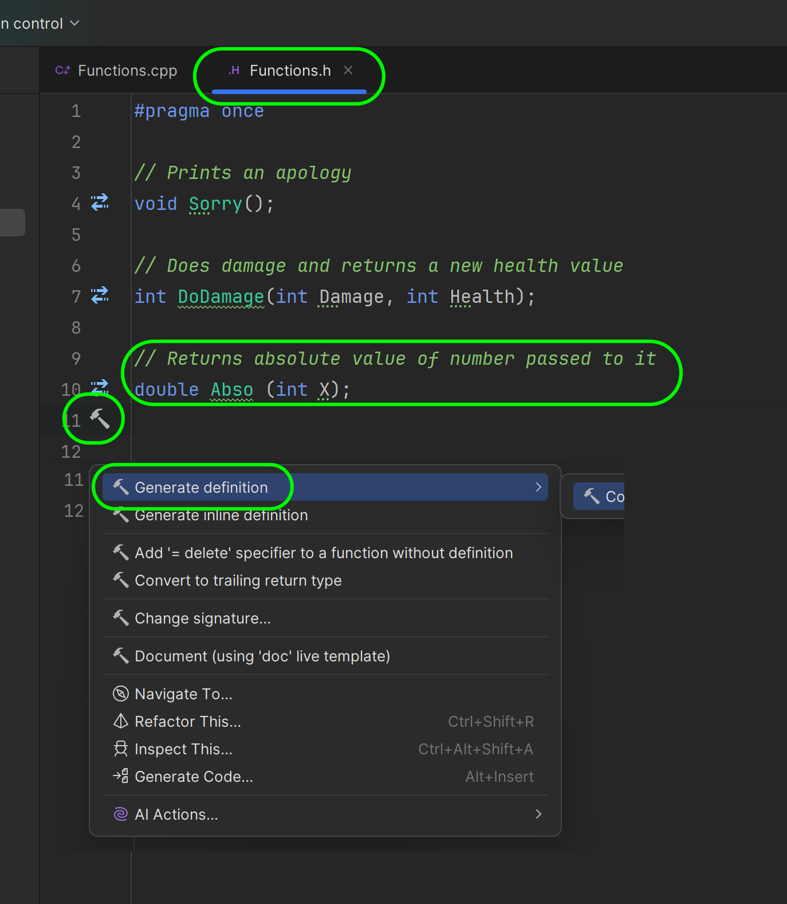
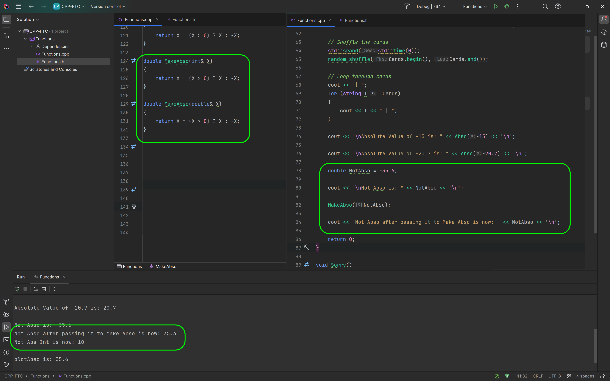
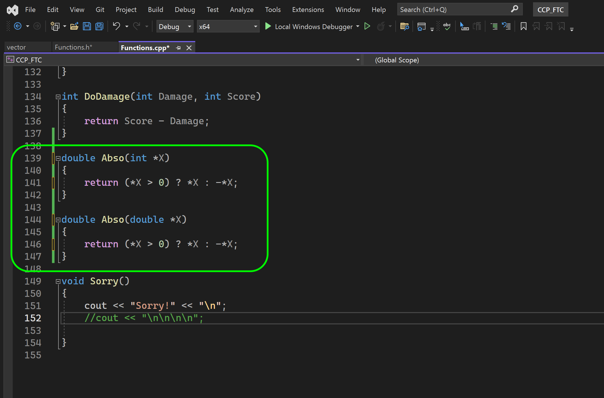
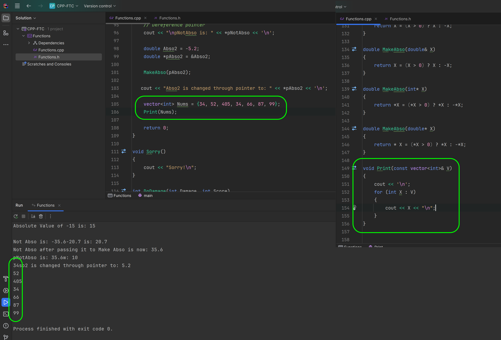
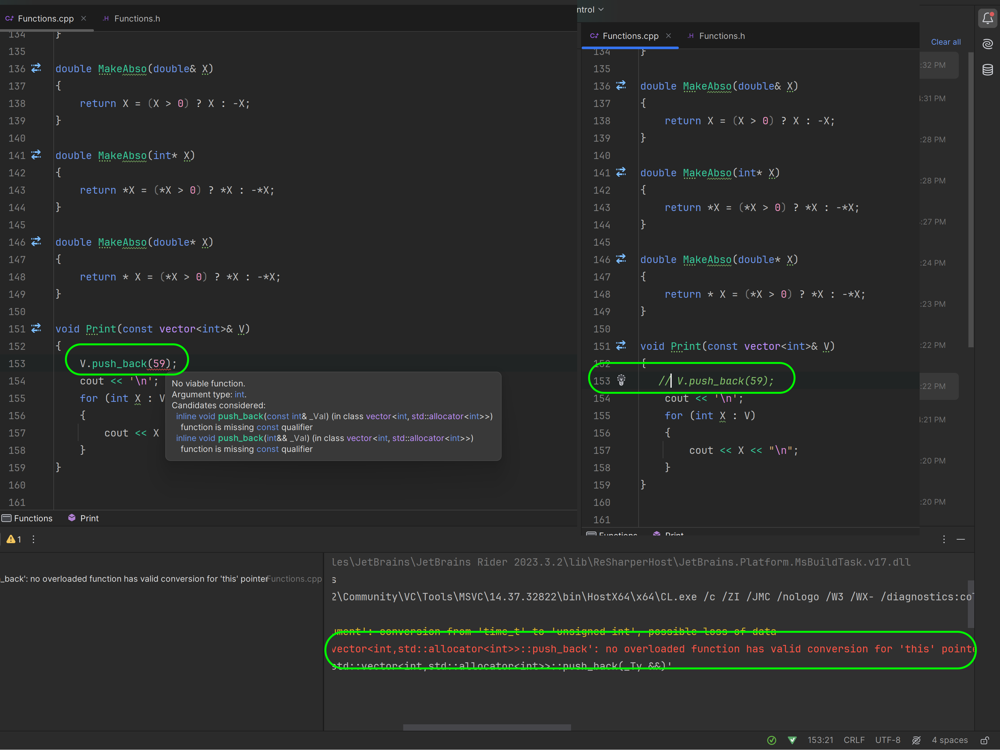
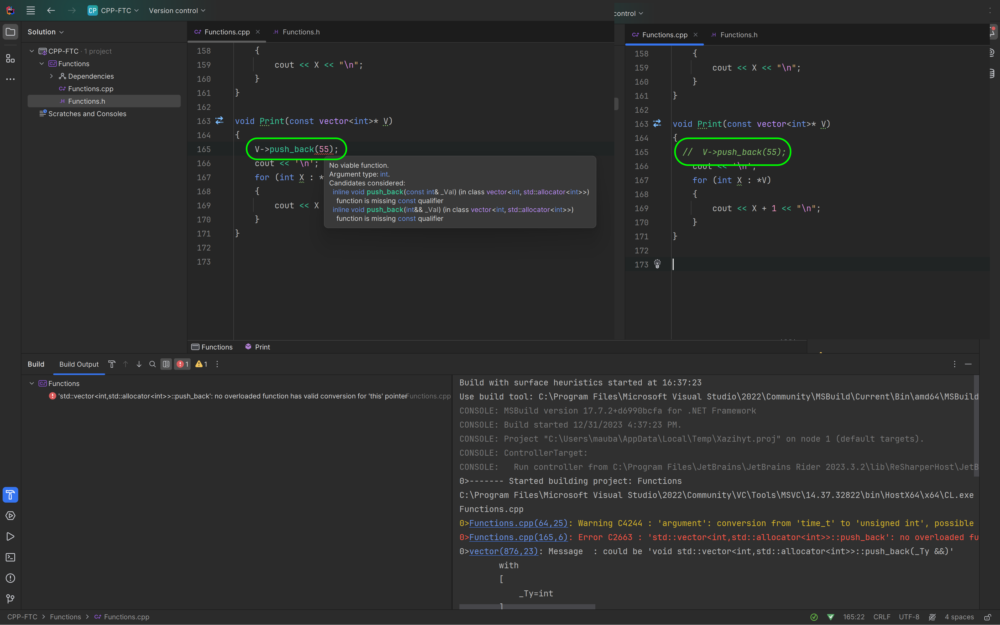

### More with Functions

<sub>[previous](../containers/README.md#user-content-containers) • [home](../README.md#user-content-ue5-cpp-functions--templates--classes) • [next](../classes-cpp/README.md#user-content-classes-in-cpp)</sub>


Lets take a close look at **Functions** in C++.  

<br>

---

##### `Step 1.`\|`UECPPFTC`|:small_blue_diamond:

Re-open **CPP_FTC** solution and pick **Functions.h** and lets add a new function called `Abso`. This function will return type **double** and take an integer parameter.  This will return an absolute value to the integer passed (so it is always a positive number -5 would be become 5).

Now click on the hammer next to the function declaration and select **Create definition of `Abso` in Function.cpp**.




##### `Step 2.`\|`UECPPFTC`|:small_blue_diamond: :small_blue_diamond: 

This will give you a starting point for the function definition.


##### `Step 3.`\|`UECPPFTC`|:small_blue_diamond: :small_blue_diamond: :small_blue_diamond:

Open up the `.cpp` file and lets define **Abso()**.  We will check to see if value is positive,and if so just return the integer and if it is negative return the opposite sign (--X == +X). Then in the **main()** function call this new method.

Press the <kbd>Play</kbd> button and notice that if we pass `-15` we get `15` back!


##### `Step 4.`\|`UECPPFTC`|:small_blue_diamond: :small_blue_diamond: :small_blue_diamond: :small_blue_diamond:

If we send a double to the function by parameter it will cast it to an integer and we will get a truncated double back so `-20.7` becomes `20`. How can we accomplish this objective by having a single function handle different parameter types?


##### `Step 5.`\|`UECPPFTC`| :small_orange_diamond:

We can overload a function (a feature of C++) that allows multiple functions to have the same name but different parametersIn function overloading, the function name should be the same but the arguments should be different. Function overloading can be considered an example of a polymorphism feature in C++. Overloaded functions are those that belong to a class but have more than one instance with the same name but different parameters.

So in our case we can overload **Abso()** with a different parameter type. Open up the `.h` file and we will use the same return type, and the same name but a different parameter type.  In this case we will pass a double. It will be up to the program to pick the most appropriate version of the function based on the parameter given. Press the Hammer icon an dselect **Generate definition**.


##### `Step 6.`\|`UECPPFTC`| :small_orange_diamond: :small_blue_diamond:

Now we have to define this new function in the `.cpp` file.  Now the code is the same as the math is identical.

Now when we Press the <kbd>Play</kbd> button, the program picks the overloaded function and does this math on the double parameter, preserving the fractional number.


##### `Step 7.`\|`UECPPFTC`| :small_orange_diamond: :small_blue_diamond: :small_blue_diamond:

When we call a function what is happening to that data?  When we pass the integer as we have in our two examples we are passing it by value. This is a method of passing arguments to a function in C++ where the actual value of an argument is copied into the parameter of the function. In this method, changes made to the parameter inside the function have no effect on the argument. Pass by value is the default argument passing technique for all data types in a C++ program except arrays.

Lets confirm this.  Notice that I have in the function actually changed the parameter:

```cpp
return X = X (X > 0) ? X : -X;
```

This effectively does nothing as this parameter we changed will be removed from the stack when the function ends and will have no effect. So in **main()** create a `Num` variable and set it to `-15.7`.  Now we can pass it to the **Abso** function then print Num after.  Lets see if the function changed the **Num** variable or made a copy and left it unchanged.

Press the <kbd>Play</kbd> button and notice that it is unchanged and is still a negative number!


##### `Step 8.`\|`UECPPFTC`| :small_orange_diamond: :small_blue_diamond: :small_blue_diamond: :small_blue_diamond:

Is there a way to pass a value to a function and have it actually change the passed value?

Pass by reference is a method of passing arguments to a function in C++ where the reference of an argument is copied into the formal parameter of the function. In this case, changes made to the parameter inside the function affect the argument. Pass by reference is useful when the function needs to modify the value of the argument or when the argument is large and copying it would be inefficient. To pass an argument by reference, the function parameter must be declared as a reference type using the `&` operator AFTER the type and before the variable name. 

When a reference is used to pass an argument, the memory location of the passed variable and parameter is the same, so any changes made to the parameter also reflect in the variable inside its parent function. Pass by reference is more efficient than pass by value because it avoids copying the argument and instead directly works with the original variable. 

Return to the `.h` file and add a new function that also changes the parameter passed and lets call it `MakeAbso`. We can override the function to take both `int` and `double`. Th only difference is to mark the parameter type to pass by reference by adding the `&` operator after the type in the parameter parenthesis passed so `X` becomes `&X` and this will now pass by reference.


##### `Step 9.`\|`UECPPFTC`| :small_orange_diamond: :small_blue_diamond: :small_blue_diamond: :small_blue_diamond: :small_blue_diamond:

Now all we need to do is go to the Definition and use the sajme definition we used in the pass by value. Now create a new variable called `NotAbso` and then pass it to the function `MakeAbso()` which will pass the parameter by reference. Now when we call the function it actually changes the underlying variable as it is no longer passing a copy but an alias to the location of the original variable.  This is useful if a function needs to change more than one variable which is the limit to what a function can return.

Press the <kbd>Play</kbd> button and notice that the value has changed from `-35.6` to `35.6` and the calling variable has changed.




##### `Step 10.`\|`UECPPFTC`| :large_blue_diamond:

Finally we can pass by pointer. In C++, a pointer is a variable that stores the memory address of another variable. Pointers are used extensively in both C and C++ for various purposes including passing variables to other functions. To declare a pointer variable in C++, the unary operator `*` is used. For example, to declare a pointer variable ptr that points to an integer variable x, the following syntax is used:

```cpp
double* pNotAbso = NotAbso;
```

Now it doesn't compile as it needs the address of the variable and not the underlying data so we get a compile error.


##### `Step 11.`\|`UECPPFTC`| :large_blue_diamond: :small_blue_diamond: 

To pass it the memory location we need to place the `&` before the variable name.  So when you declare a variable with the `&` on the left side after type on the and before the variable means a reference.  When you use it before a variable name on the right side it means a memory address. Here, `&NotAbso` is the address of the variable `NotAbso`, and `pNotAbso` is a pointer variable that stores the address of `Num`. This time it compiles.


##### `Step 12.`\|`UECPPFTC`| :large_blue_diamond: :small_blue_diamond: :small_blue_diamond: 

We are now going to output the pointer.  Now instead of seeing `35.6`, we are seeing a hexadecimal number.  This will most likely be different for you.  This is assigned by the OS when the memory was assigned for this variable and it is the hexadecimal of the 64 bit memory address. What if we want to print the underlying value and not the memory address?


##### `Step 13.`\|`UECPPFTC`| :large_blue_diamond: :small_blue_diamond: :small_blue_diamond:  :small_blue_diamond: 

The `*` operator is used to dereference the pointer and access the value stored at the memory address pointed to by the pointer. So we will now **cout** the `*pNotAbso` and then press the <kbd>Run</kbd> button and get the underlying number that is stored in that memory location.


##### `Step 14.`\|`UECPPFTC`| :large_blue_diamond: :small_blue_diamond: :small_blue_diamond: :small_blue_diamond:  :small_blue_diamond: 

Now in the `.h` file lets override the **MakeAbso** function so it passes by pointer instead of by reference so replace `&X` with `*X`. So if you pass it by pointer it will use the overriden functions.


##### `Step 15.`\|`UECPPFTC`| :large_blue_diamond: :small_orange_diamond: 

Now we have to add the definitions in the `.cpp` file.  We need to dereference the pointer when we want to use the value and NOT the location in memory.




##### `Step 16.`\|`UECPPFTC`| :large_blue_diamond: :small_orange_diamond:   :small_blue_diamond: 

Now we will create a new variable of type `double` called `Abso2` and set it to `-5.2`.  We will then create a pointer to it called `pAbso2`.  We will call our overloaded function and pass the pointer.  Now we notice that after the value has changed and when we print it after passing it to `MakeAbso` it has changed the calling variable that the pointer addresses.


##### `Step 17.`\|`UECPPFTC`| :large_blue_diamond: :small_orange_diamond: :small_blue_diamond: :small_blue_diamond:


Since pass by reference can be dangerous if the function modifies the argument in unexpected ways or if the reference is not properly initialized we can use it in combination with `const` to get a desired behavior.  If we are sending a large file to a function (like a video, or a very large texture) - we do NOT want to pass by value and make a copy and take double the memory.  But we want safety that it will not be altered by the function.  This is where one of the more common uses of passing by reference in a function is passing a const reference.

If you see this in the hearder file it is a promise that this function will not mutate that object passed.

```cpp
void Print(const vector<int>& V);
```


##### `Step 18.`\|`UECPPFTC`| :large_blue_diamond: :small_orange_diamond: :small_blue_diamond: :small_blue_diamond: :small_blue_diamond:

Now lets define the **Print** function in the `.cpp` file.  In this case we will just loop through the vector and print out each element in the container.

Now we will create a new vector of `int`s and give the container some initial values.  We will then send it to the function as a const reference. Press the <kbd>Run</kbd> button and see that it prints the values as is.




##### `Step 19.`\|`UECPPFTC`| :large_blue_diamond: :small_orange_diamond: :small_blue_diamond: :small_blue_diamond: :small_blue_diamond: :small_blue_diamond:

Now if you try and make a change to the array like adding an element the compiler will give an error as the parameter is immutable. Now comment out that line so it compiles again.




##### `Step 20.`\|`UECPPFTC`| :large_blue_diamond: :large_blue_diamond:

We can do the same thing with a const pointer.  Override the **Print()** declaration in the `.h` file to a const pointer reference.


##### `Step 21.`\|`UECPPFTC`| :large_blue_diamond: :large_blue_diamond: :small_blue_diamond:

Now define the overridden **Print** statement and use a ranged for loop to access each integer.  Now pass the parameter by address (pointer) and notice that it will print out the value again.


##### `Step 22.`\|`UECPPFTC`| :large_blue_diamond: :large_blue_diamond: :small_blue_diamond: :small_blue_diamond:

In C++, the arrow operator -> is used to access the members of a class or struct when working with pointers. The arrow operator is a shorthand for dereferencing a pointer and accessing a member of the object that the pointer points to. The arrow operator is formed by using a minus sign, followed by the greater than symbol.  So this is a lot easier to read with the arrow operator.

Notice, it still won't compile because we have declared this as a const pointer.  Try removing the `const` from the declaration and definition and it should compile and run.

Put it back to `const` and comment out this line.




<!--  -->


| [previous](../containers/README.md#user-content-containers)| [home](../README.md#user-content-ue5-cpp-functions--templates--classes) | [next](../classes-cpp/README.md#user-content-classes-in-cpp)|
|---|---|---|
