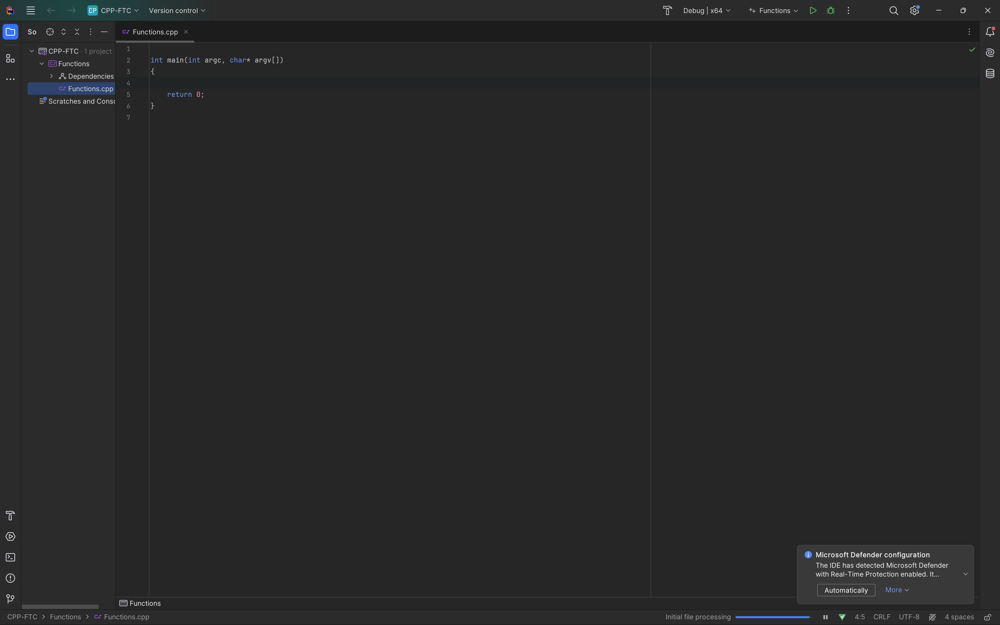

### Setting Up VS22

[home](../README.md#user-content-ue5-cpp-functions--templates--classes) • [next](../vanilla-functions/README.md#user-content-vanilla-cpp-functions)

Lets set up a new Solution and Project in Rider 2023.

 

---

##### `Step 1.`\|`UECPPFTC`| :small_blue_diamond:

Open up **Rider 2023** and press the <kbd>New Solution</kbd> button.

s

##### `Step 2.`\|`UECPPFTC`| :small_blue_diamond: :small_blue_diamond: 

Select a **C++ | Console Application** and call the solution `CPP-FTC`. Call the prject name `Functions`.  I am using the default diretory for Rider of `C:\Users\MyPCUsername\RiderProjects`.  Press the <kbd>Create</kbd> button.

##### `Step 3.`\|`UECPPFTC`| :small_blue_diamond: :small_blue_diamond: :small_blue_diamond:

So if we go in **Explorer** to our **C:\Users\MyPCUsername\RiderProjects** directory we will see that our solution is the top most folder. 

##### `Step 4.`\|`UECPPFTC`| :small_blue_diamond: :small_blue_diamond: :small_blue_diamond: :small_blue_diamond:

Inside our solution folder we find a rider solution file called **CPP-FTC.sln**.  We have a hidden folder **.idea** and our project folder **Functions**.  This will contain our `.cpp` file.

##### `Step 5.`\|`UECPPFTC`| :small_orange_diamond:

Now we are ready to go with an empty template of our blank cpp file.

<!--  -->

<!----><!-- old code -->
<a href="../vanilla-functions/README.md#user-content-vanilla-cpp-functions"><!-- new code -->
  
</a>

| [home](../README.md#user-content-ue5-cpp-functions--templates--classes) | [next](../vanilla-functions/README.md#user-content-vanilla-cpp-functions)|
|---|---| 
