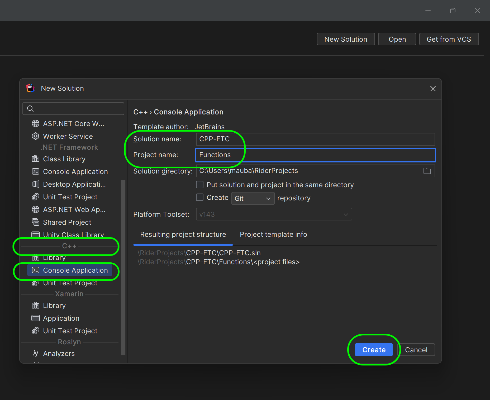
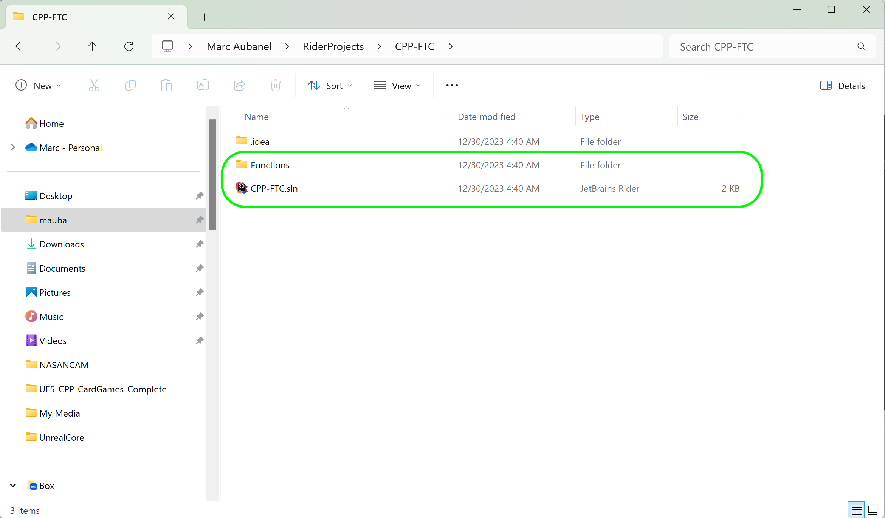

### Setting Up VS22

[home](../README.md#user-content-ue5-cpp-functions--templates--classes) • [next](../)

Lets set up a new project in Visual Studio 22.

 

---

##### `Step 1.`\|`UECPPFTC`|:small_blue_diamond:

Open up **Visual Studio 22** and press the **Create new project** button.

##### `Step 2.`\|`UECPPFTC`|:small_blue_diamond: :small_blue_diamond: 

Select an **Empty Project** for **C++ | Windows | Console**.  Press the <kbd>Next</kbd> button.

##### `Step 3.`\|`UECPPFTC`|:small_blue_diamond: :small_blue_diamond: :small_blue_diamond:

Enter `CPP_FTC` (short for Functions, Templates and Classes) into the **Project name** box.  Select a folder to save the solution to.  Press the <kbd>Create</kbd> button.

##### `Step 4.`\|`UECPPFTC`|:small_blue_diamond: :small_blue_diamond: :small_blue_diamond: :small_blue_diamond:

Now we need a `.cpp` file to hold our **main()** function that runs with the program.  Right click on **Source Files** and select **Add New Item...**, then call the new file `Functions.cpp`.  Press the <kbd>Add</kbd> button.  Now we are ready to start programming.

<!--  -->

| [home](../README.md#user-content-ue5-cpp-functions--templates--classes) | [next](../)|
|---|---| 
