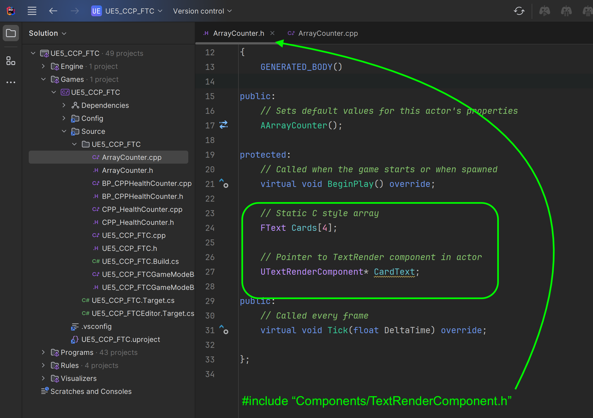
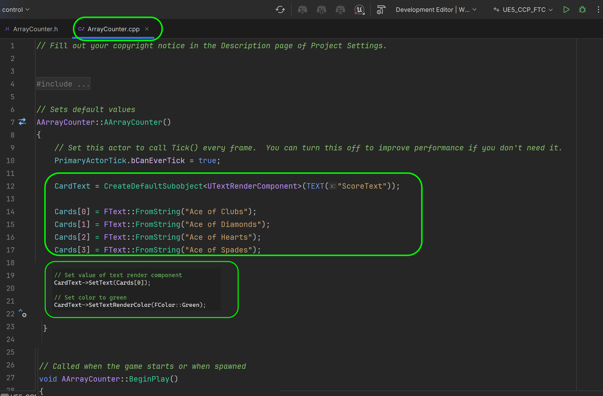

### Static Array

[previous](../const/README.md#user-content-const-keyword) • [home](../README.md#user-content-ue5-cpp-functions--templates--classes) • [next](../containers/README.md#user-content-containers)

In C++, an array is a collection of elements of the same data type that are stored in contiguous memory locations. It is a **list** of elements of a type.

An array variable is represented with `[]`.  So `int foo[5]` is an array of integers and it is accessing the 6th item (arrays start at `0`).

A static array is allocated memory at compile time and its size is fixed, i.e., cannot be changed later. Static arrays store their values on the stack, and their size must be known at compile time. This means that if you want an array to be sized based on input from the user, then you cannot use static arrays. 

These basic C++ arrays are risky to use as the game will crash if it tries to access an element that is out of bounds (so if we have array of 3 elements and you try and access array [5], it will crash).

 

---

##### `Step 1.`\|`UECPPFTC`|:small_blue_diamond:

Open up the **UE5_CPP_FTC** project.Select the **Tools | New C++ Class...** menu item and select the **Actor** class. Press the <kbd>Next</kbd> button. Name the `.cpp` file `ArrayCounter` and press the <kbd>Create Class</kbd> key.

##### `Step 2.`\|`UECPPFTC`|:small_blue_diamond: :small_blue_diamond: 

Again for our text component inclue the **TextRenderComponent.h** to the new **ArrayCounter.h** file in visual studio. Add a pointer to this new component called `CardText`.

Also, add a new array with 5 elements in it by initializing the array with:

`FText Cards[4]`

Remember arrays start with `0` so there are 5 cards of **FTextz** type.

##### `Step 3.`\|`UECPPFTC`|:small_blue_diamond: :small_blue_diamond: :small_blue_diamond:

Now go to the **ArrayCounter.cpp** file and in the constructor add the **TextRender** component.  Then add 4 cards and you need to cast the strings `""` to **FText** with the `FText::FromString()` static function.

Set the card value to the first array list item and then set the color.

##### `Step 4.`\|`UECPPFTC`|:small_blue_diamond: :small_blue_diamond: :small_blue_diamond: :small_blue_diamond:

Press the <kbd>Play</kbd> button from **Visual Studio** to launch the engine form the debugger.  Now it is probably best to stop it from the debugger as well (the play button turns to a stop button after it runs the program).

https://github.com/maubanel/UE5-CPP-Functions-Templates-Classes/assets/5504953/fee4469e-4c70-4c8c-a1cd-42c559d33522

##### `Step 5.`\|`UECPPFTC`| :small_orange_diamond:

In the game access the **Content Drawer** and drag **C++ Classes | UE5_CPP_FTC | ArrayCounter** actor into the level.  Put it on top of the two countersa and make sure it is facing the camera.

##### `Step 6.`\|`UECPPFTC`| :small_orange_diamond: :small_blue_diamond:

Now lets turn this **Cards[]** array into a **UPROPERTY**.  Go to **ArrayCounter.h** and add a Macro with the **UPROPERTY** allowing the variable to be visible anyhwere and allow it to be blueprint read only. Select the **File | Save** or <kbd>cntrl-c</kbd> to save the change.  Now go back to Unreal and press the <kbd>Compile</kbd> button.

![add uproperty to cards[]](images/addUProperty.png)

##### `Step 7.`\|`UECPPFTC`| :small_orange_diamond: :small_blue_diamond: :small_blue_diamond:

OK, now notice we get an error saying **Static arrays cannot be exposed to bluepritn Class: ArrayCounter**.  So we cannot access this variable inside a blueprint. 

##### `Step 8.`\|`UECPPFTC`| :small_orange_diamond: :small_blue_diamond: :small_blue_diamond: :small_blue_diamond:

Now even though Unreal doesn't allow us to access them in **Blueprints** we can still use them in the editor in each instance in a level.  Keep **EditAnywhere** in the **UPROPERTY** but remove the **BlueprintReadOnly**.  Select the **File | Save** or <kbd>cntrl-c</kbd> to save the change.  Now go back to Unreal and press the <kbd>Compile</kbd> button.

##### `Step 9.`\|`UECPPFTC`| :small_orange_diamond: :small_blue_diamond: :small_blue_diamond: :small_blue_diamond: :small_blue_diamond:

Now it compiles again succesfully.

##### `Step 10.`\|`UECPPFTC`| :large_blue_diamond:

You might have to restart the editor (stopping it in VS, then starting again) you will see that the arrays now show up in the **Details** panel and you could change the text on each instance.

##### `Step 11.`\|`UECPPFTC`| :large_blue_diamond: :small_blue_diamond: 

##### `Step 12.`\|`UECPPFTC`| :large_blue_diamond: :small_blue_diamond: :small_blue_diamond: 

##### `Step 13.`\|`UECPPFTC`| :large_blue_diamond: :small_blue_diamond: :small_blue_diamond:  :small_blue_diamond: 

##### `Step 14.`\|`UECPPFTC`| :large_blue_diamond: :small_blue_diamond: :small_blue_diamond: :small_blue_diamond:  :small_blue_diamond: 

##### `Step 15.`\|`UECPPFTC`| :large_blue_diamond: :small_orange_diamond: 

##### `Step 16.`\|`UECPPFTC`| :large_blue_diamond: :small_orange_diamond:   :small_blue_diamond: 

https://github.com/maubanel/UE5-CPP-Functions-Templates-Classes/assets/5504953/21c9ef63-5550-4b2e-aae9-1d76f7902ef2

<!--  -->

| [previous](../const/README.md#user-content-const-keyword)| [home](../README.md#user-content-ue5-cpp-functions--templates--classes) | [next](../containers/README.md#user-content-containers)|
|---|---|---|
