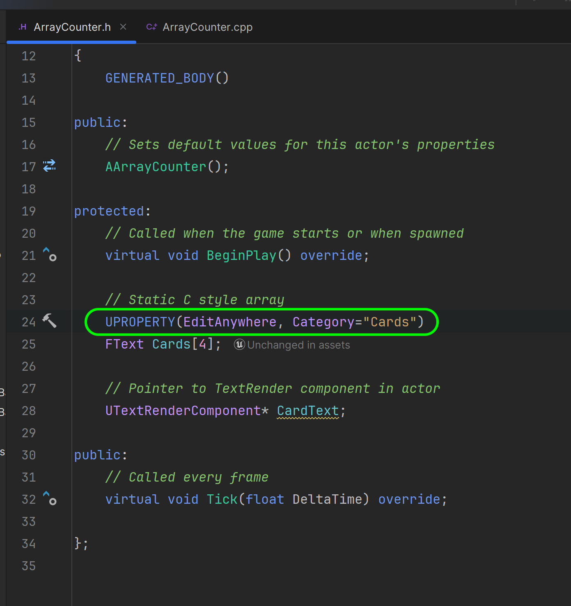
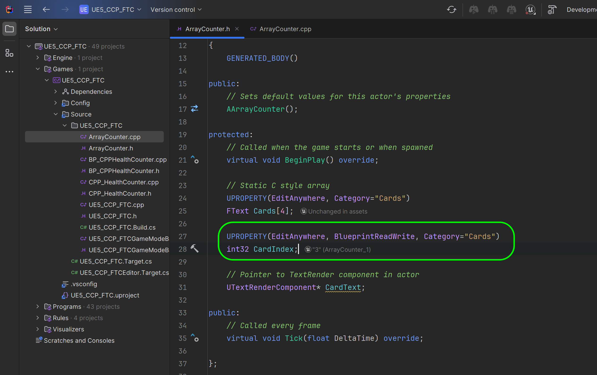

### Static Array

[previous](../const/README.md#user-content-const-keyword) • [home](../README.md#user-content-ue5-cpp-functions--templates--classes) • [next](../containers/README.md#user-content-containers)

In C++, an array is a collection of elements of the same data type that are stored in contiguous memory locations. It is a **list** of elements of a type.

An array variable is represented with `[]`.  So `int foo[5]` is an array of integers and it is accessing the 6th item (arrays start at `0`).

A static array is allocated memory at compile time and its size is fixed, i.e., cannot be changed later. Static arrays store their values on the stack, and their size must be known at compile time. This means that if you want an array to be sized based on input from the user, then you cannot use static arrays. 

These basic C++ arrays are risky to use as the game will crash if it tries to access an element that is out of bounds (so if we have array of 3 elements and you try and access array [5], it will crash).

 

---

##### `Step 1.`\|`UECPPFTC`|:small_blue_diamond:

Open up the **UE5_CPP_FTC** project.Select the **Tools | New C++ Class...** menu item and select the **Actor** class. Press the <kbd>Next</kbd> button. Name the `.cpp` file `ArrayCounter` and press the <kbd>Create Class</kbd> key.

##### `Step 2.`\|`UECPPFTC`|:small_blue_diamond: :small_blue_diamond: 

##### `Step 3.`\|`UECPPFTC`|:small_blue_diamond: :small_blue_diamond: :small_blue_diamond:

##### `Step 4.`\|`UECPPFTC`|:small_blue_diamond: :small_blue_diamond: :small_blue_diamond: :small_blue_diamond:

https://github.com/maubanel/UE5-CPP-Functions-Templates-Classes/assets/5504953/fee4469e-4c70-4c8c-a1cd-42c559d33522

##### `Step 5.`\|`UECPPFTC`| :small_orange_diamond:

##### `Step 6.`\|`UECPPFTC`| :small_orange_diamond: :small_blue_diamond:

##### `Step 7.`\|`UECPPFTC`| :small_orange_diamond: :small_blue_diamond: :small_blue_diamond:

##### `Step 8.`\|`UECPPFTC`| :small_orange_diamond: :small_blue_diamond: :small_blue_diamond: :small_blue_diamond:

##### `Step 9.`\|`UECPPFTC`| :small_orange_diamond: :small_blue_diamond: :small_blue_diamond: :small_blue_diamond: :small_blue_diamond:

##### `Step 10.`\|`UECPPFTC`| :large_blue_diamond:

##### `Step 11.`\|`UECPPFTC`| :large_blue_diamond: :small_blue_diamond: 

##### `Step 12.`\|`UECPPFTC`| :large_blue_diamond: :small_blue_diamond: :small_blue_diamond: 

##### `Step 13.`\|`UECPPFTC`| :large_blue_diamond: :small_blue_diamond: :small_blue_diamond:  :small_blue_diamond: 

##### `Step 14.`\|`UECPPFTC`| :large_blue_diamond: :small_blue_diamond: :small_blue_diamond: :small_blue_diamond:  :small_blue_diamond: 

##### `Step 15.`\|`UECPPFTC`| :large_blue_diamond: :small_orange_diamond: 

##### `Step 16.`\|`UECPPFTC`| :large_blue_diamond: :small_orange_diamond:   :small_blue_diamond: 

https://github.com/maubanel/UE5-CPP-Functions-Templates-Classes/assets/5504953/21c9ef63-5550-4b2e-aae9-1d76f7902ef2

<!--  -->

| [previous](../const/README.md#user-content-const-keyword)| [home](../README.md#user-content-ue5-cpp-functions--templates--classes) | [next](../containers/README.md#user-content-containers)|
|---|---|---|
