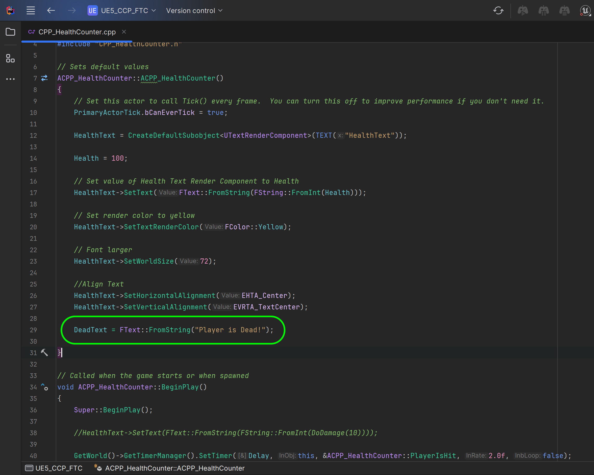

### Unreal CPP Functions II

[previous](../unreal-cpp-functions/README.md#user-content-unreal-app-functions) • [home](../README.md#user-content-ue5-cpp-functions--templates--classes) • [next](../macros/README.md#user-content-macros--blueprints)

Chapter introduction here.

 

---

##### `Step 1.`\|`UECPPFTC`|:small_blue_diamond:

Press the <kbd>Play</kbd> button and notice that we have the original function back from the blueprint version.  The only issue is that the timer goes below zero to negative number space.  Lets fix it.

https://github.com/maubanel/UE5-CPP-Functions-Templates-Classes/assets/5504953/11b18195-a838-4b85-a7c8-b49a8fa5e0fb

##### `Step 2.`\|`UECPPFTC`|:small_blue_diamond: :small_blue_diamond: 

First, in the constructor we assign **DeadText** with teh string `"Player is Dead"`. This is the message we will use when the health goes below zero.

##### `Step 3.`\|`UECPPFTC`|:small_blue_diamond: :small_blue_diamond: :small_blue_diamond:

Now open up **HealthCounter.cpp** and in **PlayerIsHit()**, and wrap the recursive function of doing damage then displaying the health string in a conditional statement check if `Health > 0`.  If not then set the text to the  **DeadText**.

##### `Step 4.`\|`UECPPFTC`|:small_blue_diamond: :small_blue_diamond: :small_blue_diamond: :small_blue_diamond:

<!--  -->

| [previous](../unreal-cpp-functions/README.md#user-content-unreal-cpp-functions)| [home](../README.md#user-content-ue5-cpp-functions--templates--classes) | [next](../macros/README.md#user-content-macros--blueprints)|
|---|---|---|
