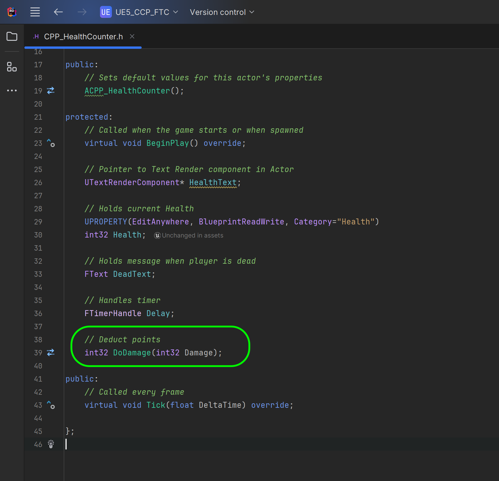

### Unreal CPP Functions

[previous](../bp-functions/README.md#user-content-blueprint-functions) • [home](../README.md#user-content-ue5-cpp-functions--templates--classes) • [next](../unreal-cpp-functions-ii/README.md#user-content-unreal-cpp-functions-ii)

Lets take a stab at combining what we have done in C++ and what we have done in Blueprints.  Lets create an **Actor** C++ class and duplicate the functionality we just wrote in the blueprint as a C++ class instead. This is a native Unreal C++ class that will replicate the prior behavior without using any blueprints. Now a C++ class that inherits from an **Actor** class (just like the blueprint) can be added to a level **WITHOUT** having to convert it to a blueprint.

We will not be able to make a complete mirror as there is not a **Delay** function that can be called in the **Tick** event.  Instead we will use **Timers** and call a new function recursively from the **Begin Play** event. So we will have to change the algorithm a little bit.  Lets get started.

 

---

##### `Step 1.`\|`UECPPFTC`| :small_blue_diamond:

In Unreal Engine, an Actor is any object that can be placed into a level, such as a camera, static mesh, or player start location. Actors support 3D transformations such as translation, rotation, and scaling. They can be created (spawned) and destroyed through gameplay code (C++ or Blueprints). AActor is the base class of all Actors (in game objects) in C++.

We are going to add our first C++ class inside of Unreal.  *Select* the ****Tools | New C++ Class**** menu ite.  Now we select the same class as we do in a Blueprint.  We will not get into classes yet but will cover it later on.  Select **Actor** and press the <kbd>Next</kbd> button. Call it `CPP_HealthCounter` and press the <kbd>Create Class</kbd> button.  Now wait a bit for the system to load up Visual Studio and create this new class in the Unreal project.

##### `Step 2.`\|`UECPPFTC`| :small_blue_diamond: :small_blue_diamond: 

Now most everything in a blueprint we can do as a C++ class.  So google **Text Render Component** and you will find a **UTextRenderComponent** which is the equivalent C++ class. 

In unreal the lowest base class is a **UObject**.  The **AActor** class inherits from **UObject**. This class gets garbage collected and replicated over the network.

Now in Unreal's  [manual](http://api.unrealengine.com/INT/API/Runtime/Engine/Components/UTextRenderComponent/) they will always add an **Include** location so we know that the **UTextRenderComponent** can be accessed by including `Components/TextRenderComponent.h`.

##### `Step 3.`\|`UECPPFTC`| :small_blue_diamond: :small_blue_diamond: :small_blue_diamond:

This will open up Visual Studio (if it is not already open) and you can see that it creates a `.cpp` and `.h` file for you with a standard boiler starter for this class type.

<!-- err77 (add common problems with visual studio). -->

If Visual Studio does not boot up, or you just want to open the class from the menu this can be done. Press the arrow button next to **Filters** in the **Content Browser** <!-- err99 (filters and content browser?). --> and you will see the parent diretory to **Contents**.  Then you will see a directory called C++ Classes. If you do not you will need to click on **View Options** <!-- err99 (view option?). --> and make sure that **Show C++ Classes** is selected.  Please note that you need to think carefully about what folder to include the class in and its name.  It is quite a chore to change the C++ location or adjust its class name in UE5.

So now lets open the **CPP_HealthCounter.h** and `#include Components/TextRenderComponent.h` to the top of the headers. Now be careful the `.generated.h` **ALWAYS** has to be the last header loaded or the game will not work correclty. So I added it just before the generated header.

We get a lot of boilerplate code. Now add in the `protected` section under `virtual void BeginPlay() override;` .  We need to add the TextRenderComponent.  This is a `UTextRenderComponent` and we need a pointer to it (we will get into pointers later on) which is what the asterix indicates.  Call this pointer `HealthText`.

##### `Step 4.`\|`UECPPFTC`| :small_blue_diamond: :small_blue_diamond: :small_blue_diamond: :small_blue_diamond:

Now in Unreal we want to guarantee that an integer is 32 bit regardless of the platfrom.  So we do not use the vanilla `int` that C++ provides and instead us the Unreal varibale `int32` which guarantees the size across all of Unreal's supported platforms.

*Add* an **int32** `Health` variable and an **FText** `DeadText` variable. We do not have a **Delay** type class that is analogous to the one in blueprints, so we will create our own using Unreal's **FTimerHandle** which does not require a new header.  Create a `FTimerHandle Delay` varaible called `Delay`.  We will need two functions that we will have to define.  The first is `void PlayerIsHit()` that will cause the damage and update the text and an `int32 DoDamage(int32 Damage)` that is analogous to the one we created in the blueprint but DO NOT need to pass the health variable as it is acccessible by any member function in this class. Please note that we do not define or set any of the variables in the `.h` file - we just *declare* them.

##### `Step 5.`\|`UECPPFTC`| :small_orange_diamond:

Now we will not see this in game yet as we have only intialized the **HealthText** and have not assigned it.  Go to the **CPP_HealthCounter.cpp** and we will add a component using the **CreateDefaultSubobject** method.  We ware creating a new **UTextRenderComponent** and add it to a category of **HealthText**. We do this inside the C++ Constructor (which we will get into more details later on).

A constructor in C++ is a special method that is automatically called when an object of a class is created. It is used to initialize the data members of new objects generally. The constructor has the same name as the class and is always public. It does not have any return value or void.

##### `Step 6.`\|`UECPPFTC`| :small_orange_diamond: :small_blue_diamond:

Now press save in **Visual Studio** and go to the game and press the **C++ Compile** button (different than the blueprint compile).  Now we want to see a **Successful** message in the **Live Coding** window saying it succsfully compiled.

##### `Step 7.`\|`UECPPFTC`| :small_orange_diamond: :small_blue_diamond: :small_blue_diamond:

Now we will be rebooting the game a lot so lets go to **File | Project Settings** and select the **Maps and Modes** tab. Change both the **Editor Startup Map** and the **Game Default Map** to `Functions`.

##### `Step 8.`\|`UECPPFTC`| :small_orange_diamond: :small_blue_diamond: :small_blue_diamond: :small_blue_diamond:

Now in the **C++** section of the **Content** folder add the **CPP_HealthCounter** C++ class to the level.  And orient it to the camera and position it under the blueprint function example.

If you do not see the C++ classes press **Content Browswer | Settings** and select **Show C++ Classes**. 

Notice that the actor has a TextRender component called **HealthText**. 

##### `Step 9.`\|`UECPPFTC`| :small_orange_diamond: :small_blue_diamond: :small_blue_diamond: :small_blue_diamond: :small_blue_diamond:

Lets now set our **Health** variable to a value, that is usable and in this case we will set it to `100`.

In a blueprint when we drag a reference to a component it sets a pointer to that object. In CPP we access the method from the pointer to this component (we access the function or variable with `->`).  We call the method `SetText` then cast an **Integer** to a **String** then to a **Text** format (there is no method from going from **int32** to **FText** in a single call).

##### `Step 10.`\|`UECPPFTC`| :large_blue_diamond:

Now since this change is in the constructor and the actor is already in the level you need to press **File | Save All** then quit and restart Unreal.  Press the <kbd>Play</kbd> button and the text is set to `100`.

##### `Step 11.`\|`UECPPFTC`| :large_blue_diamond: :small_blue_diamond: 

In the blueprint the color of the font was titled **Text Render Color**.  So in C++ we call the `HealthText->SetTextRenderColor(FColor::Yelllow);` method.  This sets a color to yellow. 

##### `Step 12.`\|`UECPPFTC`| :large_blue_diamond: :small_blue_diamond: :small_blue_diamond: 

Now since this change is in the constructor and the actor is already in the level you need to press **File | Save All** then quit and restart Unreal.  Press the <kbd>Play</kbd> button and the text is now yellow.

##### `Step 13.`\|`UECPPFTC`| :large_blue_diamond: :small_blue_diamond: :small_blue_diamond:  :small_blue_diamond: 

Lets define our first method.  Uncomment out `int32 DoDamage(int32 Damage)`.  Then press the paint brush icon next to the function and select **Create definition of 'DoDamage' in CPP_HealthCounter.cpp**. This will create a compiling stub in the cpp file to save you the typing.

##### `Step 14.`\|`UECPPFTC`| :large_blue_diamond: :small_blue_diamond: :small_blue_diamond: :small_blue_diamond:  :small_blue_diamond: 

Now all we have to do is add the definition of the function.  In this case it is simple we deduct **Damange** from **Health**.  Now when we declare a variable in the `.h` file it is persistent with each instance of the class in game.  So the **Health** variable will stay up to date unitl the object is destroyed.  But a variable that is declared within the `cpp` file will go away once it leaves scope.  So once we get past line 34 in my example the **Damage** variable will no longer exist and will be returned to the OS.

Call `DoDamage(10);` in the **Begin Play** event function definition. This will deduct 10 points from health when the game is run.

##### `Step 15.`\|`UECPPFTC`| :large_blue_diamond: :small_orange_diamond: 

Press the **Save** in Visual Studio. Now since this is not in the constructor we should be able to go to the game and press the<kbd>C++ Compile</kbd> button and it will pop up the live coding box.  It will have a green succesful or a red failure if it doesn't compile.

##### `Step 16.`\|`UECPPFTC`| :large_blue_diamond: :small_orange_diamond:   :small_blue_diamond: 

Press the <kbd>Play</kbd> button and you will see the text go down by 10 points to `90`.  So our function **DoDamage** is called when we hit play.  The C++ BeginPlay is triggered when the object is instantiated just like it does in Blueprints. Now the font is a bit small and is not centered like our prior font was.

##### `Step 17.`\|`UECPPFTC`| :large_blue_diamond: :small_orange_diamond: :small_blue_diamond: :small_blue_diamond:

 For **World Size** we just need to call the **SetWorldSize(72)** method and pass it `71`.  Then we can call the same function for **Horizontal Alignment** and **Vertical Alignment**.  Now the enumerators are different and a quick click in the manual and we can see that **Center** is `EHTA_Center` and **Text Center** is `EVRTA_TextCenter`.

##### `Step 18.`\|`UECPPFTC`| :large_blue_diamond: :small_orange_diamond: :small_blue_diamond: :small_blue_diamond: :small_blue_diamond:

Now since it is in the constructor save and restart the game. Now in the editor we see that the font is larger and center.

##### `Step 19.`\|`UECPPFTC`| :large_blue_diamond: :small_orange_diamond: :small_blue_diamond: :small_blue_diamond: :small_blue_diamond: :small_blue_diamond:

Press the <kbd>Play</kbd> button and now you see the font is large and centered!

##### `Step 20.`\|`UECPPFTC`| :large_blue_diamond: :large_blue_diamond:

Now there is no function called **Delay**.  So we will change the algorythm a little bit and use the **UWorld::GetTimerManager** that will allows us to create a function call in the future (like a delay).

##### `Step 21.`\|`UECPPFTC`| :large_blue_diamond: :large_blue_diamond: :small_blue_diamond:

So back in the visual studio we comment out the prior line we used in **BeginPlay** and instead set a timer for 2 seconds out.  `GetWorld()` is a getter for the cached world pointer and will get us access to the actor in the current level (sort of like using a level blueprint). This is needed as a the concept of the timer is within a level and not within the actor blueprint.

So we call the PlayerIsHit function in **Begin Play**.  Then we need to uncomment out **PlayerIsHit()** and call oneself recursively every 2 seconds. This will mean that the player will get damage every 2 seconds, no matter what.

<!--  -->

| [previous](../bp-functions/README.md#user-content-blueprint-functions)| [home](../README.md#user-content-ue5-cpp-functions--templates--classes) | [next](../unreal-cpp-functions-ii/README.md#user-content-unreal-cpp-functions-ii)|
|---|---|---|
