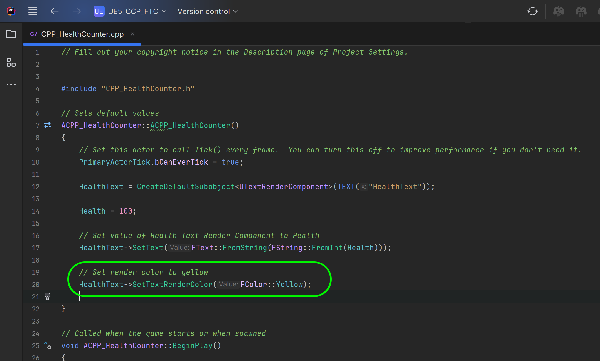
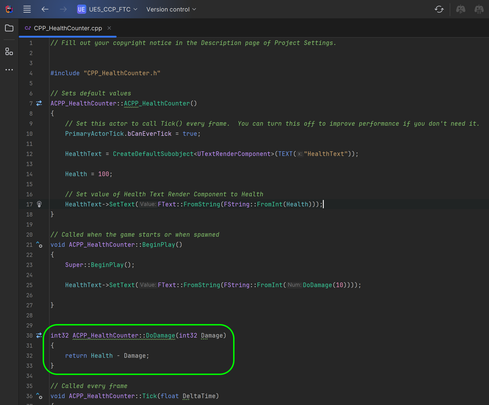

### Unreal CPP Functions

[previous](../bp-functions/README.md#user-content-blueprint-functions) • [home](../README.md#user-content-ue5-cpp-functions--templates--classes) • [next](../unreal-cpp-functions-ii/README.md#user-content-unreal-cpp-functions-ii)

Lets take a stab at combining what we have done in C++ and what we have done in Blueprints.  Lets create an **Actor** C++ class and duplicate the functionality we just wrote in the blueprint as a C++ class instead. Thi sis a native Unreal C++ class that will replicate the prior behavior without using any blueprints. Now a C++ class that inherits from an **Actor** class (just like the blueprint) can be added to a level **WITHOUT** having to convert it to a blueprint.

We will not be able to make a complete mirror as there is not a **Delay** function that can be called in the **Tick** event.  Instead we will use **Timers** and call a new function recursively from the **Begin Play** event. So we will have to change th algorithm a little bit.  Lets get started.

 

---

##### `Step 1.`\|`UECPPFTC`|:small_blue_diamond:

In Unreal Engine, an Actor is any object that can be placed into a level, such as a camera, static mesh, or player start location. Actors support 3D transformations such as translation, rotation, and scaling. They can be created (spawned) and destroyed through gameplay code (C++ or Blueprints). AActor is the base class of all Actors (in game objects) in C++.

We are going to add our first C++ class inside of Unreal.  *Select* the ****Tools | New C++ Class**** menu ite.  Now we select the same class as we do in a Blueprint.  We will not get into classes yet but will cover it later on.  Select **Actor** and press the <kbdNext</kbd> button. Call it `CPP_HealthCounter` and press the <kbd>Create Class</kbd> button.  Now wait a bit for the system to load up Visual Studio and create this new class in the Unreal project.

##### `Step 2.`\|`UECPPFTC`|:small_blue_diamond: :small_blue_diamond: 

Now most everything in a blueprint we can do as a C++ class.  So google **Text Render Component** and you will find a **UTextRenderComponent** which is the equivalent C++ class. 

In unreal the lowest base class is a **UObject**.  The **AActor** class inherits from **UObject**. This class gets garbage collected and replicated over the network.

Now in Unreal's  [manual](http://api.unrealengine.com/INT/API/Runtime/Engine/Components/UTextRenderComponent/) they will always add an **Include** location so we know that the **UTextRenderComponent** can be accessed by including `Components/TextRenderComponent.h`.

##### `Step 3.`\|`UECPPFTC`|:small_blue_diamond: :small_blue_diamond: :small_blue_diamond:

This will open up Visual Studio (if it is not already open) and you can see that it creates a `.cpp` and `.h` file for you with a standard boiler starter for this class type.

If Visual Studio does not boot up, or you just want to open the class from the menu this can be done. Press the arrow button next to **Filters** in the **Content Browser** and you will see the parent diretory to **Contents**.  Then you will see a directory called C++ Classes. If you do not you will need to click on **View Options** and make sure that **Show C++ Classes** is selected.  Please note that you need to think carefully about what folder to include the class in and its name.  It is quite a chore to change the C++ location or adjust its class name in UE4.

So now lets open the **CPP_HealthCounter.h** and `#include Components/TextRenderComponent.h` to the top of the headers. Now be careful the `.generated.h` **ALWAYS** has to be the last header loaded or the game will not work correclty. So I added it just before the generated header.

We get a lot of boiler playte code. Now add in the `protected` section under `virtual void BeginPlay() override;` .  We need to add the TextRenderComponent.  This is a `UTextRenderComponent` and we need a pointer to it (we will get into pointers later on) which is what the asterix indicates.  Call this pointer `ScoreText`.

##### `Step 4.`\|`UECPPFTC`|:small_blue_diamond: :small_blue_diamond: :small_blue_diamond: :small_blue_diamond:

Now in Unreal we want to guarantee that an integer is 32 bit regardless of the platfrom.  So we do not use the vanilla `int` that C++ provides and instead us the Unreal varibale `int32` which guarantees the size across all of Unreal's supported platforms.

*Add* an **int32** `Health` variable and an **FText** `DeadText` variable. We do not have a **Delay** type class that is analogous to the one in blueprints, so we will create our own using Unreal's **FTimerHandle** which does not require a new header.  Create a `FTimerHandle Delay` varaible called `Delay`.  We will need two functions that we will have to define.  The first is `void PlayerIsHit()` that will cause the damage and update the text and an `int32 DoDamage(int32 Damage)` that is analogous to the one we created in the blueprint but DO NOT need to pass the health variable as it is acccessible by any member function in this class. Please note that we do not define or set any of the variables in the `.h` file - we just *declare* them.

##### `Step 5.`\|`UECPPFTC`| :small_orange_diamond:

##### `Step 6.`\|`UECPPFTC`| :small_orange_diamond: :small_blue_diamond:

##### `Step 7.`\|`UECPPFTC`| :small_orange_diamond: :small_blue_diamond: :small_blue_diamond:

##### `Step 8.`\|`UECPPFTC`| :small_orange_diamond: :small_blue_diamond: :small_blue_diamond: :small_blue_diamond:

##### `Step 9.`\|`UECPPFTC`| :small_orange_diamond: :small_blue_diamond: :small_blue_diamond: :small_blue_diamond: :small_blue_diamond:

##### `Step 10.`\|`UECPPFTC`| :large_blue_diamond:

##### `Step 11.`\|`UECPPFTC`| :large_blue_diamond: :small_blue_diamond: 

##### `Step 12.`\|`UECPPFTC`| :large_blue_diamond: :small_blue_diamond: :small_blue_diamond: 

##### `Step 13.`\|`UECPPFTC`| :large_blue_diamond: :small_blue_diamond: :small_blue_diamond:  :small_blue_diamond: 

##### `Step 14.`\|`UECPPFTC`| :large_blue_diamond: :small_blue_diamond: :small_blue_diamond: :small_blue_diamond:  :small_blue_diamond: 

##### `Step 15.`\|`UECPPFTC`| :large_blue_diamond: :small_orange_diamond: 

##### `Step 16.`\|`UECPPFTC`| :large_blue_diamond: :small_orange_diamond:   :small_blue_diamond: 

##### `Step 17.`\|`UECPPFTC`| :large_blue_diamond: :small_orange_diamond: :small_blue_diamond: :small_blue_diamond:

##### `Step 18.`\|`UECPPFTC`| :large_blue_diamond: :small_orange_diamond: :small_blue_diamond: :small_blue_diamond: :small_blue_diamond:

##### `Step 19.`\|`UECPPFTC`| :large_blue_diamond: :small_orange_diamond: :small_blue_diamond: :small_blue_diamond: :small_blue_diamond: :small_blue_diamond:

##### `Step 20.`\|`UECPPFTC`| :large_blue_diamond: :large_blue_diamond:

##### `Step 21.`\|`UECPPFTC`| :large_blue_diamond: :large_blue_diamond: :small_blue_diamond:

<!--  -->

| [previous](../bp-functions/README.md#user-content-blueprint-functions)| [home](../README.md#user-content-ue5-cpp-functions--templates--classes) | [next](../unreal-cpp-functions-ii/README.md#user-content-unreal-cpp-functions-ii)|
|---|---|---|
