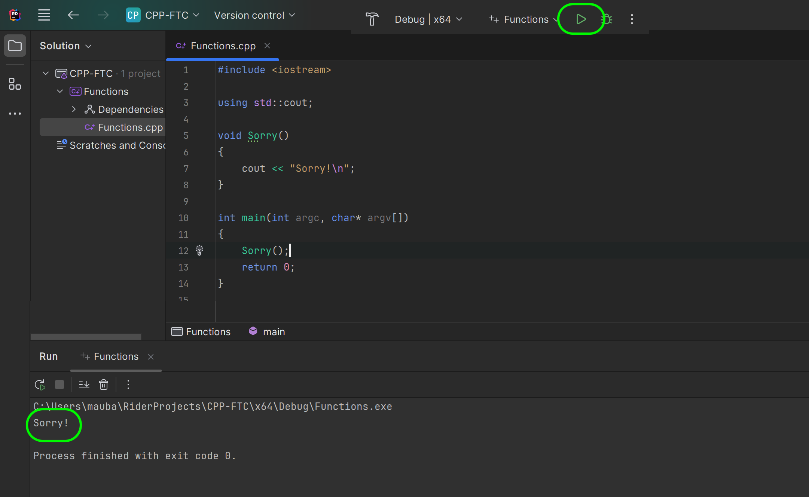
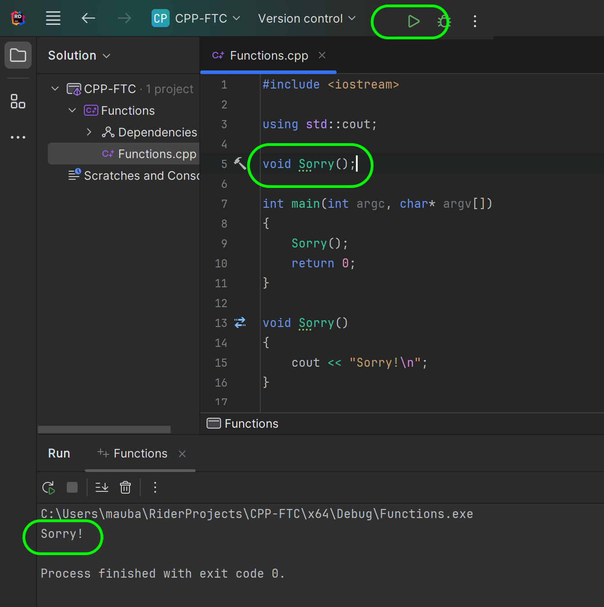
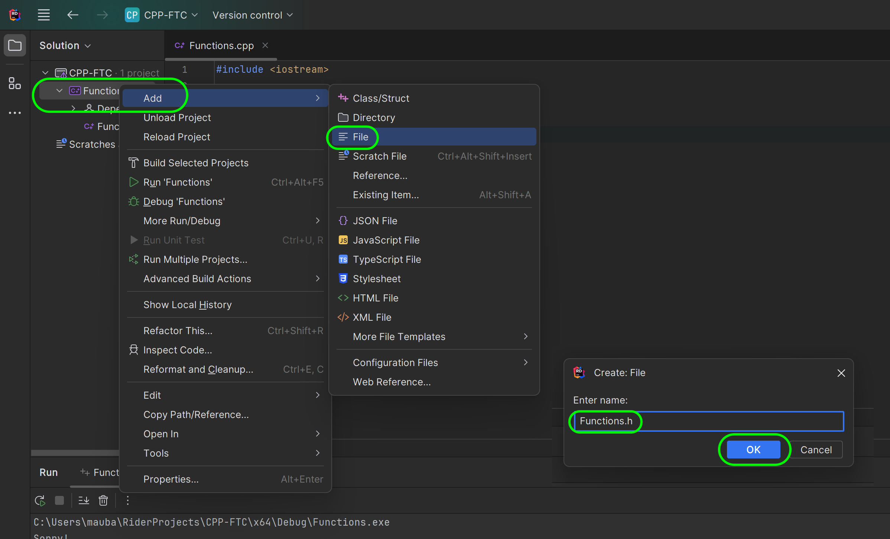
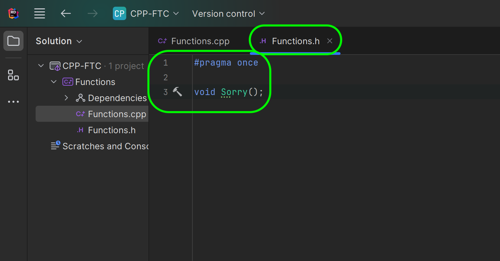
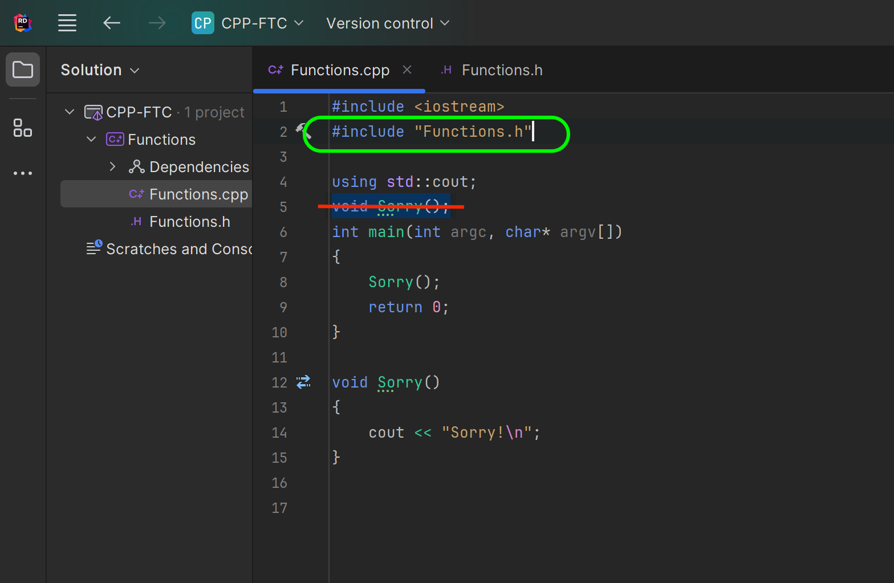

### Vanilla CPP Functions

<sub>[previous](../) • [home](../README.md#user-content-ue5-cpp-functions--templates--classes) • [next](../)</sub>


In C++, a function is a block of code that performs a specific task. It is a reusable piece of code that can be called from anywhere in the program. Every C++ program has at least one function, which is the `main()` function. A function can be predefined or user-defined

A predefined function is a function that is already defined in the C++ standard library, such as `std::cout`. A user-defined function is a function that is created by the programmer to perform a specific task. It is defined by specifying the function name, return type, and parameters (if any) in the function declaration, followed by the function body in the function definition.

Lets create a user defined function.
<br>

---

##### `Step 1.`\|`UECPPFTC`|:small_blue_diamond:

A user defined function has:

```ReturnValueType NameOfFunction(Parameter to pass, Paremeter2 to pass....)```

A function starts with a **return value** type.  If the function returns nothing the type is `void`. In C++, `void` is a keyword that is used to indicate the absence of a type. It is used in several different contexts. It is important to note that void is not a type qualifier on any value. Despite the name, this is semantically similar to an implicit unit type, not a zero or bottom type (which is sometimes confusingly called the "void type").

Lets now create a function. Now we have used functions before `main()` but visual studio runs **main()** by default.  We can also define a new function before `main()`.  In this case we defined a new function that returns no value (it is void).  Next run the game to see what happens. Then we have `void Sorry()` a function that returns no value and prints `Sorry!` to console.


##### `Step 2.`\|`UECPPFTC`|:small_blue_diamond: :small_blue_diamond: 

 Run the game and `Main()` runs and calls the `Sorry()` function.  The function just prints `Sorry!` to the console.




##### `Step 3.`\|`UECPPFTC`|:small_blue_diamond: :small_blue_diamond: :small_blue_diamond:

Now what happens when we move the **Sorry** function after the **Main** function.  Will it still work?  Copy and paste the function definition below the **Main** function and press the <kbd>Local Windows Debugger</kbd> button. Woops we get an error message saying it didn't compile.  We don't want to run the last build so press <kbd>No</kbd>.


##### `Step 4.`\|`UECPPFTC`|:small_blue_diamond: :small_blue_diamond: :small_blue_diamond: :small_blue_diamond:

Now we don't know the error.  So **Build** the project (`cntrl shift b`) and you get an error saying it doesn't recognize **Sorry**. In C++ you can have the definition of the **C++** file anywhere but you need to **declare** it to the compiler before it is called. In C++, a function declaration tells the compiler about a function's name, return type, and parameters, while a function definition provides the actual body of the function.


##### `Step 5.`\|`UECPPFTC`| :small_orange_diamond:

So all we need to do to fix the problem is have a **Function Declaration** before it is called in `main()`.  In C++, a function declaration tells the compiler about a function's name, return type, and parameters, while a function definition provides the actual body of the function.

Now press <kbd>Local Windows Debugger</kbd> button and the function runs as it did before and compiles fine.




##### `Step 6.`\|`UECPPFTC`| :small_orange_diamond: :small_blue_diamond:

In C++ programming, header files are used to declare functions, that are used in a program. Header files are included in a program using the `#include` **preprocessor** directive. In C++, header files may or may not end with the .h extension, but it is customary to do so.

User-defined header files are created by the user and can also be imported using the #include directive. To create one right click on the **Header Files** folder and select **New Item...** and call it `Functions.h` the same name as the `.cpp` file.  Press the <kbd>Add</kbd> button.





##### `Step 7.`\|`UECPPFTC`| :small_orange_diamond: :small_blue_diamond: :small_blue_diamond:

Open up **Functions.h" which includes `#pragma once`.  This is a preprocessor directive that is used to ensure that a header file is included only once in a single compilation. It is a non-standard but widely supported directive that serves the same purpose as include guards, but with several advantages, including less code, avoidance of name clashes, and sometimes improvement in compilation speed.  This means that you can include the same file in multiple portions of the game but it will only include a single copy of this code regardless of how many times the header is called.

Now move the function definition from the `Functions.cpp` to `Functions.h`.




##### `Step 8.`\|`UECPPFTC`| :small_orange_diamond: :small_blue_diamond: :small_blue_diamond: :small_blue_diamond:

Now at the top of **Functions.cpp** we need to include the header.  So this will basically read this before processing the code on the page so the compiler will know that this files will define `Sorry()` regardless of the order.




##### `Step 9.`\|`UECPPFTC`| :small_orange_diamond: :small_blue_diamond: :small_blue_diamond: :small_blue_diamond: :small_blue_diamond:


##### `Step 10.`\|`UECPPFTC`| :large_blue_diamond:


##### `Step 11.`\|`UECPPFTC`| :large_blue_diamond: :small_blue_diamond: 


##### `Step 12.`\|`UECPPFTC`| :large_blue_diamond: :small_blue_diamond: :small_blue_diamond: 


##### `Step 13.`\|`UECPPFTC`| :large_blue_diamond: :small_blue_diamond: :small_blue_diamond:  :small_blue_diamond: 


##### `Step 14.`\|`UECPPFTC`| :large_blue_diamond: :small_blue_diamond: :small_blue_diamond: :small_blue_diamond:  :small_blue_diamond: 


##### `Step 15.`\|`UECPPFTC`| :large_blue_diamond: :small_orange_diamond: 


##### `Step 16.`\|`UECPPFTC`| :large_blue_diamond: :small_orange_diamond:   :small_blue_diamond: 


##### `Step 17.`\|`UECPPFTC`| :large_blue_diamond: :small_orange_diamond: :small_blue_diamond: :small_blue_diamond:


##### `Step 18.`\|`UECPPFTC`| :large_blue_diamond: :small_orange_diamond: :small_blue_diamond: :small_blue_diamond: :small_blue_diamond:


##### `Step 19.`\|`UECPPFTC`| :large_blue_diamond: :small_orange_diamond: :small_blue_diamond: :small_blue_diamond: :small_blue_diamond: :small_blue_diamond:


##### `Step 20.`\|`UECPPFTC`| :large_blue_diamond: :large_blue_diamond:


##### `Step 21.`\|`UECPPFTC`| :large_blue_diamond: :large_blue_diamond: :small_blue_diamond:


<!--  -->


| [previous](../)| [home](../README.md#user-content-ue5-cpp-functions--templates--classes) | [next](../)|
|---|---|---|
